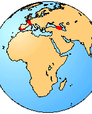

# [[Pelodytidae]]

Parsley Frogs 

## #has_/text_of_/abstract 

> **Pelodytidae**, also known as the parsley frogs, or rarely, mud divers, is a family of frogs. 
> It contains a single extant genus, Pelodytes, and three genera only known from fossils. 
> The extant species are found in southwestern Europe and the Caucasus.
>
> [Wikipedia](https://en.wikipedia.org/wiki/Pelodytidae) 

## Introduction

[David Cannatella]() 

Pelodytidae are the \"Parsley Frogs.\" The name comes from Pelodytes
punctatus, a species whose green coloration makes the frog look like it
is garnished with parsley. There is one living genus, Pelodytes, with
two species, in western Europe and the Caucasus mountains. Fossil taxa
are also known, from the Eocene to Pleistocene.

Pelodytes punctatus of Europe is a small (4 cm), gracile and agile frog
with prominent eyes. It is mostly nocturnal and terrestrial, but breeds
in water, with males apparently calling from under water. The tadpoles
have beaks, denticles, and a sinistral spiracle (Orton Type 4).

The group is recognized as a family mainly because of the fused
astragalus and calcaneum, an unusual feature in frogs (also known in
centrolenid frogs). Another distinctive feature is the presence of a
parahyoid bone in the hyoid apparatus. Among frogs in the Pipanura this
character is known only in rhinophrynids and palaeobatrachids.

### Geographic Distribution

The distribution of the living members of the family Pelodytidae is
indicated in red.\

### Discussion of Phylogenetic Relationships

The genus Pelodytes was considered a family distinct from Pelobatidae
(sensu lato) because it has a fused astragalus and calcaneum, a derived
feature seen elsewhere only in Centrolenidae (Lynch, 1973). Sanchíz
(1978) reviewed the fossil forms of Pelodytidae. †Miopelodytes and the
extinct Pelodytes †arevacus have a fused astragalus and calcaneum, but
†Propelodytes does not. Sanchíz (1978) tentatively retained
†Propelodytes in Pelodytidae.

Pelodytes was defined by Ford and Cannatella (1993) to be the most
recent ancestor of the living species P. punctatus and P. caucasicus,
and all of its descendants. Sanchíz (1978) considered Pelodytes
†arevacus to be more closely related to P. punctatus than to P.
caucasicus, and as such it is part of Pelodytes. As normally used,
Pelodytidae includes the fossil forms, so Pelodytidae was defined as a
stem-based name, for those taxa that are more closely related to the
living Pelodytes than to either Pelobatidae or Megophryidae. The
synapomorphy of Pelodytidae is the fusion of the astragalus and
calcaneum. The status of †Propelodytes as a pelodytid is tenuous.

## Phylogeny 

-   « Ancestral Groups  
    -   [Salientia](../Salientia.md)
    -   [Living Amphibians](Living_Amphibians)
    -   [Terrestrial Vertebrates](../../../Terrestrial.md)
    -   [Sarcopterygii](../../../../Sarc.md)
    -   [Gnathostomata](../../../../../Gnath.md)
    -   [Vertebrata](../../../../../../Vertebrata.md)
    -   [Craniata](../../../../../../../Craniata.md)
    -   [Chordata](../../../../../../../../Chordata.md)
    -   [Deuterostomia](../../../../../../../../../Deutero.md)
    -   [Bilateria](Bilateria)
    -   [Animals](Animals)
    -   [Eukaryotes](Eukaryotes)
    -   [Tree of Life](../../../../../../../../../../../../Tree_of_Life.md)

-   ◊ Sibling Groups of  Salientia
    -   [Triadobatrachus         massinoti](Triadobatrachus_massinoti.md)
    -   [Vieraella herbsti](Vieraella_herbsti.md)
    -   [Notobatrachus degiustoi](Notobatrachus_degiustoi.md)
    -   [Ascaphus truei](Ascaphus_truei.md)
    -   [Leiopelma](Leiopelma.md)
    -   [Eodiscoglossus         santonjae](Eodiscoglossus_santonjae.md)
    -   [Bombinatoridae](Bombinatoridae.md)
    -   [Discoglossidae](Discoglossidae.md)
    -   [Eopelobatinae](Eopelobatinae.md)
    -   [Megophryidae](Megophryidae.md)
    -   [Pelobatidae](Pelobatidae.md)
    -   Pelodytidae
    -   [Rhinophrynidae](Rhinophrynidae.md)
    -   [\'Pipids\'](%27Pipids%27)
    -   [Palaeobatrachidae](Palaeobatrachidae.md)
    -   [Pipidae](Pipidae.md)
    -   [Neobatrachia](Neobatrachia.md)

-   » Sub-Groups 

