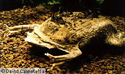

# Pipidae

Tongueless Frogs (Aglossa) 

 
 

## #has_/text_of_/abstract 

> The **Pipid**ae are a family of primitive, tongueless frogs. 
> There are 41 species in the family, found in tropical South America (genus Pipa) 
> and sub-Saharan Africa (the three other genera).
>
> [Wikipedia](https://en.wikipedia.org/wiki/Pipidae)

## Introduction

[David Cannatella](http://www.tolweb.org/)

Pipids are highly aquatic frogs that rarely if ever venture out of
water. They have several adaptations to aquatic life, including the loss
of the tongue (tongues are not generally useful for feeding in water),
and the presence of lateral line organs, which are used to detection
wave motion in water (these are present in most groups of fishes). The
group is sometimes called the Aglossa.

Pipid frogs are found in Africa, South America, and just get into
Panama. Some species in South America, such as the Surinam Toad (Pipa
pipa) are extremely flattened and look like roadkills. Females of the
genus Pipa have an elaborate mating behavior, in which eggs are
deposited on the back of the female, and the skin swells up around the
eggs to encase them in pockets in which the embryos develop. In some
species the eggs hatch out as tadpoles, but in others fully formed
froglets emerge from the mother\'s back.

Tadpoles (when present) lack beaks and denticles, and have paired
spiracles (if spiracles are present). This is the Orton type 1 tadpole,
also found in Rhinophrynidae. There is much diversity in larval
morphology and ecology in pipids. Tadpoles of Xenopus and Silurana are
extremely efficient filter feeders. Tadpoles of Hymenochirus are
carnivorous, eating larger prey items. In some species of Pipa the eggs
(embedded in the mother\'s back) hatch out as tadpoles, but in other
species have direct development, in which froglets emerge.

The genus Xenopus (African Clawed frogs) has undergone drastic evolution
in chromosome number, producing tetraploid (4n), and octoploid (8n), and
even dodecaploid (12n) species. These higher levels of ploidy may have
resulted from hybridization of between species. One species, Xenopus
laevis, is widely used as a lab animal in molecular and developmental
biology. The Dwarf Clawed Frog (Hymenochirus) are very small, about
20-30 mm, and are widely sold in aquarium stores. The call of many pipid
frogs is a clicking sound, which in Xenopus borealis is produced by
forcefully pulling apart the large arytenoid cartilages of the larynx
(voice-box), thus producing a \"pop\" by implosion.

### Geographic Distribution

The distribution of living members of the familiy Pipidae is indicated
in red.\

### Discussion of Phylogenetic Relationships

The definition of the name Pipidae is problematic because of the
relationships of Mesozoic and Tertiary taxa to living pipids (Báez,
1981). Báez\' cladogram placed †Thoraciliacus, †Cordicephalus,
†Saltenia, and †Eoxenopoides outside of the living Pipidae. She used two
synapomorphies for Pipidae (including the aforementioned taxa): the
absence of a quadratojugal and the absence of mentomeckelian bones. The
first of these is also present in the closely related
†Palaeobatrachidae, and may be diagnostic of a larger clade. Although
mentomeckelians are reported in palaeobatrachids, the examination of
†Palaeobatrachus fossils and figures in Spinar (1972) has not convinced
Cannatella of their presence.

Cannatella and Trueb (1988a) diagnosed the living Pipidae by a large
number of synapomorphies including presence of an epipubis cartilage, an
unpaired epipubic muscle, absence of a quadratojugal, free ribs in the
larvae, a fused articulation between the coccyx and sacrum, a short,
stocky scapula, elongate septomaxillary bones, ossified pubis, a single,
median palatal opening of the eustachian tube, lateral line organs in
the adults, and absence of a tongue. Several of these characters are
present in fossil taxa, and thus may be diagnostic of larger clades.
Several others cannot be assessed in fossils. By ignoring the fossils,
Cannatella and Trueb (1988a) produced a diagnosis for the family that
was misleading. Relationships within the living Pipidae were discussed
by Báez (1981), Cannatella and de Sá (1993), Cannatella and Trueb
(1988a,b), and de Sá and Hillis (1990).

To ensure stability, Ford and Cannatella (1993) defined the node-based
name Pipidae to be the most recent common ancestor of living pipids
(Xenopus, Silurana, Hymenochirus, Pseudhymenochirus, and Pipa) and all
of its descendants. Taxa considered to be fossil \"pipids\"
(†Thoraciliacus, †Cordicephalus, †Saltenia, †Shomronella, and
†Eoxenopoides) are assigned only to the level of Pipimorpha.

## Phylogeny 

-   « Ancestral Groups  
    -   [Salientia](../Salientia.md)
    -   [Living Amphibians](Living_Amphibians)
    -   [Terrestrial Vertebrates](../../../Terrestrial.md)
    -   [Sarcopterygii](../../../../Sarc.md)
    -   [Gnathostomata](../../../../../Gnath.md)
    -   [Vertebrata](../../../../../../Vertebrata.md)
    -   [Craniata](../../../../../../../Craniata.md)
    -   [Chordata](../../../../../../../../Chordata.md)
    -   [Deuterostomia](../../../../../../../../../Deutero.md)
    -   [Bilateria](Bilateria)
    -   [Animals](Animals)
    -   [Eukaryotes](Eukaryotes)
    -   [Tree of Life](../../../../../../../../../../../../Tree_of_Life.md)

-   ◊ Sibling Groups of  Salientia
    -   [Triadobatrachus         massinoti](Triadobatrachus_massinoti.md)
    -   [Vieraella herbsti](Vieraella_herbsti.md)
    -   [Notobatrachus degiustoi](Notobatrachus_degiustoi.md)
    -   [Ascaphus truei](Ascaphus_truei.md)
    -   [Leiopelma](Leiopelma.md)
    -   [Eodiscoglossus         santonjae](Eodiscoglossus_santonjae.md)
    -   [Bombinatoridae](Bombinatoridae.md)
    -   [Discoglossidae](Discoglossidae.md)
    -   [Eopelobatinae](Eopelobatinae.md)
    -   [Megophryidae](Megophryidae.md)
    -   [Pelobatidae](Pelobatidae.md)
    -   [Pelodytidae](Pelodytidae.md)
    -   [Rhinophrynidae](Rhinophrynidae.md)
    -   [\'Pipids\'](%27Pipids%27)
    -   [Palaeobatrachidae](Palaeobatrachidae.md)
    -   Pipidae
    -   [Neobatrachia](Neobatrachia.md)

-   » Sub-Groups 

## Title Illustrations

--------------------------------------------------------------------------

Scientific Name ::     Pipa pipa
Comments             with newly laid eggs partially embedded in the back
Specimen Condition   Live Specimen
Sex ::                Female
View                 head-on
Copyright ::            © 1995 [David Cannatella](http://www.catfishlab.org/) 

--------------------------------------------------------------------------

Scientific Name ::  Pipa pipa
Copyright ::         © 1995 [David Cannatella](http://www.catfishlab.org/) 

## Confidential Links & Embeds: 

### #is_/same_as :: [Pipidae](/_Standards/bio/bio~Domain/Eukaryotes/Animals/Bilateria/Deutero/Chordata/Craniata/Vertebrata/Gnath/Sarc/Tetrapods/Amphibians/Salientia/Pipidae.md) 

### #is_/same_as :: [Pipidae.public](/_public/bio/bio~Domain/Eukaryotes/Animals/Bilateria/Deutero/Chordata/Craniata/Vertebrata/Gnath/Sarc/Tetrapods/Amphibians/Salientia/Pipidae.public.md) 

### #is_/same_as :: [Pipidae.internal](/_internal/bio/bio~Domain/Eukaryotes/Animals/Bilateria/Deutero/Chordata/Craniata/Vertebrata/Gnath/Sarc/Tetrapods/Amphibians/Salientia/Pipidae.internal.md) 

### #is_/same_as :: [Pipidae.protect](/_protect/bio/bio~Domain/Eukaryotes/Animals/Bilateria/Deutero/Chordata/Craniata/Vertebrata/Gnath/Sarc/Tetrapods/Amphibians/Salientia/Pipidae.protect.md) 

### #is_/same_as :: [Pipidae.private](/_private/bio/bio~Domain/Eukaryotes/Animals/Bilateria/Deutero/Chordata/Craniata/Vertebrata/Gnath/Sarc/Tetrapods/Amphibians/Salientia/Pipidae.private.md) 

### #is_/same_as :: [Pipidae.personal](/_personal/bio/bio~Domain/Eukaryotes/Animals/Bilateria/Deutero/Chordata/Craniata/Vertebrata/Gnath/Sarc/Tetrapods/Amphibians/Salientia/Pipidae.personal.md) 

### #is_/same_as :: [Pipidae.secret](/_secret/bio/bio~Domain/Eukaryotes/Animals/Bilateria/Deutero/Chordata/Craniata/Vertebrata/Gnath/Sarc/Tetrapods/Amphibians/Salientia/Pipidae.secret.md)

