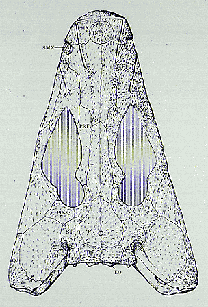
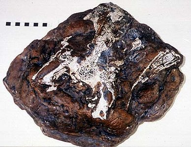

# [[Baphetidae]] 

Loxommatidae 

## #has_/text_of_/abstract 

> **Baphetidae** is an extinct family of stem-tetrapods. Baphetids were large labyrinthodont predators of the Late Carboniferous period (Namurian through Westphalian) of Europe. Fragmentary remains from the Early Carboniferous of Canada have been tentatively assigned to the group. The phylogenetic relationships of baphetids is uncertain; while many studies have placed the group as a close relative of Amniota, other analyses have found Baphetidae to be a more basal clade of early stem tetrapods. Baphetids were among the first of the Carboniferous fossil tetrapods to be found and were originally described in 1850 by John William Dawson. The baphetids have been referred to the family Loxommatidae, but this group was later shown to be a junior synonym of Baphetidae, which was named earlier in 1865. Baphetids are known mainly from skulls; very little postcranial material has been found.
>
> [Wikipedia](https://en.wikipedia.org/wiki/Baphetidae) 

## Introduction

[Jennifer A. Clack](http://www.tolweb.org/)

Among the most bizarre and enigmatic tetrapods of the Carboniferous
period are the baphetids (formerly known as loxommatids, see Milner and
Lindsay (1998)). Though their skulls are not uncommon, there is little
yet known about their postcrania. Baphetids were among the first of the
Carboniferous fossil tetrapods to be found and were originally described
in 1850 by William Dawson. They ranged from the Late Mississippian to
the Middle Pennsylvanian, a period of about 35 million years. Most
specimens come from Scotland and northern England (Beaumont 1977).

{width="388"}

Figure 1. Skull of Kyrinion martilli, a recently discovered baphetid
from the north east coast of England. [Hancock Museum](http://www.twmuseums.org.uk/hancock/){target="_self"}, Newcastle
upon Tyne, UK. Copyright © 1997 Hancock Museum.
### Discussion of Phylogenetic Relationships

Baphetids were at one time regarded as relatives of temnospondyls, but
since the advent of cladistic analysis, it has been suggested that they
show no derived characters in common with this group (eg. Panchen 1980).
They have been placed as relatives of the reptiliomorph group (amniotes
and extinct related groups) as defined by Panchen and Smithson (1988),
but the characters on which this grouping was founded are seen more
widely among stem-tetrapods. When data from *Eucritta* is included,
baphetids appear as either sister to temnospondyls or to anthracosaur,
more or less with equal frequency (see *[Eucritta melanolimnetes](tree?group=Eucritta%20melanolimnetes)*).
Some characters of the ear and occiput have recently been described that
add further support to the original view of a relationship with
temnospondyls (Clack 2003). Work in progress by Robinson one the otic
region and stapes is also likely to support this suggestion. Ruta et al.
(2003) placed baphetids as a stem tetrapod plesion falling immediately
below temnospondyls. No analysis of the interrelationships of the
constituent taxa has ever been formally proposed, though work by Milner
and Walsh (in preparation) should resolve some of the issues.

The author disagrees with the move to restrict the vernacular term
'tetrapod' to a crown clade (Gauthier et al., 1989). In this page, the
term 'tetrapod' and 'stem-tetrapod' refer only to vertebrates with limbs
and digits. (Refer to the page on the [Definition of the taxon Tetrapoda](http://www.tolweb.org/accessory/Definition_of_the_Taxon_Tetrapoda?acc_id=504)
to get more information on this topic.)

### Characteristics

There are six baphetid genera but very few unique characters unite them,
while they share many primitive characters such as a closed palate with
fang-pairs on the marginal palatal bones. All the baphetids had a
strongly embayed spiracular notch, while the stapes was distally broad
(Beaumont and Smithson 1998, Clack 2003). One distinctive feature they
share is a characteristic 'key-hole shaped orbit', formed by excavation
of the lacrimal and prefrontal anterior to the orbit (see title figure).
Few other characters unite the four genera apart from those found more
widely in stem-tetrapods. In the basal baphetid *Eucritta*, this feature
is incipiently shown (Clack 1998, 2001)

### The baphetid orbit

The function of the anterior extension of the orbit in baphetids has
stimulated much speculation. One suggestion is that the space was
occupied by a salt-gland, ridding the body of excess salt. The bone
around the rim however, is excavated on the internal suface, which
suggests that any gland was housed inside the skull. The coal swamps in
which baphetids lived are usually considered to have been freshwater,
though recent work (Schultze et al. 1994) has suggested that some of
them were brackish, so that presence of a salt gland might be not be
considered so unlikely.

Another possibility is that the space was occupied by the pterygoideus
muscle used for rapid closing of the lower jaw . With the shallow skull
characteristic of baphetids, there may have been little room for this
muscle, which is thought to have run dorsally along the inside of the
palate, to bulge during contraction. Extra room may have allowed the
muscle to have developed more power for snapping the jaws shut.
Alternatively, the muscles may have originated around the rim of the
hole, giving a firmer attachment. However, the course of the muscle is
conjectural (Beaumont 1977).

A third possibility is that the space was occupied by an electrosensory
organ (Bjerring, 1986). Such organs are not uncommon in modern fishes
which live in murky vegetation-choked water, and they help the animals
to detect electrical impulses produced by the muscles of fishes or
tetrapods, when vision is of limited use.

## Phylogeny 

-   « Ancestral Groups  
    -   [Terrestrial Vertebrates](../Terrestrial.md)
    -   [Sarcopterygii](../../Sarc.md)
    -   [Gnathostomata](../../../Gnath.md)
    -   [Vertebrata](../../../../Vertebrata.md)
    -   [Craniata](../../../../../Craniata.md)
    -   [Chordata](../../../../../../Chordata.md)
    -   [Deuterostomia](../../../../../../../Deutero.md)
    -   [Bilateria](Bilateria)
    -   [Animals](Animals)
    -   [Eukaryotes](Eukaryotes)
    -   [Tree of Life](../../../../../../../../../../Tree_of_Life.md)

-   ◊ Sibling Groups of  Terrestrial Vertebrates
    -   [Amniota](Amniota.md)
    -   [Solenodonsaurus         janenschi](Solenodonsaurus_janenschi)
    -   [Living Amphibians](Living_Amphibians)
    -   [Seymouriamorpha](Seymouriamorpha.md)
    -   [Temnospondyli](Temnospondyli.md)
    -   Baphetidae
    -   [Crassigyrinus scoticus](Crassigyrinus_scoticus)
    -   [Ichthyostega](Ichthyostega.md)
    -   [Acanthostega gunnari](Acanthostega_gunnari)

-   » Sub-Groups
    -   [Eucritta melanolimnetes](Baphetidae/Eucritta_melanolimnetes.md)
	-   *Baphetes bohemicus* †
	-   *Baphetes kirkbyi* †
	-   *Baphetes lintonensis* †
	-   *Baphetes planiceps* †
	-   *Kyrinion martilli* †
	-   *Loxomma acutirhinus* †
	-   *Loxomma allmani* †
	-   *Loxomma rankini* †
	-   *Megalocephalus lineolatus* †
	-   *Megalocephalus pachycephalus* †
	-   *Spathicephalus pereger* †

## Title Illustrations

---------------------------------------------------------

Scientific Name ::   Megalocephalus
Comments           skull reconstruction
Reference          Beaumont, E. I. (1977) Cranial morphology of the Loxommatidae (Amphibia: Labyrinthodontia). Philosophical Transactions of the Royal Society, London, B, 280: 29-101.
Acknowledgements   reproduced with permission
Copyright ::          © 1977 Royal Society, London

## Confidential Links & Embeds: 

### #is_/same_as :: [Baphetidae](/_Standards/bio/bio~Domain/Eukaryotes/Animals/Bilateria/Deutero/Chordata/Craniata/Vertebrata/Gnath/Sarc/Tetrapods/Baphetidae.md) 

### #is_/same_as :: [Baphetidae.public](/_public/bio/bio~Domain/Eukaryotes/Animals/Bilateria/Deutero/Chordata/Craniata/Vertebrata/Gnath/Sarc/Tetrapods/Baphetidae.public.md) 

### #is_/same_as :: [Baphetidae.internal](/_internal/bio/bio~Domain/Eukaryotes/Animals/Bilateria/Deutero/Chordata/Craniata/Vertebrata/Gnath/Sarc/Tetrapods/Baphetidae.internal.md) 

### #is_/same_as :: [Baphetidae.protect](/_protect/bio/bio~Domain/Eukaryotes/Animals/Bilateria/Deutero/Chordata/Craniata/Vertebrata/Gnath/Sarc/Tetrapods/Baphetidae.protect.md) 

### #is_/same_as :: [Baphetidae.private](/_private/bio/bio~Domain/Eukaryotes/Animals/Bilateria/Deutero/Chordata/Craniata/Vertebrata/Gnath/Sarc/Tetrapods/Baphetidae.private.md) 

### #is_/same_as :: [Baphetidae.personal](/_personal/bio/bio~Domain/Eukaryotes/Animals/Bilateria/Deutero/Chordata/Craniata/Vertebrata/Gnath/Sarc/Tetrapods/Baphetidae.personal.md) 

### #is_/same_as :: [Baphetidae.secret](/_secret/bio/bio~Domain/Eukaryotes/Animals/Bilateria/Deutero/Chordata/Craniata/Vertebrata/Gnath/Sarc/Tetrapods/Baphetidae.secret.md)

