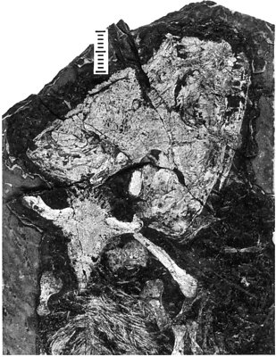

# [[Eucritta_melanolimnetes]]  

 

## #has_/text_of_/abstract 

> Eucritta (meaning "true creature") is an extinct genus of stem-tetrapod from the Viséan epoch in the Carboniferous period of Scotland. The name of the type and only species, E. melanolimnetes ("true creature from the black lagoon") is a homage to the 1954 horror film Creature from the Black Lagoon.
>
> Eucritta possessed many features in common with other generalized Carboniferous tetrapods and tetrapod relatives. A large amount of these features were plesiomorphic, meaning that they resembled the "primitive" condition that was acquired when four-limbed vertebrates ("amphibians", in the broad sense) first appeared. With a short, wide skull, large eyes, and strongly-built limbs, Eucritta proportionally resembled Balanerpeton, a contemporary terrestrial tetrapod which was one of the earliest members of Temnospondyli, a successful tetrapod group which may have produced modern amphibians. However, Eucritta lacked key temnospondyl adaptations, while also not showing certain adaptations of reptiliomorphs (the tetrapod lineage that would lead to reptiles and other amniotes). In other cases, it possesses certain characteristics in common with each. Its closest relatives may have been baphetids such as Megalocephalus, based on the possession of slight embayments on the front edge of the eye sockets.
>
> Eucritta's mosaic possession of characters seen in baphetids, "anthracosaurs" (early reptiliomorphs), and temnospondyls suggests that these three groups diverged in the Carboniferous rather than earlier, in the Devonian. Its limb proportions support terrestrial preferences while skeletal features suggest that it utilized buccal pumping, the type of breathing used by modern amphibians.
>
> [Wikipedia](https://en.wikipedia.org/wiki/Eucritta) 

## Introduction

[Jennifer A. Clack](http://www.tolweb.org/)

*Eucritta melanolimnetes* is a recently described species of tetrapod
from the Visean of Scotland. It is one of a range of tetrapods found at
the East Kirkton Quarry near Edinburgh. Other taxa include
anthracosaurs, temnospondyls, stem amniotes and aistopods, and they
represent the earliest known terrestrial tetrapod fauna. *Eucritta*
shows a mixture of temnospondyl-like (eg. wide otic notch) and
anthracosaur-like (eg. closed palate, girdle features) characters, but
also shows incipiently the anterior embayment of the orbit found in
baphetids. It clusters with baphetids in phylogenetic analyses (eg.
Clack 1998, 2001, Ruta et al. 2003), as the basalmost member of the
clade.\

{height="500" width="348"}\

Reconstruction of the skeleton of the holotype specimen of *Eucritta
melanolimnetes* (UMZC T.1347).  See Clack (2001). © [Jennifer A. Clack](http://www.zoo.cam.ac.uk/museum/jenny.htm)

## Phylogeny 

-   « Ancestral Groups  
    -   [Baphetidae](../Baphetidae.md)
    -   [Terrestrial Vertebrates](../../Terrestrial.md)
    -   [Sarcopterygii](../../../Sarc.md)
    -   [Gnathostomata](../../../../Gnath.md)
    -   [Vertebrata](../../../../../Vertebrata.md)
    -   [Craniata](../../../../../../Craniata.md)
    -   [Chordata](../../../../../../../Chordata.md)
    -   [Deuterostomia](../../../../../../../../Deutero.md)
    -   [Bilateria](Bilateria)
    -   [Animals](Animals)
    -   [Eukaryotes](Eukaryotes)
    -   [Tree of Life](../../../../../../../../../../../Tree_of_Life.md)

-   ◊ Sibling Groups of  Baphetidae
    -   Eucritta melanolimnetes

-   » Sub-Groups 

## Title Illustrations

------------------------------------------------------------------------------

  Scientific Name ::     Eucritta melanolimnetes
  Reference            see Clack, J. A. 2001 Eucritta melanolimnetes from the Early Carboniferous of Scotland, a stem tetrapod showing a mosaic of characteristics. Trans R. Soc. Ed. 92, 75-95.
  Specimen Condition   Fossil
  Type                 Holotype
  Copyright ::            © [Jennifer A. Clack](http://www.zoo.cam.ac.uk/museum/jenny.htm) 

## Confidential Links & Embeds: 

### [Eucritta_melanolimnetes](/_Standards/bio/bio~Domain/Eukaryotes/Animals/Bilateria/Deutero/Chordata/Craniata/Vertebrata/Gnath/Sarc/Tetrapods/Baphetidae/Eucritta_melanolimnetes.md) 

### [Eucritta_melanolimnetes.public](/_public/bio/bio~Domain/Eukaryotes/Animals/Bilateria/Deutero/Chordata/Craniata/Vertebrata/Gnath/Sarc/Tetrapods/Baphetidae/Eucritta_melanolimnetes.public.md) 

### [Eucritta_melanolimnetes.internal](/_internal/bio/bio~Domain/Eukaryotes/Animals/Bilateria/Deutero/Chordata/Craniata/Vertebrata/Gnath/Sarc/Tetrapods/Baphetidae/Eucritta_melanolimnetes.internal.md) 

### [Eucritta_melanolimnetes.protect](/_protect/bio/bio~Domain/Eukaryotes/Animals/Bilateria/Deutero/Chordata/Craniata/Vertebrata/Gnath/Sarc/Tetrapods/Baphetidae/Eucritta_melanolimnetes.protect.md) 

### [Eucritta_melanolimnetes.private](/_private/bio/bio~Domain/Eukaryotes/Animals/Bilateria/Deutero/Chordata/Craniata/Vertebrata/Gnath/Sarc/Tetrapods/Baphetidae/Eucritta_melanolimnetes.private.md) 

### [Eucritta_melanolimnetes.personal](/_personal/bio/bio~Domain/Eukaryotes/Animals/Bilateria/Deutero/Chordata/Craniata/Vertebrata/Gnath/Sarc/Tetrapods/Baphetidae/Eucritta_melanolimnetes.personal.md) 

### [Eucritta_melanolimnetes.secret](/_secret/bio/bio~Domain/Eukaryotes/Animals/Bilateria/Deutero/Chordata/Craniata/Vertebrata/Gnath/Sarc/Tetrapods/Baphetidae/Eucritta_melanolimnetes.secret.md)

