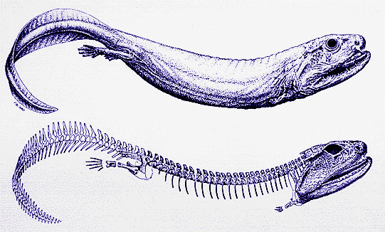
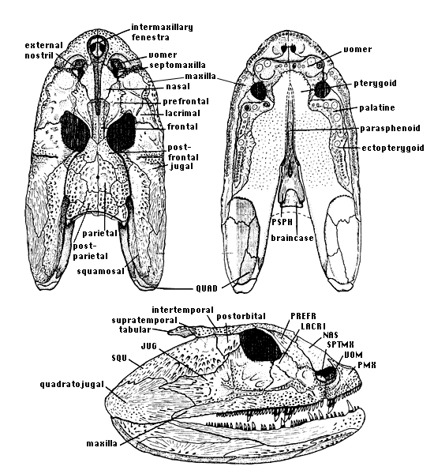
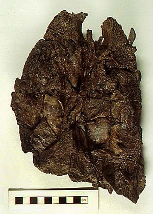

## Crassigyrinus

Crassigyrinus scoticus

 

Containing group: [Terrestrial Vertebrates](../Terrestrial.md)

## Introduction

[Jennifer A. Clack](http://www.tolweb.org/)

*Crassigyrinus scoticus* is an aquatic stem-tetrapod from the Late
Mississippian and Early Pennsylvanian (Visean and basal Namurian) of
Scotland, notable for combining bizarre specializations such as tiny
forelimbs, with a number of primitive features such as the palatal
construction. These have given rise to arguments about its taxonomic
status. It is known from three skulls, one of which is in articulation
with a fairly complete skeleton, and a couple of incomplete lower jaws.
Not only is it taxonomically enigmatic, it must also have been a
remarkable and formibable animal when alive.

### Phylogenetic Position of *Crassigyrinus*

The taxonomic position of *Crassigyrinus* has been the source of some
debate. Panchen (1985) regarded it as related to 'anthracosaurs', that
is to say embolomeres plus *Gephyrostegus* and *Eoherpeton*. The basis
for this rested upon a few characters such as 'dark dentine' in the
teeth and the form of the dermal bone ornament. Since then, other
analyses have progressively severed the link with anthracosaurs.
However, the most recent descriptive work (Clack 1998) found that it
clustered with *Whatcheeria* and the embolomeres. Since then, Ruta et
al.(2003) in an analysis including representatives of all Palaeozoic
tetrapod groups, concluded that it was the next most basal taxon after
the Devonian forms, contrasting with Clack (2002), who placed it as the
next stem taxon above the Early Carboniferous family Whatcheeriidae.

The author disagrees with the move to restrict the vernacular term
'tetrapod' to a crown clade (Gauthier et al., 1989). In this page, the
term 'tetrapod' and 'stem-tetrapod' refer only to vertebrates with limbs
and digits. (Refer to the lichen page on the [Definition of the taxon Tetrapoda](http://www.tolweb.org/accessory/Definition_of_the_Taxon_Tetrapoda?acc_id=501)
to get more information on this topic.)

### Skull

The holotype skull, from Gilmerton near Edinburgh, shows a more or less
undistorted and complete side view (Panchen 1973). The short pre-orbital
region, quadrangular orbit and extended suspensorial region are clear
from this specimen, as is the irregular, patchy nature of the dermal
ornament. The snout is somewhat compressed, obscuring its structure.
Further preparation of this and a second skull specimen showed that the
naris was peculiar. Though relatively large, it included a
cushion-shaped septomaxilla. A skull associated with a postcranial
skeleton, from the Dora Bone Bed of Cowdenbeath, Fife, (Andrews et al.
1977, Panchen 1985) shows the skull table to be similar in structure to
those of embolomeres, with unsutured junctions to the cheeks. In
contrast to embolomeres, however, it had a primitive bone-pattern with
supra-temporal/ postparietal contact. A notch between the skull table
and the cheek has been interpreted as housing a spiracle, but the stapes
is unknown.

Figure 1. Skull reconstructions of *Crassigyrinus scoticus* in dorsal
(top right), ventral (top left) and lateral (below) views. Drawing
copyright © 1997 J. A. Clack.

A third skull (BMNH 30532), also from Gilmerton, shows the palate very
clearly, and indicates that *Crassigyrinus* had a combination of a very
osteolepiform-like configuration of the vomers, and extremely
specialized, massive palatal dentition. This specimen also shows more
clearly than the other two, a bizarre fenestra between the premaxillae,
which communicated with an anterior palatal fenestra (Clack 1998). The
function of this structure is unknown. Large holes in the dorsal surface
of the dentary housed the massive palatal teeth when the jaws were
closed, a feature unique to *Crassigyrinus*. In other respects the lower
jaws prove to be rather primitive in construction (Ahlberg and Clack
1998)

Figure 2. Skull roof specimen BMNH 30532. Natural Histroy Museum London.
Photo by S. Finney. Copyright © 1997 University Museum of Zoology
Cambridge.

### Postcranial skeleton

If the skull was bizarre, the postcranial skeleton to which it attached
was correspondingly weird (see title figure). The humerus was extremely
small, no longer than the longest dimension of the orbit. It retains
some of the extra foramina seen in *Ichthyostega* and *Acanthostega*.
The ulna and radius were similarly reduced making the forelimbs
"ridiculously small" (Panchen and Smithson 1990). They articulated with
the shoulder girdle at a point very close to the jaw joint. It is not
known how many digits were present. Long curved ribs surrounded the
body, attached to centra which were poorly ossified and formed ventral
U-shaped supports for the persistent notochord. The hind limbs were
relatively small compared with a more conventional tetrapod, but were
not nearly so reduced as the forelimbs.

### Paleoecology and Lifestyle

*Crassigyrinus* was a large, long-bodied, permanently aquatic predator,
with fearsome-looking teeth in a heavily reinforced skull. The snout in
particular was consolidated and buttressed, and with a kinetic inertial
jaw mechanism, would have produced a bone-smashing snap-trap. Its large
eyes were probably adapted for use in murky coal-swampy water. Panchen
(1985) envisaged it as behaviourally somewhat analgous to a Moray eel.

## Phylogeny 

-   « Ancestral Groups  
    -   [Terrestrial Vertebrates](../Terrestrial.md)
    -   [Sarcopterygii](../../Sarc.md)
    -   [Gnathostomata](../../../Gnath.md)
    -   [Vertebrata](../../../../Vertebrata.md)
    -   [Craniata](../../../../../Craniata.md)
    -   [Chordata](../../../../../../Chordata.md)
    -   [Deuterostomia](../../../../../../../Deutero.md)
    -   [Bilateria](Bilateria)
    -   [Animals](Animals)
    -   [Eukaryotes](Eukaryotes)
    -   [Tree of Life](../../../../../../../../../../Tree_of_Life.md)

-   ◊ Sibling Groups of  Terrestrial Vertebrates
    -   [Amniota](Amniota.md)
    -   [Solenodonsaurus         janenschi](Solenodonsaurus_janenschi)
    -   [Living Amphibians](Living_Amphibians)
    -   [Seymouriamorpha](Seymouriamorpha.md)
    -   [Temnospondyli](Temnospondyli.md)
    -   [Baphetidae](Baphetidae.md)
    -   Crassigyrinus scoticus
    -   [Ichthyostega](Ichthyostega.md)
    -   [Acanthostega gunnari](Acanthostega_gunnari)

-   » Sub-Groups 

## Title Illustrations

---------------------------------------------------------------------------------------

Scientific Name ::     Crassigyrinus scoticus
Comments             skeletal and life reconstructions
Reference            Panchen, A.L. and Smithson, T.R. 1990. The pelvic girdle and hind limb of Crassigyrinus scoticus (Lydekker) from the Scottish Carboniferous and the origin of the tetrapod pelvic skeleton. Transactions of the Royal Society of Edinburgh: Earth Sciences. 81:31-44.
Specimen Condition   Fossil
Copyright ::            © 1990 Royal Society of Edinburgh

## Confidential Links & Embeds: 

### #is_/same_as :: [Crassigyrinus](/_Standards/bio/bio~Domain/Eukaryotes/Animals/Bilateria/Deutero/Chordata/Craniata/Vertebrata/Gnath/Sarc/Tetrapods/Crassigyrinus.md) 

### #is_/same_as :: [Crassigyrinus.public](/_public/bio/bio~Domain/Eukaryotes/Animals/Bilateria/Deutero/Chordata/Craniata/Vertebrata/Gnath/Sarc/Tetrapods/Crassigyrinus.public.md) 

### #is_/same_as :: [Crassigyrinus.internal](/_internal/bio/bio~Domain/Eukaryotes/Animals/Bilateria/Deutero/Chordata/Craniata/Vertebrata/Gnath/Sarc/Tetrapods/Crassigyrinus.internal.md) 

### #is_/same_as :: [Crassigyrinus.protect](/_protect/bio/bio~Domain/Eukaryotes/Animals/Bilateria/Deutero/Chordata/Craniata/Vertebrata/Gnath/Sarc/Tetrapods/Crassigyrinus.protect.md) 

### #is_/same_as :: [Crassigyrinus.private](/_private/bio/bio~Domain/Eukaryotes/Animals/Bilateria/Deutero/Chordata/Craniata/Vertebrata/Gnath/Sarc/Tetrapods/Crassigyrinus.private.md) 

### #is_/same_as :: [Crassigyrinus.personal](/_personal/bio/bio~Domain/Eukaryotes/Animals/Bilateria/Deutero/Chordata/Craniata/Vertebrata/Gnath/Sarc/Tetrapods/Crassigyrinus.personal.md) 

### #is_/same_as :: [Crassigyrinus.secret](/_secret/bio/bio~Domain/Eukaryotes/Animals/Bilateria/Deutero/Chordata/Craniata/Vertebrata/Gnath/Sarc/Tetrapods/Crassigyrinus.secret.md)

