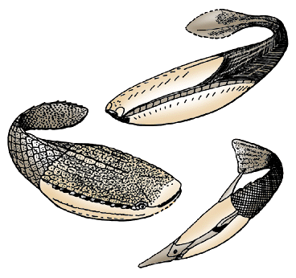

# [[Pteraspidomorphi]]

 

Interrelationships of the Pteraspidomorphi.

The main characteristics supporting the nodes of this phylogeny are:

-   **Node 1**: Gill openings along the dorsolateral margin of the head
    armor.
-   **Node 2**: Dentine with large tubules in tubercles.

Containing group: [Vertebrata](../Vertebrata.md)

## Introduction

[Philippe Janvier]() 

The Pteraspidomorphi, or pteraspidomorphs, is a group of fossil jawless
vertebrates which lived from the Early Ordovician to the Late Devonian
(i.e. from 470 to 370 million years ago). They possess and extensive
dermal armor covering the head, and a scaly tail. They have no other fin
than the caudal fin. Their head armor, which always comprises large,
median dorsal and ventral plates (or shields), is generally oblong, and
this gives them the aspect of a tadpole. Pteraspidormorphs have long
been regarded as closely related -or even ancestral- to jawed
vertebrates, but the few characteristics they share with the latter are
now considered as primitive for all vertebrates.

Most pteraspidomorphs were marine, but lived very near to the shore, in
lagoons and deltas. Some groups are thought to have been fresh water.
They were certainly bottom-dewellers, as shown by traces of abrasion of
the ventral surface of their headshield.

### Characteristics

Pteraspidomorphs are characterized by:

-   Large, median ventral and dorsal dermal plates, or \"discs\", which
    form most of the head armor.
-   Oak leaf-shaped tubercles on the dermal plates (lost independently
    several times)

The Pteraspidomorphi include four clades, the Arandaspida, Astraspida,
Eriptychiida and Heterostraci. Their dermal plates and scales are made
up of acellular bone, or aspidine, but this is thought to be a primitive
condition for the dermal bone of all bony vertebrates. Pteraspidomorphs
have no calcified endoskeleton, except for eriptychiids and possibly
arandaspids, which show traces of calcified cartilage. Pteraspidomorphs
generally have a fusiform shape, with a head armor almost as long as the
body, and have no other fin than the caudal fin, which is generally pad-
or fan-shaped. The mouth is armed with elongate dermal plates which
could expand as the mouth opened, and served as a scoop. The internal
surface of the dermal plates -at any rate in heterostracans- shows
impressions of the gills, brain, two vertical semicircular canal and
distinctly paired nasal capsules. The nasal capsules of heterostracans
seem to have opened ventrally into a separate median duct comparable to
the nasopharyngeal duct of hagfishes. They are put among the Vertebrata
because some heterostracans show impressions of arcualia (dorsal
components of the vertebrae), and because they have a well-developed
sensory-line system.

### Discussion of Phylogenetic Relationships

Pteraspidomorphs have been first regarded as related to bony fishes,
then to sharks, then ancestral to hagfishes, and finally as the closest
jawless relatives of the gnathostomes. This last theory was based on the
fact that they seem to have a paired olfactory organ and a sensory-line
pattern which is quite similar to that of the gnathostomes. These
characteristics are, however, likely to be general for either the
vertebrates or, at any rate, for the ensemble of all \"ostracoderms\"+
the gnathostomes. Other \"ostracoderms\", such as the Galeaspida are now
known to have a paired olfactory organ. Current phylogenetic analysis
using a large number of characteristics (see Vertebrata page) now place
pteraspidomorphs as the sister-group of all other \"ostracoderms\" and
the gnathostomes.

The interrelationships of the Pteraspidomorphi are still poorly
corroborated. The Astraspida share with the Heterostraci the
dorsolateral position of the gill openings (single in heterostracans).
The poorly known Eriptychiida seem to share with the Heterostraci the
same type of dentine in the tubercles.

## Phylogeny 

-   « Ancestral Groups  
    -   [Vertebrata](../Vertebrata.md)
    -   [Craniata](../../Craniata.md)
    -   [Chordata](../../../Chordata.md)
    -   [Deuterostomia](../../../../Deutero.md)
    -   [Bilateria](Bilateria)
    -   [Animals](Animals)
    -   [Eukaryotes](Eukaryotes)
    -   [Tree of Life](../../../../../../../Tree_of_Life.md)

-   ◊ Sibling Groups of  Vertebrata
    -   [Hyperoartia](Hyperoartia.md)
    -   [Euconodonta](Euconodonta.md)
    -   Pteraspidomorphi
    -   [Thelodonti](Thelodonti.md)
    -   [Anaspida](Anaspida.md)
    -   [Galeaspida](Galeaspida.md)
    -   [Pituriaspida](Pituriaspida.md)
    -   [Osteostraci](Osteostraci.md)
    -   [Gnathostomata](Gnath.md)

-   » Sub-Groups
    -   [Heterostraci](Pteraspidomorphi/Heterostraci.md)
    -   [Eriptychiida](Pteraspidomorphi/Eriptychiida.md)
    -   [Astraspida](Pteraspidomorphi/Astraspida.md)
    -   [Arandaspida](Pteraspidomorphi/Arandaspida.md)

## Title Illustrations

Pteraspidomorphs are among the earliest known vertebrates. They were
jawless and possessed a massive dermal skeleton. They are characterized
by their dermal head armor having large, median, ventral and dorsal
plates or \"shields\" (red). (after Janvier 1996)

  Copyright ::   © 1997 Philippe Janvier

## Confidential Links & Embeds: 

### [Pteraspidomorphi](/_Standards/bio/bio~Domain/Eukaryotes/Animals/Bilateria/Deutero/Chordata/Craniata/Vertebrata/Pteraspidomorphi.md) 

### [Pteraspidomorphi.public](/_public/bio/bio~Domain/Eukaryotes/Animals/Bilateria/Deutero/Chordata/Craniata/Vertebrata/Pteraspidomorphi.public.md) 

### [Pteraspidomorphi.internal](/_internal/bio/bio~Domain/Eukaryotes/Animals/Bilateria/Deutero/Chordata/Craniata/Vertebrata/Pteraspidomorphi.internal.md) 

### [Pteraspidomorphi.protect](/_protect/bio/bio~Domain/Eukaryotes/Animals/Bilateria/Deutero/Chordata/Craniata/Vertebrata/Pteraspidomorphi.protect.md) 

### [Pteraspidomorphi.private](/_private/bio/bio~Domain/Eukaryotes/Animals/Bilateria/Deutero/Chordata/Craniata/Vertebrata/Pteraspidomorphi.private.md) 

### [Pteraspidomorphi.personal](/_personal/bio/bio~Domain/Eukaryotes/Animals/Bilateria/Deutero/Chordata/Craniata/Vertebrata/Pteraspidomorphi.personal.md) 

### [Pteraspidomorphi.secret](/_secret/bio/bio~Domain/Eukaryotes/Animals/Bilateria/Deutero/Chordata/Craniata/Vertebrata/Pteraspidomorphi.secret.md)

