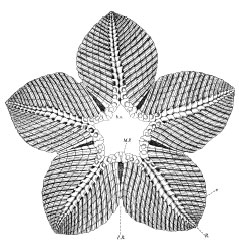
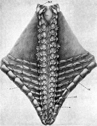
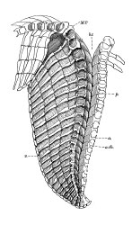
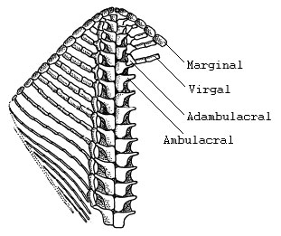
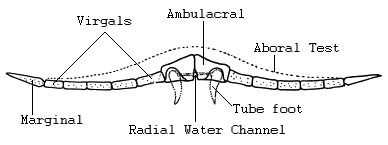

---
title: Somasteroidea
---

# [[Somasteroidea]]

## #has_/text_of_/abstract 

> The **Somasteroidea**, or Stomasteroidea, is an extinct order of asterozoan echinoderms first defined in 1951 by W. K. Spencer. Their first appearance in the fossil record was in the Early Ordovician (Tremadocian) and they had become extinct by the Late Devonian (Famennian). They are similar to the asteroids in that their bodies are flattened dorsoventrally and they have five petaloid arms with broad bases. The ambulacral plates in somasteroids are simple and unspecialized, and the arms were thought to be not flexible and were unable to assist in feeding, but the oral mouth parts were more complex.
>
> [Wikipedia](https://en.wikipedia.org/wiki/Somasteroidea) 

## Introduction

[Alexander E. Primus](http://www.tolweb.org/) 

*Somasteroidea* are an extinct subclass of asterozoan echinoderms
(star-shaped echinoderms), known to have lived during the early
Paleozoic (Spencer, 1951). Somasteroids first appear in the fossil
record in the Early Ordovician (Tremadocian, \~510-493 Ma), just prior
to the appearance of the other two asterozoan classes, *Asteroidea* (sea
stars) and *Ophiuroidea* (brittle stars). While the asteroids and
ophiuroids have subsequently undergone extensive radiations and
represent the two most successful extant echinoderm classes, somasteroid
forms do not appear in the fossil record after the late Devonian and are
therefore thought to have been extinct since then (Spencer, 1951; Blake,
1982).

Somasteroids are flattened, fivefold radially symmetrical echinoderms
that range in shape from that of a pentagon to that of a star with
protruding arms. It appears that somasteroids were benthic marine
animals that were filter- and/or detritus-feeders. Despite their
relatively rigid arm structure, somasteroids are thought to have been
somewhat mobile and able to scavenge along the ocean floor (Spencer,
1951).

### Characteristics

Spencer\'s (1951) original organization of the early asterozoans was
primarily based upon the activities of the arms with respect to feeding.
While early asteroids had stout and muscular arms, adapted for a
carnivorous diet of large food items, and early ophiuroids had long and
narrow arms, adapted for feeding on small food particles present in or
near the sea floor, the broad, undifferentiated, petaloid arms of
somasteroids appeared to have had little or no role in feeding. More
contemporary classification schemes of the asterozoans have relied upon
the subsequent diversification of certain asterozoan arm morphological
characteristics, such as the types and organization of arm skeletal
elements. In the following description of somasteroid morphology,
comparisons to asteroid and ophiuroid morphology will be made in an
effort to signify some of the key defining characteristics.

Asterozoans, as described by Spencer (1951), have an appreciably
flattened central body cavity from which five arms extend. As in
asteroids, the arms and body of somasteroids are fully continuous. The
arms and the disk-like body of ophiuroids, on the other hand, are
clearly discontinuous. The two flat sides of asterozoans comprise the
oral and aboral surfaces, of which the oral side is in contact with the
substrate. A disjunct ossicular skeleton called a test covers both oral
and aboral surfaces of asterozoans. Adjacent skeletal ossicles of the
test are not rigidly fused as they are in crinoids and most echinoids,
but are joined with connective and muscular tissues. The ossicular
skeleton of somasteroids is often refered to as simple or
undifferentiated when compared to that of asteroids and ophiuroids.
Nevertheless, while the aboral test of somasteroids is composed of a
single ossicle type (paxillae with tetraradiate bases), the oral test is
significantly more complex (see Figures 1 and 2).

Figure 1. Interpretation of one arm of *Ampullaster ubaghasi*
(*Villebrunasteridae*), view of oral test.\
Figure modified from Fell (1963b). Drawing by H. B. Fell. Copyright ©
1963 Royal Society of London.

The oral surface of each arm consists of two adjacent rows of recumbent
ambulacral plates (ambulacrals). These ambulacrals, presumably involved
in feeding, extend from the centrally located mouth to the tip of each
arm. In asteroids, ophiuroids and most somasteroids, adjacent
ambulacrals are arranged in a paired manner. In some early somasteroids,
however, adjacent ambulacrals are alternately arranged. Each ambulacral
gives rise to a transverse series of ossicles (metapinnules). These
ossicles can occur as undifferentiated rod-like elements called virgals
(found only in somasteroids), or as various differentiated elements
including adambulacrals, intermediate ossicles, and marginal ossicles.
When present in somasteroids and ophiuroids, adambulacrals are
positioned laterally with respect to ambulacrals. In asteroids, however,
adambulacrals are located underneath the ambulacrals. In addition, in
asteroids the ambulacral plates are raised slightly off the surface upon
which they sit, creating a space between the ambulacrals and the
substrate. This space is often refered to as the ambulacral furrow or
groove. Somasteroids and ophiuroids lack a permanent ambulacral furrow,
although it appears that some derived somasteroids may have been able to
create a temporary ambulacral furrow through muscular flexures.

Figure 2. Reconstructed cross-section of one arm of *Chininanaster* sp.
(*Chinianasteridae*).\
Figure modified from Fell (1963b). Drawing by H. B. Fell. Copyright ©
1963 Royal Society of London.

Radial water vessels extend the length of each arm within a radial
channel formed by the recumbent ambulacral plates and give rise to
numerous tube feet (Figure 2). In somasteroids, the radial water vessel
is often positioned at the oral-marginal junction of ambulacrals, as in
asteroids, but can also be enclosed within the ambulacral plates, as in
ophiuroids. Tube feet branching from the radial water vessels are seated
in broad basins that, in some species, also give rise to ampulae that
extend into the body cavity through ambulacral pores. The jaw ossicles
of somasteroids are differentiated with small mouth angle plates, in
contrast to those of asteroids that lack odontophores (McKnight, 1975).
Buccal slits, which function primarily as respiratory structures in
ophiuroids, may or may not have been present adjacent to the mouth frame
in somasteroids.

### Origin of Somasteroidea

Discussions addressing somasteroid origins have certainly been a major
point of contention through the years primarily because the intermediate
forms that gave rise to the somasteroids are lacking from the fossil
record (Blake and Guensburg 1993; Blake, 1994). It seems most likely,
however, that the somasteroids emerged from either a crinoid lineage
(Fell, 1963; Mooi and David, 2000), or an edrioasteroid lineage (Paul
and Smith, 1984; Smith 1988b).

### Discussion of Phylogenetic Relationships

Informative evolutionary and phylogenetic analyses within
*Somasteroidea* have been quite difficult because the examination and
characterization of the group has been somewhat limited. What is known
about the diversification of somasteroids, however, is primarily derived
from work on three lower Ordovician families: *Chinianasteridae*
(Tremadoc-Early Arenig), *Villebrunasteridae* (Tremadoc-Early Arenig),
and *Archegonasteridae* (Late Arenig), as discussed by Nichols (1962),
Fell (1963), and Blake (1982).

The Family *Chinianasteridae* is thought to include the most basal group
of somasteroids based on the presence of undifferentiated virgals and
robust ambulacrals, in addition to the absence of ampulae. The more
derived Family *Villebrunasteridae* has differentiated virgals that
include adambulacral, oral intermediate, and distinct marginal elements.
Members of this group also have internal ampulae that provide a more
direct connection between the body cavity and the environment. The most
derived of these three families, the *Archegonasteridae*, represent the
most thoroughly examined group of somasteroids. The *Archegonasteridae*
have undergone a virgal reduction and have changed their body shape
slightly from their predecessors to a more or less pentagonal outline
with no interradial slits. In addition, *Archegonasteridae* specimens
appear to have a more robust mouth frame than the more basal
somasteroids and are often preserved with an ambulacral furrow. The
latter two of these *Archeogasteridae* characteristics are also quite
typical of asteroids and may very well have facilitated an adaptive
change in feeding behavior from scavenging to predation.

### Classification of Somasteroidea

The first organized classification of *Somasteroidea* was carried out by
W. K. Spencer (1951). In his report, Spencer describes some of the
earliest asteroid and ophiuroid specimens ever found. In addition, he
describes fossils of a third asterozoan group, the somasteroids, which
occur not only contemporaneously with, but also prior to all
recognizable asteroid and ophiuroid fossil forms. These findings are
suggestive of a scenario in which all asterozoans arose from ancient
somasteroid forms.

Spencer (1951) assigned one order, *Goniactinida*, to the subclass
*Somasteroidea*. Within this order he assigned two families,
*Chinianasteridae*, including the genera *Chinianaster* (Tremadoc-Early
Arenig) and *Villebrunaster* (Tremadoc-Early Arenig), and
*Archegonasteridae*, composed of one genus, *Archegonaster* (Late
Arenig). Subsequently, a seemingly extant somasteroid was identified by
Fell (1962) in the Pacific off the coast of southern Mexico. This extant
specimen, *Platasterias latiradiata*, was placed into a new somasteroid
family, *Platasteriidae* (Fell, 1963a). The following year, Fell (1963b)
reclassified the entire *Asterozoa*, and in so doing, removed
*Villebrunaster* from the family *Chinianasteridae* and placed it in its
own family *Villebrunasteridae*. Spencer and Wright (1966) added one
more family, *Archophiactinidae* composed of three genera,
*Archophiactis* (Late Ordovician), *Stuertzurea* (Silurian), and
*Lepidasterina* (Late Devonian). McKnight (1975) then placed one more
family, *Helianthasteridae*, previously an asteroid group, into
*Somasteroidea*. The extant *Platasterias latiradiata* was subsequently
reclassified by D. B. Blake (1982) and was placed in the *Asteroidea*.
*Platasteriidae* was consequently removed from the somasteroids. This
left five families and between 8-12 genera in the subclass
*Somasteroidea* (Smith and Jell, 1990), as can be seen in the cladogram,
based on Spencer and Wright (1966), McKnight (1975), and Blake (1982),
shown above.

## Phylogeny 

-   « Ancestral Groups  
    -   [Echinodermata](../Echinodermata.md)
    -   [Deuterostomia](../../Deutero.md)
    -   [Bilateria](Bilateria)
    -   [Animals](Animals)
    -   [Eukaryotes](Eukaryotes)
    -   [Tree of Life](../../../../../Tree_of_Life.md)

-   ◊ Sibling Groups of  Echinodermata
    -   [Crinoidea](Crinoidea.md)
    -   [Asteroidea](Asteroidea.md)
    -   Somasteroidea
    -   [Holothuroidea](Holothuroidea.md)

-   » Sub-Groups 

## Title Illustrations

------------------------------------

Scientific Name ::     Villebrunaster thorali (Villebrunasteridae)
Location ::           from south France
Reference            After Spencer, W.K. 1951. Early Paleozoic starfish. Phil. Trans. R. Soc. Lond., ser. B 235:87-129.
Specimen Condition   Fossil \-- Period: Lower Ordovician, Tremadoc-Early Arenig
Body Part            ventral side showing schematic of oral test
Copyright ::            © 1951 Royal Society of London

------------------------------------

Scientific Name ::     Archegonaster pentagonus (Archegonasteridae)
Location ::           from former Czechoslovakia
Reference            After Spencer, W.K. 1951. Early Paleozoic starfish. Phil. Trans. R. Soc. Lond., ser. B 235:87-129.
Specimen Condition   Fossil \-- Period: Lower Ordovician, Late Arenig
Body Part            ventral side showing schematic of oral test
Copyright ::            © 1951 Royal Society of London

------------------------------------

Scientific Name ::     Chinianaster levyi (Chinianasteridae)
Location ::           from south France
Reference            After Spencer, W.K. 1951. Early Paleozoic starfish. Phil. Trans. R. Soc. Lond., ser. B 235:87-129.
Specimen Condition   Fossil \-- Period: Lower Ordovician, Tremadoc-Early Arenig
Body Part            ventral side showing schematic of oral test
Copyright ::            © 1951 Royal Society of London

## Confidential Links & Embeds: 

### #is_/same_as :: [Somasteroidea](/_Standards/bio/bio~Domain/Eukaryotes/Animals/Bilateria/Deutero/Echinodermata/Somasteroidea.md) 

### #is_/same_as :: [Somasteroidea.public](/_public/bio/bio~Domain/Eukaryotes/Animals/Bilateria/Deutero/Echinodermata/Somasteroidea.public.md) 

### #is_/same_as :: [Somasteroidea.internal](/_internal/bio/bio~Domain/Eukaryotes/Animals/Bilateria/Deutero/Echinodermata/Somasteroidea.internal.md) 

### #is_/same_as :: [Somasteroidea.protect](/_protect/bio/bio~Domain/Eukaryotes/Animals/Bilateria/Deutero/Echinodermata/Somasteroidea.protect.md) 

### #is_/same_as :: [Somasteroidea.private](/_private/bio/bio~Domain/Eukaryotes/Animals/Bilateria/Deutero/Echinodermata/Somasteroidea.private.md) 

### #is_/same_as :: [Somasteroidea.personal](/_personal/bio/bio~Domain/Eukaryotes/Animals/Bilateria/Deutero/Echinodermata/Somasteroidea.personal.md) 

### #is_/same_as :: [Somasteroidea.secret](/_secret/bio/bio~Domain/Eukaryotes/Animals/Bilateria/Deutero/Echinodermata/Somasteroidea.secret.md)

