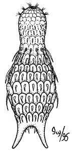

# [[Gastrotricha]] 

 

## #has_/text_of_/abstract 

> The gastrotrichs (phylum **Gastrotricha**), commonly referred to as hairybellies or hairybacks, are a group of microscopic (0.06–3.0 mm), cylindrical, acoelomate animals, and are widely distributed and abundant in freshwater and marine environments. They are mostly benthic and live within the periphyton, the layer of tiny organisms and detritus that is found on the seabed and the beds of other water bodies. The majority live on and between particles of sediment or on other submerged surfaces, but a few species are terrestrial and live on land in the film of water surrounding grains of soil. Gastrotrichs are divided into two orders, the Macrodasyida which are marine (except for two species), and the Chaetonotida, some of which are marine and some freshwater. Nearly 800 species of gastrotrich have been described.
>
> Gastrotrichs have a simple body plan with a head region, with a brain and sensory organs, and a trunk with a simple gut and the reproductive organs. They have adhesive glands with which they can anchor themselves to the substrate and cilia with which they move around. They feed on detritus, sucking up organic particles with their muscular pharynx. They are hermaphrodites, the marine species producing eggs which develop directly into miniature adults. The freshwater species are parthenogenetic, producing unfertilised eggs, and at least one species is viviparous. Gastrotrichs mature with great rapidity and have lifespans of only a few days.
>
> [Wikipedia](https://en.wikipedia.org/wiki/Gastrotrich) 

## Phylogeny 

-   « Ancestral Groups  
    -   [Bilateria](Bilateria)
    -   [Animals](Animals)
    -   [Eukaryotes](Eukaryotes)
    -   [Tree of Life](../../../Tree_of_Life.md)

-   ◊ Sibling Groups of  Bilateria
    -   [Deuterostomia](Deutero.md)
    -   [Arthropoda](Arthropoda)
    -   [Onychophora](Onychophora)
    -   [Tardigrade](Tardigrade.md)
    -   [Nematoda](Nematoda)
    -   [Nematomorpha](Nematomorpha)
    -   [Kinorhyncha](Kinorhyncha)
    -   [Loricifera](Loricifera)
    -   [Priapulida](Priapulida)
    -   [Arrow_Worm](Arrow_Worm.md)
    -   Gastrotricha
    -   [Rotifera](Rotifera)
    -   [Gnathostomulida](Gnathostomulida)
    -   [Limnognathia maerski](Limnognathia_maerski)
    -   [Cycliophora](Cycliophora)
    -   [Mesozoa](Mesozoa)
    -   [Platyhelminthes](Platyhelminthes)
    -   [Annelida](Annelida)
    -   [Bryozoa](Bryozoa)
    -   [Sipuncula](Sipuncula)
    -   [Mollusca](Mollusca)
    -   [Nemertea](Nemertea)
    -   [Entoprocta](Entoprocta)
    -   [Phoronida](Phoronida)
    -   [Brachiopoda](Brachiopoda)

-   » Sub-Groups 

## Title Illustrations

Diagram showing the major external features of a gastrotrich.\
Drawing by Ivy Livingstone. Copyright © 1995
[BIODIDAC](http://biodidac.bio.uottawa.ca/index.htm).

--------------------------------------------------------------------------

Copyright ::   © 1995 [BIODIDAC](http://biodidac.bio.uottawa.ca/index.htm) 

## Confidential Links & Embeds: 

### #is_/same_as :: [Gastrotricha](/_Standards/bio/bio~Domain/Eukaryotes/Animals/Bilateria/Gastrotricha.md) 

### #is_/same_as :: [Gastrotricha.public](/_public/bio/bio~Domain/Eukaryotes/Animals/Bilateria/Gastrotricha.public.md) 

### #is_/same_as :: [Gastrotricha.internal](/_internal/bio/bio~Domain/Eukaryotes/Animals/Bilateria/Gastrotricha.internal.md) 

### #is_/same_as :: [Gastrotricha.protect](/_protect/bio/bio~Domain/Eukaryotes/Animals/Bilateria/Gastrotricha.protect.md) 

### #is_/same_as :: [Gastrotricha.private](/_private/bio/bio~Domain/Eukaryotes/Animals/Bilateria/Gastrotricha.private.md) 

### #is_/same_as :: [Gastrotricha.personal](/_personal/bio/bio~Domain/Eukaryotes/Animals/Bilateria/Gastrotricha.personal.md) 

### #is_/same_as :: [Gastrotricha.secret](/_secret/bio/bio~Domain/Eukaryotes/Animals/Bilateria/Gastrotricha.secret.md)

