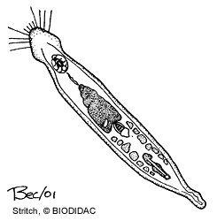

# [[Gnathostomulida]] 

Jaw Worms 

 

## #has_/text_of_/abstract 

> Gnathostomulids, or jaw worms, are a small phylum of nearly microscopic marine animals. They inhabit sand and mud beneath shallow coastal waters and can survive in relatively anoxic environments. They were first recognised and described in 1956.
>
> [Wikipedia](https://en.wikipedia.org/wiki/Gnathostomulid) 

## Phylogeny 

-   « Ancestral Groups  
    -   [Bilateria](Bilateria)
    -   [Animals](Animals)
    -   [Eukaryotes](Eukaryotes)
    -   [Tree of Life](../../../Tree_of_Life.md)

-   ◊ Sibling Groups of  Bilateria
    -   [Deuterostomia](Deutero.md)
    -   [Arthropoda](Arthropoda)
    -   [Onychophora](Onychophora)
    -   [Tardigrade](Tardigrade.md)
    -   [Nematoda](Nematoda)
    -   [Nematomorpha](Nematomorpha)
    -   [Kinorhyncha](Kinorhyncha)
    -   [Loricifera](Loricifera)
    -   [Priapulida](Priapulida)
    -   [Arrow_Worm](Arrow_Worm.md)
    -   [Gastrotricha](Gastrotricha)
    -   [Rotifera](Rotifera)
    -   Gnathostomulida
    -   [Limnognathia maerski](Limnognathia_maerski)
    -   [Cycliophora](Cycliophora)
    -   [Mesozoa](Mesozoa)
    -   [Platyhelminthes](Platyhelminthes)
    -   [Annelida](Annelida)
    -   [Bryozoa](Bryozoa)
    -   [Sipuncula](Sipuncula)
    -   [Mollusca](Mollusca)
    -   [Nemertea](Nemertea)
    -   [Entoprocta](Entoprocta)
    -   [Phoronida](Phoronida)
    -   [Brachiopoda](Brachiopoda)

-   » Sub-Groups 

## Title Illustrations

Representative body plan of a gnathostomulid.\
Drawing by Stritch. Copyright ©
[BIODIDAC](http://biodidac.bio.uottawa.ca/index.htm).

------------------------------------------------------------------------

Copyright ::   © [BIODIDAC](http://biodidac.bio.uottawa.ca/index.htm) 

