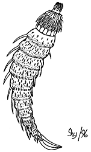

# [[Kinorhyncha]] 

## #has_/text_of_/abstract 

> **Kinorhyncha**  (Ancient Greek: κινέω, romanized: kīnéō, lit. 'I move', ῥύγχος rhúnkhos "snout") is a phylum of small marine invertebrates that are widespread in mud or sand at all depths as part of the meiobenthos. They are commonly called mud dragons. Modern species are 1 mm (0.039 in) or less, but Cambrian forms could reach 4 cm (1.6 in).
>
> [Wikipedia](https://en.wikipedia.org/wiki/Kinorhyncha) 

## Phylogeny 

-   « Ancestral Groups  
    -   [Bilateria](Bilateria)
    -   [Animals](Animals)
    -   [Eukaryotes](Eukaryotes)
    -   [Tree of Life](../../../Tree_of_Life.md)

-   ◊ Sibling Groups of  Bilateria
    -   [Deuterostomia](Deutero.md)
    -   [Arthropoda](Arthropoda)
    -   [Onychophora](Onychophora)
    -   [Tardigrade](Tardigrade.md)
    -   [Nematoda](Nematoda)
    -   [Nematomorpha](Nematomorpha)
    -   Kinorhyncha
    -   [Loricifera](Loricifera)
    -   [Priapulida](Priapulida)
    -   [Arrow_Worm](Arrow_Worm.md)
    -   [Gastrotricha](Gastrotricha)
    -   [Rotifera](Rotifera)
    -   [Gnathostomulida](Gnathostomulida)
    -   [Limnognathia maerski](Limnognathia_maerski)
    -   [Cycliophora](Cycliophora)
    -   [Mesozoa](Mesozoa)
    -   [Platyhelminthes](Platyhelminthes)
    -   [Annelida](Annelida)
    -   [Bryozoa](Bryozoa)
    -   [Sipuncula](Sipuncula)
    -   [Mollusca](Mollusca)
    -   [Nemertea](Nemertea)
    -   [Entoprocta](Entoprocta)
    -   [Phoronida](Phoronida)
    -   [Brachiopoda](Brachiopoda)

-   » Sub-Groups 
	-   *Cyclorhagida*
	    -   *Echinoderidae*
	    -   *Dracoderidae*
	    -   *Zelinkaderidae*
	    -   *Centroderidae*
	    -   *Semnoderidae*
	    -   *Cateridae*
	-   *Homalorhagida*
	    -   *Neocentrophyidae*
	    -   *Pycnophyidae*

## Title Illustrations

Major external features of a kinorhynchan.\
Drawing by Ivy Livingstone. Copyright © 1996
[BIODIDAC](http://biodidac.bio.uottawa.ca/index.htm).

--------------------------------------------------------------------------
 
Copyright ::   © 1996 [BIODIDAC](http://biodidac.bio.uottawa.ca/index.htm) 

## Confidential Links & Embeds: 

### [Kinorhyncha](/_Standards/bio/bio~Domain/Eukaryotes/Animals/Bilateria/Kinorhyncha.md) 

### [Kinorhyncha.public](/_public/bio/bio~Domain/Eukaryotes/Animals/Bilateria/Kinorhyncha.public.md) 

### [Kinorhyncha.internal](/_internal/bio/bio~Domain/Eukaryotes/Animals/Bilateria/Kinorhyncha.internal.md) 

### [Kinorhyncha.protect](/_protect/bio/bio~Domain/Eukaryotes/Animals/Bilateria/Kinorhyncha.protect.md) 

### [Kinorhyncha.private](/_private/bio/bio~Domain/Eukaryotes/Animals/Bilateria/Kinorhyncha.private.md) 

### [Kinorhyncha.personal](/_personal/bio/bio~Domain/Eukaryotes/Animals/Bilateria/Kinorhyncha.personal.md) 

### [Kinorhyncha.secret](/_secret/bio/bio~Domain/Eukaryotes/Animals/Bilateria/Kinorhyncha.secret.md)

