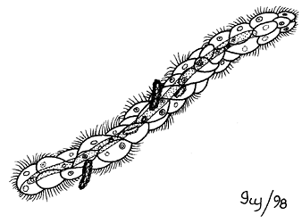

# [[Mesozoa]] 

    

## #has_/text_of_/abstract 

> The **Mesozoa** are minuscule, worm-like parasites of marine invertebrates. Generally, these tiny, elusive creatures consist of a somatoderm (outer layer) of ciliated cells surrounding one or more reproductive cells.
>
> A 2017 study recovered Mesozoa as a monophyletic group that emerged in the Lophotrochozoa as sister of the Rouphozoa.
>
> Some workers previously classified Mesozoa as the sole phylum of the lonely subkingdom Agnotozoa. Cavalier-Smith argued that at least some of the mesozoans are in fact protistans, not animals.
>
> In the 19th century, the Mesozoa were a wastebasket taxon for multicellular organisms which lacked the invaginating gastrula which was thought to define the Metazoa.
>
> [Wikipedia](https://en.wikipedia.org/wiki/Mesozoa) 

## Phylogeny 

-   « Ancestral Groups  
    -   [Bilateria](Bilateria)
    -   [Animals](Animals)
    -   [Eukaryotes](Eukaryotes)
    -   [Tree of Life](../../../Tree_of_Life.md)

-   ◊ Sibling Groups of  Bilateria
    -   [Deuterostomia](Deutero.md)
    -   [Arthropoda](Arthropoda)
    -   [Onychophora](Onychophora)
    -   [Tardigrade](Tardigrade.md)
    -   [Nematoda](Nematoda)
    -   [Nematomorpha](Nematomorpha)
    -   [Kinorhyncha](Kinorhyncha)
    -   [Loricifera](Loricifera)
    -   [Priapulida](Priapulida)
    -   [Arrow_Worm](Arrow_Worm.md)
    -   [Gastrotricha](Gastrotricha)
    -   [Rotifera](Rotifera)
    -   [Gnathostomulida](Gnathostomulida)
    -   [Limnognathia maerski](Limnognathia_maerski)
    -   [Cycliophora](Cycliophora)
    -   Mesozoa
    -   [Platyhelminthes](Platyhelminthes)
    -   [Annelida](Annelida)
    -   [Bryozoa](Bryozoa)
    -   [Sipuncula](Sipuncula)
    -   [Mollusca](Mollusca)
    -   [Nemertea](Nemertea)
    -   [Entoprocta](Entoprocta)
    -   [Phoronida](Phoronida)
    -   [Brachiopoda](Brachiopoda)

-   » Sub-Groups 
	-   *Rhombozoa*
	    -   *Conocyemidae*
	    -   *Dicyemidae*
	    -   *Kantharellidae*
	-   *Orthonectida*
	    -   *Pelmatosphaeridae*
	    -   *Rhopaluridae*

## Title Illustrations

-   Rhopalura (Orthonectida) male and female
-   Dicyema (Rhombozoa) adult, nematogen stage

--------------------------------------------------------------------------
Drawings by by Ivy Livingstone. Copyright © [BIODIDAC](http://biodidac.bio.uottawa.ca/index.htm)

Copyright ::   © 1999 [BIODIDAC](http://biodidac.bio.uottawa.ca/index.htm) 

--------------------------------------------------------------------------

Copyright ::   © 1998 [BIODIDAC](http://biodidac.bio.uottawa.ca/index.htm) 

