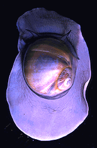
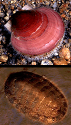

## Phylogeny 

-   « Ancestral Groups  
    -   [Bilateria](Bilateria)
    -   [Animals](Animals)
    -   [Eukaryotes](Eukaryotes)
    -   [Tree of Life](../../../Tree_of_Life.md)

-   ◊ Sibling Groups of  Bilateria
    -   [Deuterostomia](Deutero.md)
    -   [Arthropoda](Arthropoda)
    -   [Onychophora](Onychophora)
    -   [Tardigrade](Tardigrade.md)
    -   [Nematoda](Nematoda)
    -   [Nematomorpha](Nematomorpha)
    -   [Kinorhyncha](Kinorhyncha)
    -   [Loricifera](Loricifera)
    -   [Priapulida](Priapulida)
    -   [Arrow_Worm](Arrow_Worm.md)
    -   [Gastrotricha](Gastrotricha)
    -   [Rotifera](Rotifera)
    -   [Gnathostomulida](Gnathostomulida)
    -   [Limnognathia maerski](Limnognathia_maerski)
    -   [Cycliophora](Cycliophora)
    -   [Mesozoa](Mesozoa)
    -   [Platyhelminthes](Platyhelminthes)
    -   [Annelida](Annelida)
    -   [Bryozoa](Bryozoa)
    -   [Sipuncula](Sipuncula)
    -   Mollusca
    -   [Nemertea](Nemertea)
    -   [Entoprocta](Entoprocta)
    -   [Phoronida](Phoronida)
    -   [Brachiopoda](Brachiopoda)

-   » Sub-Groups
    -   [Chitons](Mollusca/Chitons.md)
    -   [Bivalvia](Bivalvia.md)
    -   [Gastropoda](Gastropoda.md)
    -   [Cephalopoda](Cephalopoda.md)

# [[Mollusca]]

Snails, clams, mussels, squids, octopi, chitons, and tusk shells 

 
 

## #has_/text_of_/abstract 

> **Mollusca** is a phylum of protostomic invertebrate animals, whose members are known as molluscs or mollusks (). Around 76,000 extant species of molluscs are recognized, making it the second-largest animal phylum after Arthropoda. The number of additional fossil species is estimated between 60,000 and 100,000, and the proportion of undescribed species is very high. Many taxa remain poorly studied.
>
> Molluscs are the largest marine phylum, comprising about 23% of all the named marine organisms. They are highly diverse, not just in size and anatomical structure, but also in behaviour and habitat, as numerous groups are freshwater and even terrestrial species. The phylum is typically divided into 7 or 8 taxonomic classes, of which two are entirely extinct. Cephalopod molluscs, such as squid, cuttlefish, and octopuses, are among the most neurologically advanced of all invertebrates—and either the giant squid or the colossal squid is the largest known extant invertebrate species. The gastropods (snails, slugs and abalone) are by far the most diverse class and account for 80% of the total classified molluscan species.
>
> The four most universal features defining modern molluscs are a soft body composed almost entirely of muscle, a mantle with a significant cavity used for breathing and excretion, the presence of a radula (except for bivalves), and the structure of the nervous system. Other than these common elements, molluscs express great morphological diversity, so many textbooks base their descriptions on a "hypothetical ancestral mollusc" (see image below). This has a single, "limpet-like" shell on top, which is made of proteins and chitin reinforced with calcium carbonate, and is secreted by a mantle covering the whole upper surface. The underside of the animal consists of a single muscular "foot". Although molluscs are coelomates, the coelom tends to be small.
>
> The main body cavity is a hemocoel through which blood circulates; as such, their circulatory systems are mainly open. The "generalized" mollusc's feeding system consists of a rasping "tongue", the radula, and a complex digestive system in which exuded mucus and microscopic, muscle-powered "hairs" called cilia play various important roles. The generalized mollusc has two paired nerve cords, or three in bivalves. The brain, in species that have one, encircles the esophagus. Most molluscs have eyes, and all have sensors to detect chemicals, vibrations, and touch. The simplest type of molluscan reproductive system relies on external fertilization, but more complex variations occur. Nearly all produce eggs, from which may emerge trochophore larvae, more complex veliger larvae, or miniature adults. The coelomic cavity is reduced. They have an open circulatory system and kidney-like organs for excretion.
>
> Good evidence exists for the appearance of gastropods, cephalopods, and bivalves in the Cambrian period, 541–485.4 million years ago. However, the evolutionary history both of molluscs' emergence from the ancestral Lophotrochozoa and of their diversification into the well-known living and fossil forms are still subjects of vigorous debate among scientists.
>
> 
>
> Molluscs have been and still are an important food source for humans. Toxins that can accumulate in certain molluscs under specific conditions create a risk of food poisoning, and many jurisdictions have regulations to reduce this risk. Molluscs have, for centuries, also been the source of important luxury goods, notably pearls, mother of pearl, Tyrian purple dye, and sea silk. Their shells have also been used as money in some preindustrial societies.
>
> A handful of mollusc species are sometimes considered hazards or pests for human activities. The bite of the blue-ringed octopus is often fatal, and that of Enteroctopus dofleini causes inflammation that can last over a month. Stings from a few species of large tropical cone shells of the family Conidae can also kill, but their sophisticated, though easily produced, venoms have become important tools in neurological research. Schistosomiasis (also known as bilharzia, bilharziosis, or snail fever) is transmitted to humans by water snail hosts, and affects about 200 million people. Snails and slugs can also be serious agricultural pests, and accidental or deliberate introduction of some snail species into new environments has seriously damaged some ecosystems.
>
> [Wikipedia](https://en.wikipedia.org/wiki/Mollusca)

## Title Illustrations

--------------------------------------------------------------------------------

Scientific Name ::   Lunatia
Acknowledgements   Gray Museum Slide Collection
Copyright ::          © 1995 [Marine Biological Laboratory, Woods Hole](http://www.mbl.edu/) 

------------------------------------------------------------------------------

Scientific Name ::   Placopecten magellanicus (top), Polyplacophora (bottom)
Acknowledgements   Gray Museum Slide Collection
Copyright ::          © [Marine Biological Laboratory, Woods Hole](http://www.mbl.edu/) 

--------------------------------------------------------------------------------

Scientific Name ::   Loligo pealei
Creator            Photograph by David Remsen
Acknowledgements   Gray Museum Slide Collection
Copyright ::          © 1995 [Marine Biological Laboratory, Woods Hole](http://www.mbl.edu/) 

