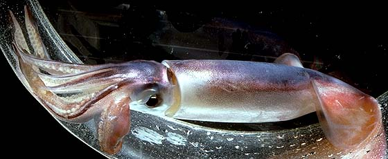
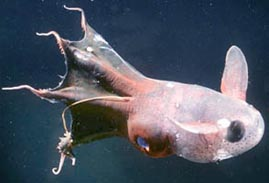

## Phylogeny 

-   « Ancestral Groups  
    -   [Cephalopoda](Cephalopoda)
    -   [Mollusca](Mollusca)
    -   [Bilateria](Bilateria)
    -   [Animals](Animals)
    -   [Eukaryotes](Eukaryotes)
    -   [Tree of Life](../../../../../Tree_of_Life.md)

-   ◊ Sibling Groups of  Cephalopoda
    -   [Nautilidae](Nautilidae)
    -   Coleoidea

-   » Sub-Groups
    -   [Decapodiformes](Decapodiformes.md)
    -   [Octopodiformes](Octopodiformes.md)
	-   *Neocoleoidea*
	    -   *[Decapodiformes](Decapodiformes.md "go to ToL page")*[
	        Leach, 1817] [(squids, cuttlefishes and their
	        relatives)]
	    -   *[Octopodiformes](Octopodiformes.md "go to ToL page")*[
	        Berthold and Engeser, 1987] [(vampire squid and
	        octopods)]

# [[Coleoidea]] 

Octopods, squids, cuttlefishes and their relatives 

 

†

## #has_/text_of_/abstract 

> **Coleoidea** or Dibranchiata is one of the two subclasses of cephalopod molluscs containing 
> all the taxa popularly thought of as "soft-bodied" or "shell-less" (i.e. octopus, squid and cuttlefish). 
> 
> Unlike its extant sister group Nautiloidea, whose members have a rigid outer shell for protection, 
> the coleoids have at most an internal shell called cuttlebone or gladius that is used for buoyancy 
> or as muscle anchorage. 
> 
> Some species, notably incirrate octopuses, have lost their internal shell altogether, 
> while in some it has been replaced by a chitinous support structure.
>
> The major divisions of Coleoidea are based upon the number of arms or tentacles and their structure. The extinct and most primitive form, the Belemnoidea, presumably had ten equally-sized arms in five pairs numbered dorsal to ventral as I, II, III, IV and V. More modern species either modified or lost a pair of arms. The superorder Decapodiformes has arm pair IV modified into long tentacles with suckers generally only on the club-shaped distal end. Superorder Octopodiformes has modifications to arm pair II; it is significantly reduced and used only as a sensory filament in the Vampyromorphida, while Octopoda species have totally lost that arm pair. The inner surface of the suckers (acetabulum) are reinforced with rigid sucker rings which are smooth in Sepiolida, have blunt teeth in Sepiida and sharply pointed teeth in Loliginidae and Oegopsida. The arms and/or tentacles of some oegopsid families have also evolved claw-like hooks.
>
> [Wikipedia](https://en.wikipedia.org/wiki/Coleoidea) 

## Introduction

[Richard E. Young, Michael Vecchione, and Katharina M. Mangold (1922-2003)]() 

The Coleoidea contains two subdivisions. One, the Belemnoidea, had
members that were common inhabitants of neritic waters during the
Cretaceous but became extinct and the end of this Period.

**Figure**. **Left** - Side view of a fossil belemnoid
\"***Acanthoteuthis***\" from Solenhofen, Germany and in the collection
of the U. S. National Museum of Natural History. The equal arms are
lined with hooks as is characteristic of this group. **Right** - Fossil
hooks of ***Belemnoteuthis*** (?) from Lyme Regis, Dorsetshire, England
and in the collection of the U. S. National Museum of Natural History.
The shape of the hooks is seen along with the way they may have lined up
on the arm. Photographs by R. Young.

The other subdivision, the Neocoleoidea, contains two extant groups: the
Octopodiformes (octopods and vampire squid) and the Decapodiformes
(squids and cuttlefishes). In addition, a variety of fossil groups exist
that may fall into either of these two groups of neocoleoids. The extant
coleoids occupy all major habitats in the ocean from intertidal to great
depths (deepest record is 7279m, Aldred *et al.*, 1983; Voss, 1988,p.
266) and from south to north polar regions. Although some loliginid
squids and some sepiolids can tolerate reduced salinity, no cephalopod
occurs in fresh water. In many regions of the oceans, coleoids are
dominant members of the ecosystem and are often targets of major
fisheries.

Coleoids generally use mantle-generated jet propulsion to obtain high
swimming speeds. This is an effective but energetically expensive means
of locomotion (Webber and O\'Dor, 1985) and, as a result, some groups
utilize the fins as the primary locomotor organ. This is especially
common in deep-sea species (e.g., cirrate octopods, octopoteuthid squid,
magnapinnid squid) where, in dark waters, the value of speed is reduced.

When cephalopods first evolved, the primary feature that separated them
from other molluscs was a shell with buoyancy chambers. This allowed
cephalopods to invade the pelagic realm where predators and competitors
were few. When the shell became internal in coleoids the bouyancy
chambers were retained in belemnoids. In most present day neocoleoids,
the buoyant shell has been abandoned (it is retained in ***Spirula***
and the Sepiidae) and many squids and octopods are negatively buoyant.
While this is not a problem for those octopods that are benthic,
negatively buoyant squids, however, must swim constantly to stay afloat.
Some squids and pelagic octopods, however, have gained near-neutral
buoyancy via the retention of light ions (especially ammonium in place
of sodium) and the reduction of heavy tissues (Clarke, *et al.*, 1979).
This type of neutral buoyancy is found in many deep-sea species since
reduction of muscular and cartilagenous tissues can be tolerated in this
habitat. In a few cases oil provides buoyancy (Bathyteuthidae) and in
one case (Ocythoidae) a true swimbladder has evolved (Packard and Wurtz,
1994).

Coleoid arms are unique grasping structures that possess a variety of
different types of suckers and hooks. The arms and suckers are also
provided with a variety of sensory organs that can be a primary means of
investigating the immediate environment. This is especially true of the
octopods where the arms can hunt for unseen prey under rocks. Prey are
seized and passed to the mouth then cut into pieces by sharp beaks and
swallowed. Because of the circumesophageal organization of the molluscan
central nervous system and its elaboration into a complex brain in
cephalopods, the cephalopod esophagus passes through the center of the
brain; this arrangement limits the maximum size of particles that can be
swallowed.

Survival in the sea depends not only on obtaining food but also on
avoiding predators. Although preyed upon by many vertebrates (especially
marine mammals) and other animals, coleoids excel at camouflage and
deception (see Hanlon and Messenger, 1996). They easily exceed all other
animals in their ability to change color quickly through the use of
chromatophoric organs (chromatophores) and various types of reflectors.
The chromatophores contain muscles under nervous control; quick muscle
contraction produces rapid color changes that immediately changes the
appearance of the animal. This camouflage, combined with their ability
to secrete clouds or globs of ink, and the ability of many to alter
their skin texture and arm postures, provides them exceptional
concealment abilities.

Another, perhaps surprising feature of coleoids, since many species
reach a large size, is their short life span. Most species grow rapidly
and live for one year or less. Reasons for this are not well understood.
However, this is part of a life-history strategy that seems designed for
rapid increase in population size. One result of this is that cephalopod
fisheries typically fluctuate wildly in annual catch rates.

### Characteristics

1.  Shell located internally.

2.  Muscular mantle for propulsion and respiration.

3.  Brachial crown consisting of ten arms.

    

    **Figure**. The diagramatic illustrations show the arm-crown
    modifications found in the major groups of coleoid cephalopods. The
    Belemnoidea represent the primitive condition with 10 equal arms. In
    the Vampyromorpha arms II are modified and in the only living
    representative, ***Vampyroteuthis***, these are a pair of slender,
    sensory filaments that arise from the aboral surface of the web. In
    the Octopoda arm pair II is lost leaving 8 arms, and in the
    Decapodiformes, arms IV are modified into tentacles with suckers
    generally confined to distal clubs.

4.  Fins present\*

5.  Chromatophores present\*

6.  Ink sac present.

7.  Eyes with lenses.

\* presence not established in Belemnoidea.

Many of these characters have been secondarily lost in various taxa.

### Nomenclature

General consensus on the names of higher taxonomic catagories in the
Coleoidea has not been achieved (eg, see Berthold and Engeser, 1987;
Clarke, 1988; Doyle, *et al.*, 1994; Haas, 2002).

### Discussion of Phylogenetic Relationships

Extant coleoids form a monophyletic group, the Neocoleoidea, as
evidenced by the uniform presence of suckers. Their sister group, the
Belemnoidea, is characterized by the presence of hooks that are derived,
perhaps, from muscular papillae, the homologues of trabeculae or cirri
that lie lateral to the suckers in living coleoids (e.g. Engeser and
Bandel, 1988, see also Haas, 1989).

The Decapodiformes is supported by only a single morphological character
that has been demonstrated to be apomorphic (i.e. derived): the
modification of the fourth pair of arms as tentacles (Young and
Vecchione, 1996). The monophyly, however, is supported by molecular
cladistic studies (Bonnaud *et al.* 1997; Carlini and Graves, 1999). The
problem with morphology, however, is not due to a lack of shared
character states among decapods but instead results from our inability
to polarize these states. The outgroup on which most polarity decisions
are based is the Nautiloidea. Unfortunately, this group is
morphologically very different from coleoids and many characters are not
applicable to both groups.

Young and Vecchione (1996, 2002) found five unambiguous character states
that supported the monophyly of the Octopodiformes:

1.  Presence of an outer statocyst capsule.
2.  Superior buccal lobes adjacent (fused at edges) or fused to
    posterior buccal lobes of the brain.
3.  Arms II modified as filaments. (This assumes an \"ordered\"
    evolutionary relationship of the character states: arms II
    unmodified - arms II modified - arms II absent.)
4.  Primary gill lamellae possess a partial or complete median septum.
5.  Secondary gill lamellae possess a partial or complete median septum.

An evolutionary study by Hass (2002) also placed the Vampyromorpha and
Octopoda together as a monophyletic group on the basis of a combination
of characters four and five above (he independently recognized these
characters but defined them slightly differently). Molecular studies
support the monophyly of this group (Carlini and Graves, 1999) or give
it equivocal support (Bonnaud *et al.*, 1997).

## Title Illustrations

--------------------------------------------------------------------------------

Scientific Name ::     Sthenoteuthis oualaniensis
Location ::           Hawaiian waters
Specimen Condition   Live Specimen
View                 Side
Size                 Estimate of 18-20 cm ML
Copyright ::            © 1996 [Richard E. Young](http://www.soest.hawaii.edu/%7Eryoung/rey.html) 

Scientific Name ::     Coleoidea
Location ::           Hawaiian waters
Comments             Unidentified octopus
Specimen Condition   Live Specimen
Copyright ::            © 1996 Roger Hanlon

--------------

Scientific Name ::     Vampyroteuthis infernalis
Location ::           Californian waters
Comments             Photographed from submersible
Specimen Condition   Live Specimen
View                 Side
Copyright ::            © 1999 Brad Seibel

## Confidential Links & Embeds: 

### #is_/same_as :: [Coleoidea](/_Standards/bio/bio~Domain/Eukaryotes/Animals/Bilateria/Mollusca/Cephalopoda/Coleoidea.md) 

### #is_/same_as :: [Coleoidea.public](/_public/bio/bio~Domain/Eukaryotes/Animals/Bilateria/Mollusca/Cephalopoda/Coleoidea.public.md) 

### #is_/same_as :: [Coleoidea.internal](/_internal/bio/bio~Domain/Eukaryotes/Animals/Bilateria/Mollusca/Cephalopoda/Coleoidea.internal.md) 

### #is_/same_as :: [Coleoidea.protect](/_protect/bio/bio~Domain/Eukaryotes/Animals/Bilateria/Mollusca/Cephalopoda/Coleoidea.protect.md) 

### #is_/same_as :: [Coleoidea.private](/_private/bio/bio~Domain/Eukaryotes/Animals/Bilateria/Mollusca/Cephalopoda/Coleoidea.private.md) 

### #is_/same_as :: [Coleoidea.personal](/_personal/bio/bio~Domain/Eukaryotes/Animals/Bilateria/Mollusca/Cephalopoda/Coleoidea.personal.md) 

### #is_/same_as :: [Coleoidea.secret](/_secret/bio/bio~Domain/Eukaryotes/Animals/Bilateria/Mollusca/Cephalopoda/Coleoidea.secret.md)

