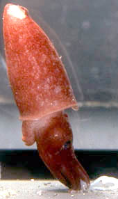
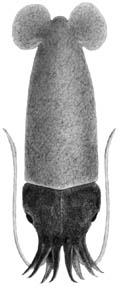

## Phylogeny 

-   « Ancestral Groups  
    -   [Bathyteuthis](Bathyteuthis)
    -   [Bathyteuthoida](Bathyteuthoida)
    -   [Decapodiformes](Decapodiformes)
    -   [Coleoidea](Coleoidea)
    -   [Cephalopoda](Cephalopoda)
    -   [Mollusca](Mollusca)
    -   [Bilateria](Bilateria)
    -   [Animals](Animals)
    -   [Eukaryotes](Eukaryotes)
    -   [Tree of Life](../../../../../../../../../Tree_of_Life.md)

-   ◊ Sibling Groups of  Bathyteuthis
    -   Bathyteuthis abyssicola
    -   [Bathyteuthis bacidifera](Bathyteuthis_bacidifera)
    -   [Bathyteuthis berryi](Bathyteuthis_berryi)

-   » Sub-Groups 

# *Bathyteuthis abyssicola* [Hoyle 1885] 

[Clyde F. E. Roper]()

The holotype is deposited in the British Museum (Natural History),
London.

Containing group: [Bathyteuthidae](Bathyteuthidae.md)

## Introduction

This deep maroon-colored squid inhabits the meso- and bathypelagic zones
of all oceans of the world. It is particularly abundant in the Southern
Ocean where it seems to be the dominant small deep-sea squid.
**Bathyteuthis** remained monotypic from the time of its discovery by
the famous Challenger Expedition until 1968 when two additional species
were recognized and described (Roper, 1968).

### Characteristics

1.  [Arms](http://www.tolweb.org/accessory/Bathyteuthis_abyssicola_Arms?acc_id=614)
    a.  Protective membranes low, fleshy, without free trabeculae.
    b.  Arms short, not attenuate; tips blunt.
    c.  Arm suckers relatively few in number, about 100 on each of arms
        I-III.
    d.  Arm sucker rings with 8-18 separated, bluntly rounded to
        truncate protuberances.
2.  [Tentacles](http://www.tolweb.org/accessory/Bathyteuthis_abyssicola_Arms?acc_id=614)
    a.  Tentacles and clubs relatively short.
3.  Gills
    a.  Gills short, narrow.

### Nomenclature

**Bathyteuthis abyssicola** was described in 1885 by Hoyle.
**Benthoteuthis megalops** was described by Verrill, also in 1885. These
species were recognized as being the same entity, but both names
continued to be used for years because no firm date of priority for
publication had been established. In 1900, Pfeffer finally synonymized
**Benthoteuthis megalops** with **Bathyteuthis abyssicola** at the same
time he erected the Family Bathyteuthidae. The actual dates of
publication of these two species were not verified until 1969 when it
was established conclusively that **B. abyssicola** had priority by two
months (Roper, 1969).

### Life History

Paralarvae of 4 mm ML have very small, paddle like, subterminal fins;
strongly protruding, anteriorly directed eyes; extremely short, stubby
arms with 6 minute suckers paired in 2 longitudinal series on arms I-III
and 5 suckers in a zigzag row on arms IV. Tentacles are relatively long
and clubs are undifferentiated with 18 minute suckers paired in 2
longitudinal series at the distal end. Immediately proximal to the
suckers are 16 knob-like bumps paired in 2 longitudinal series that are
precursors to suckers. By 6 mm ML the fins are much better developed,
the very small photophores are developing on the aboral bases of arms
I-III, and the tentacular suckers are in 5-6 longitudinal series along
the club (Roper, 1969).

### Distribution

The type locality for this species is in the southern Indian Ocean
between the subantarctic islands of Crozets Is. and Prince Edward Is.

#### Vertical Distribution

This bathypelagic species normally occurs at 700-2000 m, but records are
given as 100-4200 m; the greater depths probably are artifacts from open
(non-closing) sampling nets. Paralarvae and juveniles live at shallower
depths than adults. In the Southern Ocean (Antarctic Ocean), the
population undertakes a deep diel vertical migration (Roper, 1969). The
population in the eastern tropical-subtropical North Atlantic also
demonstrates a diel vertical migration (Clarke & Lu, 1975; Lu & Clarke,
1975).

#### Geographical Distribution

**Bathyteuthis abyssicola** is cosmopolitan in the world oceans. It is
circumpolar in the Southern Ocean and in the highly productive waters of
the eastern Pacific, the Atlantic, and the Indian Oceans (Roper, 1969).

### References

Clarke, M.R. & C.C. Lu 1975. Vertical distribution of cephalopods at 18°
N 25° W in the North Atlantic. Journal Marine Biological Association of
the United Kingdom, 55: 165-182.

Hoyle,W.E. 1885. Narrative of the Voyage of the Challenger Expedition.
The Cephalopoda. Report on the Voyage of HMS Challenger (1873-1876), 1
(1): 269-274.

Lu, C.C. & M.R. Clarke. Vertical distribution of Cephalopods at 11° N
20° W in the North Atlantic. Journal of the Marine Biological
Association of the United Kingdom, 55:369-389.

Roper, C.F.E. 1968. Preliminary descriptions of two new species of the
bathypelagic squid *Bathyteuthis* (Cephalopoda: Oegopsida). Proceedings
of the Biological Society of Washington, 81:261-272.

Roper, C.F.E. 1969. Systematics and zoogeography of the worldwide
bathypelagic squid *Bathyteuthis* (Cephalopoda: Oegopsida). Bulletin of
the United States National Museum, 291:1-210.

Verrill, A.E. 1885. Third catalog of Mollusca recently added to the
fauna of the New England coast and the adjacent parts of the Atlantic,
consisting mostly of deep-sea species with notes on others previously
recorded. Transactions of the Connecticut Academy, 6(2): 395-452.

## Title Illustrations

**Bathyteuthis abyssicola**, Antarctic waters. (Photographs copyright ©
1998, C. F. E. Roper).


  ---------
  Copyright ::   © 1998 C. F. E. Roper
  ---------


  ---------
  Copyright ::   © 1998 C. F. E. Roper
  ---------

## Confidential Links & Embeds: 

### #is_/same_as :: [abyssicola](/_Standards/bio/bio~Domain/Eukaryotes/Animals/Bilateria/Mollusca/Cephalopoda/Coleoidea/Decapodiformes/Bathyteuthoida/Bathyteuthidae/abyssicola.md) 

### #is_/same_as :: [abyssicola.public](/_public/bio/bio~Domain/Eukaryotes/Animals/Bilateria/Mollusca/Cephalopoda/Coleoidea/Decapodiformes/Bathyteuthoida/Bathyteuthidae/abyssicola.public.md) 

### #is_/same_as :: [abyssicola.internal](/_internal/bio/bio~Domain/Eukaryotes/Animals/Bilateria/Mollusca/Cephalopoda/Coleoidea/Decapodiformes/Bathyteuthoida/Bathyteuthidae/abyssicola.internal.md) 

### #is_/same_as :: [abyssicola.protect](/_protect/bio/bio~Domain/Eukaryotes/Animals/Bilateria/Mollusca/Cephalopoda/Coleoidea/Decapodiformes/Bathyteuthoida/Bathyteuthidae/abyssicola.protect.md) 

### #is_/same_as :: [abyssicola.private](/_private/bio/bio~Domain/Eukaryotes/Animals/Bilateria/Mollusca/Cephalopoda/Coleoidea/Decapodiformes/Bathyteuthoida/Bathyteuthidae/abyssicola.private.md) 

### #is_/same_as :: [abyssicola.personal](/_personal/bio/bio~Domain/Eukaryotes/Animals/Bilateria/Mollusca/Cephalopoda/Coleoidea/Decapodiformes/Bathyteuthoida/Bathyteuthidae/abyssicola.personal.md) 

### #is_/same_as :: [abyssicola.secret](/_secret/bio/bio~Domain/Eukaryotes/Animals/Bilateria/Mollusca/Cephalopoda/Coleoidea/Decapodiformes/Bathyteuthoida/Bathyteuthidae/abyssicola.secret.md)

