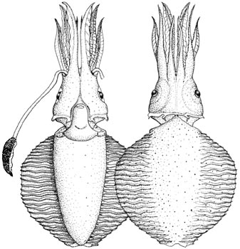

## Phylogeny 

-   « Ancestral Groups  
    -   [Chtenopteryx](Chtenopteryx)
    -   [Bathyteuthoida](Bathyteuthoida)
    -   [Decapodiformes](Decapodiformes)
    -   [Coleoidea](Coleoidea)
    -   [Cephalopoda](Cephalopoda)
    -   [Mollusca](Mollusca)
    -   [Bilateria](Bilateria)
    -   [Animals](Animals)
    -   [Eukaryotes](Eukaryotes)
    -   [Tree of Life](../../../../../../../../../Tree_of_Life.md)

-   ◊ Sibling Groups of  Chtenopteryx
    -   Chtenopteryx canariensis
    -   [Chtenopteryx         sepioloides](Chtenopteryx_sepioloides)
    -   [Chtenopteryx sicula](Chtenopteryx_sicula)

-   » Sub-Groups 

# *Chtenopteryx canariensis* [Salcedo-Vargas and Guerrero-Kommritz 2000]

## Dark combfin squid 

[Mario Alejandro Salcedo-Vargas and Richard E. Young]()

Containing group: [Chtenopterygidae](Chtenopterygidae.md)

## Introduction

This species differs from all other members of the genus in the lack of
photophores on both the eyes and viscera. It is known from four squid
taken from the eastern tropical Atlantic Ocean.

#### Diagnosis

A ***Ctenopteryx*** \...

-   without photophores.
-   with club suckers in 16-20 series.
-   with arm suckers in 8-14 series.

### Characteristics

1.  Tentacles
    1.  Club with six suckers in transverse row at proximal end, 16-20
        suckers at mid-club, then decreasing number of suckers toward
        tip.

    
    **Figure**. Ventral view of the mantle cavity of ***C. canarensis***
    holotype. Note the absence of a visceral photophore. A - Funnel
    locking apparatus. B - Ink sac. C - Nephridiopore. D - Spermatophore
    sac (= Needham\'s sac). E - Gill. Drawing from Salcedo-Vargas and
    Guerrero-Kommritz (2000).

#### Comments

[More details of the description can be found here](http://www.tolweb.org/accessory/Chtenopteryx_canariensis_Description?acc_id=631).

### Distribution

The type locality is 26°20\'N, 19°21\'W, Eastern Atlantic just south of
the Canary Islands. Other localities: 12°16\'N, 23°05\'W, 0°20\'N,
25°20\'W. All specimens were caught in nets that fished to 1000 m.

### References

Salcedo-Vargas, M. A. and J. Guerrero-Kommritz. 2000. Three new
cephalopods from the Atlantic Ocean. Mitt. Hamb. Zool. Mus. Inst., 97:
31-44.

## Title Illustrations



  ------------------------------------------------
  Scientific Name ::   Chtenopteryx canariensis
  Reference          Salcedo-Vargas, M. A. and J. Guerrero-Kommritz. 2000. Three new cephalopods from the Atlantic Ocean. Mitt. Hamb. Zool. Mus. Inst. 97:31-44.
  Sex ::              Male
  Life Cycle Stage ::   mature
  Size               63 mm ML
  Type               holotype
  ------------------------------------------------

## Confidential Links & Embeds: 

### #is_/same_as :: [canariensis](/_Standards/bio/bio~Domain/Eukaryotes/Animals/Bilateria/Mollusca/Cephalopoda/Coleoidea/Decapodiformes/Bathyteuthoida/Chtenopterygidae/canariensis.md) 

### #is_/same_as :: [canariensis.public](/_public/bio/bio~Domain/Eukaryotes/Animals/Bilateria/Mollusca/Cephalopoda/Coleoidea/Decapodiformes/Bathyteuthoida/Chtenopterygidae/canariensis.public.md) 

### #is_/same_as :: [canariensis.internal](/_internal/bio/bio~Domain/Eukaryotes/Animals/Bilateria/Mollusca/Cephalopoda/Coleoidea/Decapodiformes/Bathyteuthoida/Chtenopterygidae/canariensis.internal.md) 

### #is_/same_as :: [canariensis.protect](/_protect/bio/bio~Domain/Eukaryotes/Animals/Bilateria/Mollusca/Cephalopoda/Coleoidea/Decapodiformes/Bathyteuthoida/Chtenopterygidae/canariensis.protect.md) 

### #is_/same_as :: [canariensis.private](/_private/bio/bio~Domain/Eukaryotes/Animals/Bilateria/Mollusca/Cephalopoda/Coleoidea/Decapodiformes/Bathyteuthoida/Chtenopterygidae/canariensis.private.md) 

### #is_/same_as :: [canariensis.personal](/_personal/bio/bio~Domain/Eukaryotes/Animals/Bilateria/Mollusca/Cephalopoda/Coleoidea/Decapodiformes/Bathyteuthoida/Chtenopterygidae/canariensis.personal.md) 

### #is_/same_as :: [canariensis.secret](/_secret/bio/bio~Domain/Eukaryotes/Animals/Bilateria/Mollusca/Cephalopoda/Coleoidea/Decapodiformes/Bathyteuthoida/Chtenopterygidae/canariensis.secret.md)

