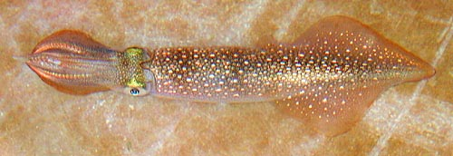

## Phylogeny 

-   « Ancestral Groups  
    -   [Decapodiformes](Decapodiformes)
    -   [Coleoidea](Coleoidea)
    -   [Cephalopoda](Cephalopoda)
    -   [Mollusca](Mollusca)
    -   [Bilateria](Bilateria)
    -   [Animals](Animals)
    -   [Eukaryotes](Eukaryotes)
    -   [Tree of Life](../../../../../../../Tree_of_Life.md)

-   ◊ Sibling Groups of  Decapodiformes
    -   [Bathyteuthoida](Bathyteuthoida)
    -   [Idiosepiidae](Idiosepiidae)
    -   Myopsida
    -   [Oegopsida](Oegopsida)
    -   [Sepioidea](Sepioidea)
    -   [Spirula spirula](Spirula_spirula)

-   » Sub-Groups
    -   [Australiteuthis         aldrichi](Australiteuthis_aldrichi)
    -   [Loliginidae](Loliginidae.md)

# Myopsida [Naef, 1916] 

[Michael Vecchione and Richard E. Young]()

Containing group: [Decapodiformes](Decapodiformes.md)

## Introduction

Myopsid squids are, neritic, often in very shallow water, or upper slope
demersal species. Many species are strong swimmers, occur in large
schools and are fished commercially for food. The Loliginidae contains
many species some of which reach a rather large size (at least 90 cm ML
in ***Loligo forbesii***) but those in ***Pickfordiateuthis***, are
dwarf species where males may mature at less than 14 mm ML
(Brachoniecki, 1996). The Australiteuthidae contains a single species
that is also a dwarf with males that mature as small as 17 mm ML (Lu,
2005).

#### Diagnosis

A decapodiform \...

-   with corneal membranes covering eye lenses.
-   without secondary eyelids.
-   with well-developed gladius.

### Characteristics

1.  Arms
    1.  Suckers of arms (and tentacles) with circularis muscles (unknown
        in Australiteuthidae).
2.  Tentacles
    1.  Club without proximal (= carpal) locking-apparatus.
3.  Eggs
    1.  Eggs, where known, attached to substrate.
    2.  Embryo with large external yolk sac.

### Discussion of Phylogenetic Relationships

The two families of the Myopsida appear to be closely related. The
Australiteuthidae differs from the Loliginidae primarily in the
structure of the funnel/mantle locking-apparatus and the position of the
mantle component which does not reach the mantle margin. A number of
features of phylogenetic importance in the Australiteuthidae, however,
are not known: the presence or absence of a branchial canal, an anterior
eye pocket, circularis muscles in the suckers, an interstellate
connective; the location of spermathecae; the symmetry of the gills; the
type and place (pelagic or benthic) of deposition of egg masses and the
position of the intestine relative to the cephalic vein and the vena
cavae.

### References

Brakoniecki, T. F. 1996. A revision of the genus *Pickfordiateuthis*
Voss, 1953 (Cephalopoda; Myopsida). Bull. Mar. Sci., 58: 9-28.

Lu, C. C. 2005. A new family of myopsid squid from Australasian waters
(Cepahlopoda: Teuthida). P. 71-82. In: Chotiyaputta, C., E. M. C.
Hatfield and C. C. Lu (editors). Cephalopod biology, recruitment and
culture. International Cephalopod Symposium and Workshop, 17-21 Feb.
2003. Research Bulletin, Phyuket Marine Biological Center, No. 66,
Published by the Center Phuket, Thailand, July 2005, 365 pp.

Naef, A. 1921-1923. Die Cephalopoden. Fauna e Flora del Golfo di Napoli,
Monographie 35, Vol I, Parts I and II, Systematik, pp 1-863.

## Title Illustrations



  -----------------------------------------------------------------------
  Scientific Name ::     Loligo plei
  Specimen Condition   Live Specimen
  View                 Dorsal
  Size                 105 mm ML
  Copyright ::            © [Michael Vecchione](mailto:vecchiom@si.edu) 
  -----------------------------------------------------------------------

## Confidential Links & Embeds: 

### #is_/same_as :: [Myopsida](/_Standards/bio/bio~Domain/Eukaryotes/Animals/Bilateria/Mollusca/Cephalopoda/Coleoidea/Decapodiformes/Myopsida.md) 

### #is_/same_as :: [Myopsida.public](/_public/bio/bio~Domain/Eukaryotes/Animals/Bilateria/Mollusca/Cephalopoda/Coleoidea/Decapodiformes/Myopsida.public.md) 

### #is_/same_as :: [Myopsida.internal](/_internal/bio/bio~Domain/Eukaryotes/Animals/Bilateria/Mollusca/Cephalopoda/Coleoidea/Decapodiformes/Myopsida.internal.md) 

### #is_/same_as :: [Myopsida.protect](/_protect/bio/bio~Domain/Eukaryotes/Animals/Bilateria/Mollusca/Cephalopoda/Coleoidea/Decapodiformes/Myopsida.protect.md) 

### #is_/same_as :: [Myopsida.private](/_private/bio/bio~Domain/Eukaryotes/Animals/Bilateria/Mollusca/Cephalopoda/Coleoidea/Decapodiformes/Myopsida.private.md) 

### #is_/same_as :: [Myopsida.personal](/_personal/bio/bio~Domain/Eukaryotes/Animals/Bilateria/Mollusca/Cephalopoda/Coleoidea/Decapodiformes/Myopsida.personal.md) 

### #is_/same_as :: [Myopsida.secret](/_secret/bio/bio~Domain/Eukaryotes/Animals/Bilateria/Mollusca/Cephalopoda/Coleoidea/Decapodiformes/Myopsida.secret.md)

