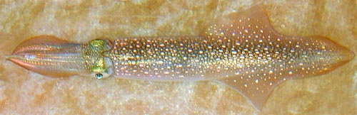

## Phylogeny 

-   « Ancestral Groups  
    -   [Loliginidae](Loliginidae)
    -   [Myopsida](Myopsida)
    -   [Decapodiformes](Decapodiformes)
    -   [Coleoidea](Coleoidea)
    -   [Cephalopoda](Cephalopoda)
    -   [Mollusca](Mollusca)
    -   [Bilateria](Bilateria)
    -   [Animals](Animals)
    -   [Eukaryotes](Eukaryotes)
    -   [Tree of Life](../../../../../../../../../Tree_of_Life.md)

-   ◊ Sibling Groups of  Loliginidae
    -   [Loligo](Loligo)
    -   [Afrololigo mercatoris](Afrololigo_mercatoris)
    -   [Alloteuthis](Alloteuthis)
    -   Doryteuthis
    -   [Heterololigo bleekeri](Heterololigo_bleekeri)
    -   [Loliolus](Loliolus)
    -   [Lolliguncula](Lolliguncula)
    -   [Pickfordiateuthis](Pickfordiateuthis)
    -   [Sepioteuthis](Sepioteuthis)
    -   [Uroteuthis](Uroteuthis)

-   » Sub-Groups 

# *Doryteuthis* [Naef, 1912] 

[Michael Vecchione]()

***Doryteuthis*** contains eight species placed into three subgenera one
of which is unnamed.

Type species. \-- ***Loligo plei*** Blainville, 1823; species first
mentioned and subsequent designation of Naef (1923:193)\].

Containing group: [Loliginidae](Loliginidae.md)

## Introduction

***Doryteuthis*** species are the common inshore squids of American
waters. Several species (e.g., ***D. pealeii***, ***D. opalescens***)
are targets of substantial fisheries. The genus is defined by geography
and the absence of specific modifications that define other genera.

#### Diagnosis

A loliginid \...

-   with fins in adults rhomboidal, longer than broad, (length \<70% of
    ML); mantle elongate, pointed posteriorly; cement body of
    spermatophore short.
-   with a distribution in waters off the Americas.

### Characteristics

1.  Arms
    1.  Hectocotylus:
        1.  Ventral crest absent.
        2.  Proximal suckers unmodified.
        3.  Distal suckers of reduced size, sucker stalks elongated to
            form papillae in either dorsal or both dorsal and ventral
            series.\
            \
2.  Tentacles
    1.  Tentacular clubs expanded, suckers in four series.\
        \
3.  Fins
    1.  Fins extend to posterior tip of mantle.
4.  Photophores
    1.  Photophores absent.\
        \
5.  Viscera
    1.  Eggs less than 4 mm.
    2.  Spermatophore cement body short.

#### Comments

The genus is subdivided into three subgenera, two of which are named,
***D***. (***Doryteuthis***) and ***D***. (***Amerigo***). Species of
***D***. (***Doryteuthis***) have the modified portion of the
hectocotylized arm extending to the arm tip, and the edges of gladius
vane are thickened, while in ***D.*** (***Amerigo***) neither of these
conditions hold. ***Doryteuthis sanpaulensis*** does not belong in
either of these subgenera and was considered by Vecchione et al. (2005)
to be the sole recognized species in an undescribed subgenus.

{width="500"}

**Figure**. Side view of ***D. (Amerigo) pealeii*** sitting on the
substrate in an aquarium. Photograph by Clyde Roper.
### Distribution

American waters of the western Atlantic and eastern Pacific Oceans.

### References

Vecchione, M., E. Shea, S. Bussarawit, F. Anderson, D. Alexeyev, C.-C.
Lu, T. Okutani, M. Roeleveld, C. Chotiyaputta, C. Roper, E. Jorgensen
and N. Sukramongkol. 2005. Systematics of Indo-West Pacific loliginids.
Phuket Mar. Biol. Cent. Res. Bull. 66: 23-26.

## Title Illustrations



  -----------------------------------------------------------------------
  Scientific Name ::     Doryteuthis pealeii
  Specimen Condition   Live Specimen
  View                 Dorsal
  Copyright ::            © [Michael Vecchione](mailto:vecchiom@si.edu) 
  -----------------------------------------------------------------------
