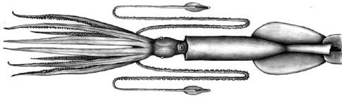

## Phylogeny 

-   « Ancestral Groups  
    -   [Asperoteuthis](Asperoteuthis)
    -   [Chiroteuthidae](Chiroteuthidae)
    -   [Chiroteuthid families](Chiroteuthid_families)
    -   [Oegopsida](Oegopsida)
    -   [Decapodiformes](Decapodiformes)
    -   [Coleoidea](Coleoidea)
    -   [Cephalopoda](Cephalopoda)
    -   [Mollusca](Mollusca)
    -   [Bilateria](Bilateria)
    -   [Animals](Animals)
    -   [Eukaryotes](Eukaryotes)
    -   [Tree of Life](../../../../../../../../../../../Tree_of_Life.md)

-   ◊ Sibling Groups of  Asperoteuthis
    -   Asperoteuthis acanthoderma
    -   [Asperoteuthis mangoldae](Asperoteuthis_mangoldae)
    -   [Asperoteuthis sp. B](Asperoteuthis_sp._B)

-   » Sub-Groups 

# *Asperoteuthis acanthoderma* [(Lu, 1977)] 

[Richard E. Young and Clyde F. E. Roper](http://www.tolweb.org/)

The holotype is deposited in the Zoological Museum, University of
Copenhagen, Denmark.

Containing group: *[Asperoteuthis](Asperoteuthis.md)*

## Introduction

***A. acanthoderma*** reaches a rather large size. The largest specimen
known has a mantle length of 78 cm and long, slender tentacles. In one
squid (45 cm ML) the tentacles were over 12 times longer than the mantle
(i.e., about 5.5 m)(Tsuchiya and Okutani, 1993). The most distinctive
feature of this species is the presence of very small, pointed
cartilagenous tubercules over the surface of the head, mantle and arms.

#### Brief diagnosis

An ***Asperoteuthis*** \...

-   with tiny, pointed tubercules in skin.
-   with a  Y-shaped groove in the funnel locking-apparatus.\

### Characteristics

1.  Arms
    1.  Large arm suckers with 3-4 broadly rounded teeth on distal half
        of inner ring.
2.  Tentacles
    1.  Suckers with nine blunt teeth in contact at base over distal
        half of inner ring.
3.  Funnel
    1.  Funnel-locking apparatus with long, slender tragus and narrow
        antitragus that form an inverted Y-shaped groove.\

        {width="416"}\
        **Figure**. Aboral views of the tentacular club of ***A.
        acanthoderma***. **Left** - Aboral view of the terminal
        photophore on the tentacular club. Drawing by J. R. Schroeder.
        **Right** - Aboral view of tentacle club showing the position of
        embedded photophores at club base and on either side of the club
        \"stalk\" , 180 mm ML. Drawing from Lu, 1977, with permission.

4.  Measurements
    1.  Arms: Arms I ca. 75-85% of ML; Arms III ca.95-110 % of ML; Arms
        IV ca. 95-115% 0f ML.
    2.  Tentacular club: Club length ca. 16% of ML; Protective
        membranes - Proximal set with x-xx trabeculae (xx-xx% of club
        length); distal set with xx trabeculae (xx-xx% of CL).
    3.  Head: Head length 26% of ML.

\

### Life History

A large 78 cm ML specimen described by Tsuchia and Okutani (1993) was an
immature female. Mature stages and doratopsis stages are unknown
(however, see comments under **Asperoteuthis**: Life History).

{width="518"}

**Figure**. Ventral views of ***A. acanthoderma***. **Top** - 560 mm ML,
immature female. Note the extremely long tentacles and the dark
pigmentation. **Bottom** - 780 mm ML, immature female. Drawing and
photograph from Tsuchiya and Okutani, 1993, with permission.
### Distribution

The type locality is the Celebes Sea. This species is also known from
waters off Okinawa (Tsuchiya and Okutani, 1993) and Hawaii.

### References

Lu, C. C. 1977. A new species of squid Chiroteuthis acanthoderma, from
the Southwest Pacific (Cephalopoda, Chiroteuthidae). Steenstrupia, 4:
179-188.

Nesis, K. N. 1980. Taxonomic position of *Chiroteuthis famelica* Berry.
Bull. Moscow Obslich. Ispyt. Prirody, Section Biology, 85: 59-66. \[In
Russian\].

Tsuchiya, K. and T. Okutani (1993). Rare and interesting squids in Japan
-X. Recent occurrences of big squids from Okinawa. Venus, 52: 299-311.

Young, R. E. (1991). Chiroteuthid and related paralarvae from Hawaiian
waters. Bull. Mar. Sci., 49: 162-185.

## Title Illustrations



  -------------------------------------------------------------------------
  Scientific Name ::  Asperoteuthis acanthoderma
  Creator           J. R. Schroeder
  Copyright ::         © [Clyde F. E. Roper](mailto:roper.clyde@nmnh.si.edu) 
  -------------------------------------------------------------------------

## Confidential Links & Embeds: 

### #is_/same_as :: [acanthoderma](/_Standards/bio/bio~Domain/Eukaryotes/Animals/Bilateria/Mollusca/Cephalopoda/Coleoidea/Decapodiformes/Oegopsida/Chiroteuthid/Chiroteuthidae/Asperoteuthis/acanthoderma.md) 

### #is_/same_as :: [acanthoderma.public](/_public/bio/bio~Domain/Eukaryotes/Animals/Bilateria/Mollusca/Cephalopoda/Coleoidea/Decapodiformes/Oegopsida/Chiroteuthid/Chiroteuthidae/Asperoteuthis/acanthoderma.public.md) 

### #is_/same_as :: [acanthoderma.internal](/_internal/bio/bio~Domain/Eukaryotes/Animals/Bilateria/Mollusca/Cephalopoda/Coleoidea/Decapodiformes/Oegopsida/Chiroteuthid/Chiroteuthidae/Asperoteuthis/acanthoderma.internal.md) 

### #is_/same_as :: [acanthoderma.protect](/_protect/bio/bio~Domain/Eukaryotes/Animals/Bilateria/Mollusca/Cephalopoda/Coleoidea/Decapodiformes/Oegopsida/Chiroteuthid/Chiroteuthidae/Asperoteuthis/acanthoderma.protect.md) 

### #is_/same_as :: [acanthoderma.private](/_private/bio/bio~Domain/Eukaryotes/Animals/Bilateria/Mollusca/Cephalopoda/Coleoidea/Decapodiformes/Oegopsida/Chiroteuthid/Chiroteuthidae/Asperoteuthis/acanthoderma.private.md) 

### #is_/same_as :: [acanthoderma.personal](/_personal/bio/bio~Domain/Eukaryotes/Animals/Bilateria/Mollusca/Cephalopoda/Coleoidea/Decapodiformes/Oegopsida/Chiroteuthid/Chiroteuthidae/Asperoteuthis/acanthoderma.personal.md) 

### #is_/same_as :: [acanthoderma.secret](/_secret/bio/bio~Domain/Eukaryotes/Animals/Bilateria/Mollusca/Cephalopoda/Coleoidea/Decapodiformes/Oegopsida/Chiroteuthid/Chiroteuthidae/Asperoteuthis/acanthoderma.secret.md)

