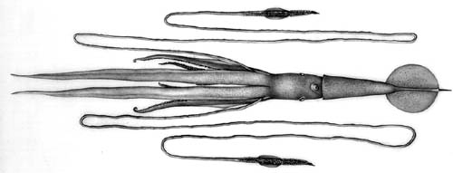

## Phylogeny 

-   « Ancestral Groups  
    -   [Chiroteuthis](Chiroteuthis)
    -   [Chiroteuthidae](Chiroteuthidae)
    -   [Chiroteuthid families](Chiroteuthid_families)
    -   [Oegopsida](Oegopsida)
    -   [Decapodiformes](Decapodiformes)
    -   [Coleoidea](Coleoidea)
    -   [Cephalopoda](Cephalopoda)
    -   [Mollusca](Mollusca)
    -   [Bilateria](Bilateria)
    -   [Animals](Animals)
    -   [Eukaryotes](Eukaryotes)
    -   [Tree of Life](../../../../../../../../../../../Tree_of_Life.md)

-   ◊ Sibling Groups of  Chiroteuthis
    -   Chiroteuthis sp. B2
    -   [Chiroteuthis calyx](Chiroteuthis_calyx)
    -   [Chiroteuthis joubini](Chiroteuthis_joubini)
    -   [Chiroteuthis mega](Chiroteuthis_mega)
    -   [Chiroteuthis picteti](Chiroteuthis_picteti)
    -   [Chiroteuthis spoeli](Chiroteuthis_spoeli)
    -   [Chiroteuthis veranyi](Chiroteuthis_veranyi)

-   » Sub-Groups 

# *Chiroteuthis sp. B2* 

[Clyde F. E. Roper and Richard E. Young]()

The illustrated squid is deposited in the National Museum of Natural
History, Smithsonian Institution, Washington, D.C., U.S.A..

Containing group: *[Chiroteuthis](Chiroteuthis.md)*

## Introduction

***Chiroteuthis sp. B2*** is a member of the ***Chiroteuthis joubini***
species complex. It is most easily separated from these species by
features of the proximal section of the tentacular club and by sucker
dentition.

#### Diagnosis

A ***Chiroteuthis*** \...

-   with club protective  membranes divided into three divisions of
    roughly the same size.
-   with nonglobular arm suckers globular bearing pointed teeth.\

### Characteristics

1.  Arms
    1.  Largest arm suckers with ca. 25 sharply pointed teeth. Teeth
        triangular distally becoming saw-toothed laterally; proximal 1/5
        of sucker ring smooth.
    2.  Largest suckers not globular.\
2.  Tentacular clubs
    1.  Suckers without enlarged central tooth.
    2.  Sucker stalks in two distinct parts; each basal portion with
        small flag; stalks of lateral and medial suckers about equal in
        length.
    3.  Protective membranes
        1.  Membranes in three distinctive sets of roughtly comparable
            length;  intermediate set with fused trabeculae.\
3.  Photophores
    1.  Eyeball - Two series of circular organs.
    2.  Viscera: two large organs.\
4.  Pigmentation
    1.  Sucker stalks with light pigmentation, becoming less pigmented
        distally; without pleats.
    2.  Buccal membrane unpigmented.

#### Comments

The pointed teeth in the large arm suckers, the lack of pleats on the
club sucker stalks and the position of the proximal aboral photophore on
the club seem to separate this species from other members of the species
group. However, until the range of variation in these characters is
better understood, the validity of this taxon will be in question.

[More details of the description of ***Chiroteuthis*** sp. B2 are found here.](http://www.tolweb.org/accessory/Chiroteuthis_sp._B2_Description?acc_id=720)

### Life history

Little is known of the life history of this species.

### Distribution

Temperate South Atlantic. Some variation in sucker dentition is apparent

## Title Illustrations



  -----------
  Scientific Name ::   Chiroteuthis sp. B2
  Location ::         South Atlantic Ocean
  Creator            J. R. Schroeder
  Sex ::              Female
  Life Cycle Stage ::   immature
  Size               130 mm ML
  -----------

## Confidential Links & Embeds: 

### #is_/same_as :: [sp. B2](/_Standards/bio/bio~Domain/Eukaryotes/Animals/Bilateria/Mollusca/Cephalopoda/Coleoidea/Decapodiformes/Oegopsida/Chiroteuthid/Chiroteuthidae/Chiroteuthis/sp. B2.md) 

### #is_/same_as :: [sp. B2.public](/_public/bio/bio~Domain/Eukaryotes/Animals/Bilateria/Mollusca/Cephalopoda/Coleoidea/Decapodiformes/Oegopsida/Chiroteuthid/Chiroteuthidae/Chiroteuthis/sp. B2.public.md) 

### #is_/same_as :: [sp. B2.internal](/_internal/bio/bio~Domain/Eukaryotes/Animals/Bilateria/Mollusca/Cephalopoda/Coleoidea/Decapodiformes/Oegopsida/Chiroteuthid/Chiroteuthidae/Chiroteuthis/sp. B2.internal.md) 

### #is_/same_as :: [sp. B2.protect](/_protect/bio/bio~Domain/Eukaryotes/Animals/Bilateria/Mollusca/Cephalopoda/Coleoidea/Decapodiformes/Oegopsida/Chiroteuthid/Chiroteuthidae/Chiroteuthis/sp. B2.protect.md) 

### #is_/same_as :: [sp. B2.private](/_private/bio/bio~Domain/Eukaryotes/Animals/Bilateria/Mollusca/Cephalopoda/Coleoidea/Decapodiformes/Oegopsida/Chiroteuthid/Chiroteuthidae/Chiroteuthis/sp. B2.private.md) 

### #is_/same_as :: [sp. B2.personal](/_personal/bio/bio~Domain/Eukaryotes/Animals/Bilateria/Mollusca/Cephalopoda/Coleoidea/Decapodiformes/Oegopsida/Chiroteuthid/Chiroteuthidae/Chiroteuthis/sp. B2.personal.md) 

### #is_/same_as :: [sp. B2.secret](/_secret/bio/bio~Domain/Eukaryotes/Animals/Bilateria/Mollusca/Cephalopoda/Coleoidea/Decapodiformes/Oegopsida/Chiroteuthid/Chiroteuthidae/Chiroteuthis/sp. B2.secret.md)

