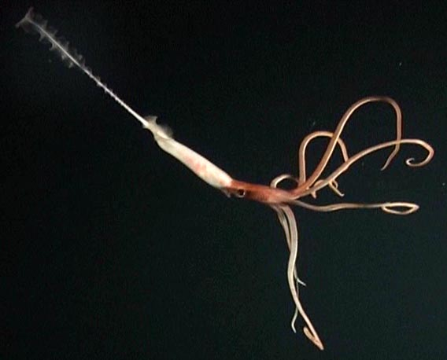

## Joubiniteuthidae [Naef, 1922] 

# Joubiniteuthis portieri 
[Joubin, 1916] 




This family contains only a single species.

## Introduction

[Richard E. Young]()

**Joubiniteuthis portieri** is a meso- to bathypelagic squid found
circumglobally in tropical and subtropical regions. This squid is
unusual in possessing extremely long arms I-III that bear numerous small
suckers in six series. Little is known about the biology of this squid.
Perhaps it floats in the depths of the ocean with arms outstretched
waiting for a small animal to accidently swim into them.

#### Diagnosis

A member of the chiroteuthidae families \...

-   with suckers in six series on arms I-III.
-   with suckers in four series on arms IV.
-   with arms I-III three or more times as long as arms IV.

### Characteristics

1.  Arms
    1.  Arms I-III extremely long (over twice ML).
    2.  Low web joins arms I-III.
    3.  Arms IV short (length one third or less than length of other
        arms).
    4.  Dorsal six arms with suckers in six series; ventral arms with
        suckers in four series.

        {width="308"}
        **Figure**. Fins and tail of ***J. portieri***, same squid as in
        the title photograph. Submersible photograph, Hawaiian waters.

    ```{=html}
    <!-- -->
    ```
2.  Photophores
    1.  Absent.

#### Comments

[More details of the description can be found here.](http://www.tolweb.org/accessory/Description_continued?acc_id=2414)

The presence of the membranous ornamentation on the slender tail wasn\'t
known until recent observations (2003) of the squid from a submersible
(see below). Therefore, the older drawings reproduced here and on the
accompanying page show a smooth tail.

### Nomenclature

[A list of all nominal genera and species in the Joubiniteuthidae can be found here](http://www.tolweb.org/accessory/Joubiniteuthidae_Taxa?acc_id=2331).
The list includes the current status and type species of all genera, and
the current status, type repository and type locality of all species and
all pertinent references.

### Life History

An advanced paralarval stage has been described (Young, 1991). The
paralarva (6.9 mm ML without the tail) is very distinctive with large,
thick tentacles, small fins and long tail.


**Figure**. Ventral (top) and dorsal views of a paralarva of ***J.
portieri***, 6.9 mm ML, Hawaiian waters. Scale bar is 1 mm. Drawings
from Young (1991).
### Behavior

Recent observations and video recordings of ***J. portieri*** by Frank
Parrish (NMFS) from a research submersible at a depth of about 1100 m
has provided the only direct evidence of the behavior of this squid (see
video frames below). Except for the constant beating of the tail fin,
the squid\'s movements appeared to be in extreme slow-motion. The video
indicates that the squid extends it tentacles in a manner similar to
that seen in species of ***Mastigoteuthis*** and ***Chiroteuthis**.* In
these squids the large tentacle-sheaths (= lateral membranes of arms IV)
on the long arms IVcradle the tentacles so that the extending tentacles
seem to emerge from the tips of arms IV. With arms IVspread apart
laterally, the long, delicate tentacles are less likely to entangle one
another. In spite of the fact that ***Joubiniteuthis*** has very short
arms IV it appears to use the same tentacle-deployment strategy.

{width="223"}

**Figure**. When first seen from the submersible, the **J. portieri**
had the posture shown in the video-frame above. Two small projections
(arrow) emerge between the arms that, presumably, are the tentacles.

{width="246"}

**Figure**. A bit later (video-frame above), the squid repositions each
of its long dorsal six arms into similar loops while the ventral arms
(arms IV) hang vertically downward possibly with the tentacular clubs
just emerging from the tentacle-sheaths at the tips of these arms.

{width="319"}

**Figure**. Shortly afterwards (video-frame above), the tentacles extend
further and the tentacular stalks (left-pointing arrows) can clearly be
seen emerging from the tentacle-sheaths of arms IV which now are angled
forward. The thick, terminal clubs (right-pointing arrows) are apparent.

{width="300"}

**Figure**. Moments later (video-frame above) from an oral view, a
nearly right-angle bend marks the emergence of the tentacles from the
tentacle-sheaths of arms IV.

{width="261"}

**Figure**. The final view of the squid shows the tentacles dangling far
below the tips of the spread arms IV.
### Distribution

#### Vertical Distribution

There are few unambiguous records of the depth of capture of this
species. Young (1978) reported a nighttime capture (64 mm ML) in an
opening-closing net at 480-550 m depth and a nighttime capture (42 mm
ML) in an oblique tow that fished to 425 m. A number of captures have
been made during the day or night in open tows that fished from 800 to
2500 m but the squid could have been caught during setting or retreival
of the net. The submersible record, therefore, is especially valuable as
it confirms the presence of the squid in deep water (1100? m) during the
day.

#### Geographical Distribution

Although the records are scattered, this squid appears to occupy
tropical and subtropical latitudes throughout the world\'s oceans.

## Phylogeny 

-   « Ancestral Groups  
    -   [Chiroteuthid families](Chiroteuthid_families)
    -   [Oegopsida](Oegopsida)
    -   [Decapodiformes](Decapodiformes)
    -   [Coleoidea](Coleoidea)
    -   [Cephalopoda](Cephalopoda)
    -   [Mollusca](Mollusca)
    -   [Bilateria](Bilateria)
    -   [Animals](Animals)
    -   [Eukaryotes](Eukaryotes)
    -   [Tree of Life](../../../../../../../../../../Tree_of_Life.md)

-   ◊ Sibling Groups of  Chiroteuthid families
    -   [Batoteuthis skolops](Batoteuthis_skolops)
    -   [Chiroteuthidae](Chiroteuthidae)
    -   Joubiniteuthis portieri
    -   [Magnapinna](Magnapinna)
    -   [Mastigoteuthis](Mastigoteuthis)
    -   [Promachoteuthis](Promachoteuthis)

-   » Sub-Groups 

## Title Illustrations

--------------------------

Scientific Name ::     Joubiniteuthis portieri
Location ::           Off Northwestern Hawaiian Islands, 1100 m depth.
Comments             Photograph from Hawaii Undersea Research Laboratory Video-archive
Specimen Condition   Live Specimen
Identified By        R.E.Y.
View                 Side
Size                 30-40 cm total length
Copyright ::            © Frank Parrish

--------------------------

Scientific Name ::     Joubiniteuthis portieri
Reference            Young, R. E. and C. F. E. Roper. 1969. A monograph of the Cephalopoda of the North Atlantic: The family Joubiniteuthidae. Smithson. Contr. Zool. No. 15: 1-10.
Specimen Condition   Dead Specimen
View                 Ventral
Copyright ::            © 1969 [Richard E. Young](http://www.soest.hawaii.edu/%7Eryoung/rey.html) 


## Confidential Links & Embeds: 

### #is_/same_as :: [Joubiniteuthidae](/_Standards/bio/bio~Domain/Eukaryotes/Animals/Bilateria/Mollusca/Cephalopoda/Coleoidea/Decapodiformes/Oegopsida/Chiroteuthid/Chiroteuthidae/Joubiniteuthidae.md) 

### #is_/same_as :: [Joubiniteuthidae.public](/_public/bio/bio~Domain/Eukaryotes/Animals/Bilateria/Mollusca/Cephalopoda/Coleoidea/Decapodiformes/Oegopsida/Chiroteuthid/Chiroteuthidae/Joubiniteuthidae.public.md) 

### #is_/same_as :: [Joubiniteuthidae.internal](/_internal/bio/bio~Domain/Eukaryotes/Animals/Bilateria/Mollusca/Cephalopoda/Coleoidea/Decapodiformes/Oegopsida/Chiroteuthid/Chiroteuthidae/Joubiniteuthidae.internal.md) 

### #is_/same_as :: [Joubiniteuthidae.protect](/_protect/bio/bio~Domain/Eukaryotes/Animals/Bilateria/Mollusca/Cephalopoda/Coleoidea/Decapodiformes/Oegopsida/Chiroteuthid/Chiroteuthidae/Joubiniteuthidae.protect.md) 

### #is_/same_as :: [Joubiniteuthidae.private](/_private/bio/bio~Domain/Eukaryotes/Animals/Bilateria/Mollusca/Cephalopoda/Coleoidea/Decapodiformes/Oegopsida/Chiroteuthid/Chiroteuthidae/Joubiniteuthidae.private.md) 

### #is_/same_as :: [Joubiniteuthidae.personal](/_personal/bio/bio~Domain/Eukaryotes/Animals/Bilateria/Mollusca/Cephalopoda/Coleoidea/Decapodiformes/Oegopsida/Chiroteuthid/Chiroteuthidae/Joubiniteuthidae.personal.md) 

### #is_/same_as :: [Joubiniteuthidae.secret](/_secret/bio/bio~Domain/Eukaryotes/Animals/Bilateria/Mollusca/Cephalopoda/Coleoidea/Decapodiformes/Oegopsida/Chiroteuthid/Chiroteuthidae/Joubiniteuthidae.secret.md)

