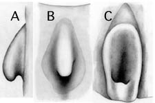

# Planctoteuthis [[exopthalmica]] 
[(Chun 1910)] 

Containing group: *[Planctoteuthis](Planctoteuthis.md)*

## Introduction

[Richard E. Young and Clyde F. E. Roper](http://www.tolweb.org/)

***P. exopthalmica*** is poorly known as the original description was
based on a 25 mm and a 9.5 mm ML paralarva. The 9.5 mm ML specimen,
taken from the Indian Ocean, was designated as the lectotype (i.e., a
\"holotype\" designated from the original type series) by Glaubrecht and
Salcedo-Vargas (2000:274). The 25 mm ML specimen, taken in the North
Atlantic, has been placed in the synonomy of ***P. levimana*** by Young
et al. (in press). The most distinguishing feature of the small
lectotype is a slender, unexpanded club, a feature shared with ***P.
levimana.*** ***P. exopthalmica*** may eventually prove to be a junior
synonym of ***P. levimana.***\

### Characteristics

From Chun, 1910:

1.  Arms
    1.  Arms IV bear uniserial suckers.
    2.  Arms IV 7 mm long.
2.  Fins
    1.  Dorsal base of fins short (1.5 mm).
    2.  Combined width of fins 3.8 mm.

#### Comments

Most of Chun\'s description was based on the larger specimen which no
longer is placed in this species. Chun states, \"The smaller specimen
from the Indian Ocean closely resembles the \[larger\] specimen in all
important characters.\" However, we reproduce here only information
specifically based on the small lectotype.\

### Nomenclature

This species was originally described by by Chun (1908) as ***Doratopsis
exopthalmica*** and was placed in ***Planktoteuthis*** by Young (1991)
due to the characteristic ventrally protruding eyes and shape of the
fins.

### Life history

Virtually nothing is known beyond the description of the paralarva.

### Distribution

#### Geographical distribution

The lectotype is from the temperate South Indian Ocean at 43°13'S, 80°30'E.

## Phylogeny 

-   « Ancestral Groups  
    -   [Planctoteuthis](Planctoteuthis)
    -   [Chiroteuthidae](Chiroteuthidae)
    -   [Chiroteuthid families](Chiroteuthid_families)
    -   [Oegopsida](Oegopsida)
    -   [Decapodiformes](Decapodiformes)
    -   [Coleoidea](Coleoidea)
    -   [Cephalopoda](Cephalopoda)
    -   [Mollusca](Mollusca)
    -   [Bilateria](Bilateria)
    -   [Animals](Animals)
    -   [Eukaryotes](Eukaryotes)
    -   [Tree of Life](../../../../../../../../../../../Tree_of_Life.md)

-   ◊ Sibling Groups of  Planctoteuthis
    -   [Planctoteuthis danae](Planctoteuthis_danae)
    -   Planctoteuthis exopthalmica
    -   [Planctoteuthis levimana](Planctoteuthis_levimana)
    -   [Planctoteuthis lippula](Planctoteuthis_lippula)
    -   [Planctoteuthis         oligobessa](Planctoteuthis_oligobessa)

-   » Sub-Groups 

## Title Illustrations

---------------------------------------------------

Scientific Name ::  Planctoteuthis exopthalmica
Reference         Chun, C. 1910. Die Cephalopoden. Oegopsida. Wissenschaftliche Ergebnisse der Deutschen Tiefsee-Expedition, \"Valdivia\" 1898-1899, 18: 1-522 + Atlas.
Size              9.5 mm ML

---------------------------------------------------

Scientific Name ::   Planctoteuthis exopthalmica
Reference          Chun, C. 1910. Die Cephalopoden. Oegopsida. Wissenschaftliche Ergebnisse der Deutschen Tiefsee-Expedition, \"Valdivia\" 1898-1899, 18: 1-522 + Atlas.
Life Cycle Stage ::   Paralarva
View               Dorsal
Size               9.5 mm ML
Type               Lectotype
