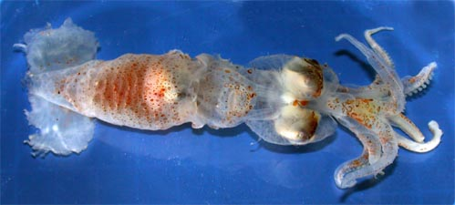

# Planctoteuthis [[levimana]] 
[(Lonnberg 1896)] 

The neotype is deposited in the Bergen Museum, catalogue number ZMBN
77635.\

Containing group: *[Planctoteuthis](Planctoteuthis.md)*

## Introduction

[Richard E. Young, Michael Vecchione, Uwe Piatkowski, and Clyde F. E. Roper]() 

***Planctoteuthis levimana*** was originally described as
***Mastigoteuthis levimana***, based on two specimens, one of which was
in fragments. It was placed in the synonomy of ***Planctoteuthis*** by
Young, 1991. The genus ***Planctoteuthis*** was not recognized until
1912 (Pfeffer, 1912) and ***P. levimana*** is now the oldest species
assigned to this genus. This description is based on two specimens, one
of which is badly damaged but has a single tentacle with an intact club
(see Young, et al., 2006). The other is in exceptionally good condition
although arm tips and tentacular clubs are missing.

#### Brief diagnosis

A ***Planctoteuthis*** \...

-   with long, slender tentacular club, without keel.
-   with double but unequal knobs compose antitragus in funnel
    locking-apparatus.

### Characteristics

1.  Arms
    1.  Arms suckers on arms IV in \"single\" broadly spaced series of
        6-8 suckers (7 suckers on the neotype and 6-8 in the type
        series).
2.  Tentacles
    1.  Club long and slender.
    2.  Club without aboral keel.
    3.  Club without terminal pad.
3.  Funnel
    1.  Funnel locking-apparatus oval with bilobed antitragus; lateral
        lobe broader; low channel between lobes off center toward medial
        edge of cartilage.

#### Comments

[More details of the description can be seen here.](http://www.tolweb.org/notes/?note_id=3119)

Specimens for the above description came from the region of the type
locality of ***P. levimana***. The similarity of the antitragus with
that illustrated of the holotype confirms the identification. The
holotype of ***P. levimana*** lacked tentacles. These specimens share a
double, but somewhat different, antitragus with **P. danae**. The
latter, however, has a much larger fin than ***P. levimana***.

### Nomenclature

Young et al. (2006) found that the original type series (two specimens,
one in fragments) is missing from the Zoological Museum, Uppsala
University, Sweden, and designated one of the specimens they examined
(the 60 mm ML immature female) as the neotype.

### Life history

Nesis (1982-87) suggested that ***P. lippula*** Chun, 1908 may be the
paralarva of ***P. levimana***. The latter, however, is now known to
have slender club lacking a keel which is similar to ***P.
exopthalmica***. A paralectotype of ***P. exopthalmica*** was taken by
Chun in the North Atlantic (31° 59\'N, 15° 5\'W) and probably belongs to
***P. levimana***. Whether or not ***P. exopthalmica***, which is now
based on a single small (9.5 mm ML) paralarva from the Indian Ocean is a
junior synonym of ***P. levimana*** remains to be determined.

**Figure**. Ventral view of a paralarva of ***P. levimana***, 25 mm ML,
North Atlantic. Drawing from Chun (1910) identified as ***P.
exopthalmica***.

### Distribution

Type locality: The holotype was taken from the north Atlantic Ocean at
43° N., 24° W; the neotype was taken nearby on July 1, 2004 at 41°31\'N,
29°55\'W north of the Azores in a trawl that fished from 800-1800 m.
Unless the lost holotype is found, the location of the neotype is the
type locality. The second specimen described here (with tentacular club)
was taken on July 1, 2004 at 41°18\'N, 28°15\'W in a trawl that fished
from 0-2400 m.

## Phylogeny 

-   « Ancestral Groups  
    -   [Planctoteuthis](Planctoteuthis)
    -   [Chiroteuthidae](Chiroteuthidae)
    -   [Chiroteuthid families](Chiroteuthid_families)
    -   [Oegopsida](Oegopsida)
    -   [Decapodiformes](Decapodiformes)
    -   [Coleoidea](Coleoidea)
    -   [Cephalopoda](Cephalopoda)
    -   [Mollusca](Mollusca)
    -   [Bilateria](Bilateria)
    -   [Animals](Animals)
    -   [Eukaryotes](Eukaryotes)
    -   [Tree of Life](../../../../../../../../../../../Tree_of_Life.md)

-   ◊ Sibling Groups of  Planctoteuthis
    -   [Planctoteuthis danae](Planctoteuthis_danae)
    -   [Planctoteuthis         exopthalmica](Planctoteuthis_exopthalmica)
    -   Planctoteuthis levimana
    -   [Planctoteuthis lippula](Planctoteuthis_lippula)
    -   [Planctoteuthis         oligobessa](Planctoteuthis_oligobessa)

-   » Sub-Groups 

## Title Illustrations

------------------------------------------------------------------------------

Scientific Name ::     Planctoteuthis levimana
Location ::           41°31\'N, 29°55\'W
Specimen Condition   Fresh
Sex ::                Female
View                 Ventral
Size                 60 mm ML
Collection           Bergen Museum, cat. no. ZMBN 77635
Type                 Neotype
Copyright ::            © [Richard E. Young](http://www.soest.hawaii.edu/%7Eryoung/rey.html) 

## Confidential Links & Embeds: 

### #is_/same_as :: [levimana](/_Standards/bio/bio~Domain/Eukaryotes/Animals/Bilateria/Mollusca/Cephalopoda/Coleoidea/Decapodiformes/Oegopsida/Chiroteuthid/Chiroteuthidae/Planctoteuthis/levimana.md) 

### #is_/same_as :: [levimana.public](/_public/bio/bio~Domain/Eukaryotes/Animals/Bilateria/Mollusca/Cephalopoda/Coleoidea/Decapodiformes/Oegopsida/Chiroteuthid/Chiroteuthidae/Planctoteuthis/levimana.public.md) 

### #is_/same_as :: [levimana.internal](/_internal/bio/bio~Domain/Eukaryotes/Animals/Bilateria/Mollusca/Cephalopoda/Coleoidea/Decapodiformes/Oegopsida/Chiroteuthid/Chiroteuthidae/Planctoteuthis/levimana.internal.md) 

### #is_/same_as :: [levimana.protect](/_protect/bio/bio~Domain/Eukaryotes/Animals/Bilateria/Mollusca/Cephalopoda/Coleoidea/Decapodiformes/Oegopsida/Chiroteuthid/Chiroteuthidae/Planctoteuthis/levimana.protect.md) 

### #is_/same_as :: [levimana.private](/_private/bio/bio~Domain/Eukaryotes/Animals/Bilateria/Mollusca/Cephalopoda/Coleoidea/Decapodiformes/Oegopsida/Chiroteuthid/Chiroteuthidae/Planctoteuthis/levimana.private.md) 

### #is_/same_as :: [levimana.personal](/_personal/bio/bio~Domain/Eukaryotes/Animals/Bilateria/Mollusca/Cephalopoda/Coleoidea/Decapodiformes/Oegopsida/Chiroteuthid/Chiroteuthidae/Planctoteuthis/levimana.personal.md) 

### #is_/same_as :: [levimana.secret](/_secret/bio/bio~Domain/Eukaryotes/Animals/Bilateria/Mollusca/Cephalopoda/Coleoidea/Decapodiformes/Oegopsida/Chiroteuthid/Chiroteuthidae/Planctoteuthis/levimana.secret.md)

