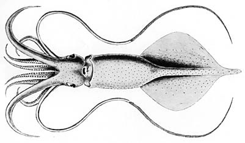

## Phylogeny 

-   « Ancestral Groups  
    -   [Mastigoteuthis](Mastigoteuthis)
    -   [Chiroteuthid families](Chiroteuthid_families)
    -   [Oegopsida](Oegopsida)
    -   [Decapodiformes](Decapodiformes)
    -   [Coleoidea](Coleoidea)
    -   [Cephalopoda](Cephalopoda)
    -   [Mollusca](Mollusca)
    -   [Bilateria](Bilateria)
    -   [Animals](Animals)
    -   [Eukaryotes](Eukaryotes)
    -   [Tree of Life](../../../../../../../../../../Tree_of_Life.md)

-   ◊ Sibling Groups of  Mastigoteuthis
    -   [Mastigoteuthis tyroi](Mastigoteuthis_tyroi)
    -   [Mastigoteuthis schmidti](Mastigoteuthis_schmidti)
    -   Mastigoteuthis pyrodes
    -   [Mastigoteuthis         psychrophila](Mastigoteuthis_psychrophila)
    -   [Mastigoteuthis magna](Mastigoteuthis_magna)
    -   [Mastigoteuthis hjorti](Mastigoteuthis_hjorti)
    -   [Mastigoteuthis         glaukopis](Mastigoteuthis_glaukopis)
    -   [Mastigoteuthis         grimaldii](Mastigoteuthis_grimaldii)
    -   [Mastigoteuthis flammea](Mastigoteuthis_flammea)
    -   [Mastigoteuthis famelica](Mastigoteuthis_famelica)
    -   [Mastigoteuthis dentata](Mastigoteuthis_dentata)
    -   [Mastigoteuthis danae](Mastigoteuthis_danae)
    -   [Mastigoteuthis         cordiformis](Mastigoteuthis_cordiformis)
    -   [Mastigoteuthis         atlantica](Mastigoteuthis_atlantica)
    -   [Mastigoteuthis         agassizii](Mastigoteuthis_agassizii)

-   » Sub-Groups 

# *Mastigoteuthis pyrodes* [Young, 1972] 

[Richard E. Young and Michael Vecchione]()

Containing group: [Mastigoteuthidae](Mastigoteuthidae.md)

## Introduction

***M. pyrodes*** is a very distinctive species and the only species of
***Mastigoteuthis*** known off Southern California, U.S.A.

#### Diagnosis

A mastigoteuthid \...

-   with integumental photophores and much larger eyelid photophores.
-   with broad funnel locking-apparatus lacking undercut posterior
    margin and antitragus.
-   with large club suckers (ca. 0.3 mm diam.)

### Characteristics

1.  Tentacles
    1.  Largest suckers of tentacular club about 0.3 mm in longest
        diameter.
    2.  Club suckers slightly elongate with 2-3 large knobs projecting
        into orifice of sucker from outer ring; few tiny distal teeth on
        inner ring.
2.  Funnel/mantle locking-apparatus
    1.  Funnel component with strong tragus on anteromedial side of
        broad oval depression.
    2.  Funnel component with low antitragus rarely visible on posterior
        border.
    3.  Funnel component with posterior border not undercut by the oval
        depression; posterior tip of mantle component does not overlap
        posterior base (ie, in profile, the mantle does not have a
        hook-shape).

#### Comments

[Additional features of the description can be found here.](http://www.tolweb.org/notes/?note_id=3138){target="_self"}

***M. pyrodes*** has the following unique features:

-   Integumental photophores on the ventral side of the fins as well as
    dorsal.
-   Funnel locking-apparatus without a antitragus and without a
    posterior undercut shelf. Mantle component without a hook-nose
    shape.
-   Eyelid photophore far larger than integumental photophores.
-   Dorsal photophores present on head and mantle.

Since the integument is often lost during capture, the form of the
funnel locking-apparatus is the most useful character.

***M. pyrodes*** is easily separated from the Pacific
integumental-photophore-bearing ***M. dentata*** by, in addition to the
above features, the many (vs two) series of photophores on arms IV and
the size, shape and ornamentation of the club suckers.

### Distribution

Type locality: 33°32\'N, 118°23\'W, off the coast of Southern
California, Eastern North Pacific. Distribution: Off Southern
California; northern Hawaiian waters (ca somewhere between 23°N-28°N).

### References

Young, R. E. 1972. The systematics and areal distribution of pelagic
cephalopods from the seas off Southern California. Smithson. Contr.
Zool., 97: 1-159.

## Title Illustrations



  --------------------------------------------------------------------------------
  Scientific Name ::   *Mastigoteuthis pyrodes*
  Comments           Holotype
  Sex ::              Male
  Life Cycle Stage ::   Immature
  View               Ventral
  Size               110 mm ML
  Copyright ::          © 1972 [Richard E. Young](http://www.soest.hawaii.edu/%7Eryoung/rey.html) 
  --------------------------------------------------------------------------------

## Confidential Links & Embeds: 

### #is_/same_as :: [pyrodes](/_Standards/bio/bio~Domain/Eukaryotes/Animals/Bilateria/Mollusca/Cephalopoda/Coleoidea/Decapodiformes/Oegopsida/Chiroteuthid/Mastigoteuthidae/pyrodes.md) 

### #is_/same_as :: [pyrodes.public](/_public/bio/bio~Domain/Eukaryotes/Animals/Bilateria/Mollusca/Cephalopoda/Coleoidea/Decapodiformes/Oegopsida/Chiroteuthid/Mastigoteuthidae/pyrodes.public.md) 

### #is_/same_as :: [pyrodes.internal](/_internal/bio/bio~Domain/Eukaryotes/Animals/Bilateria/Mollusca/Cephalopoda/Coleoidea/Decapodiformes/Oegopsida/Chiroteuthid/Mastigoteuthidae/pyrodes.internal.md) 

### #is_/same_as :: [pyrodes.protect](/_protect/bio/bio~Domain/Eukaryotes/Animals/Bilateria/Mollusca/Cephalopoda/Coleoidea/Decapodiformes/Oegopsida/Chiroteuthid/Mastigoteuthidae/pyrodes.protect.md) 

### #is_/same_as :: [pyrodes.private](/_private/bio/bio~Domain/Eukaryotes/Animals/Bilateria/Mollusca/Cephalopoda/Coleoidea/Decapodiformes/Oegopsida/Chiroteuthid/Mastigoteuthidae/pyrodes.private.md) 

### #is_/same_as :: [pyrodes.personal](/_personal/bio/bio~Domain/Eukaryotes/Animals/Bilateria/Mollusca/Cephalopoda/Coleoidea/Decapodiformes/Oegopsida/Chiroteuthid/Mastigoteuthidae/pyrodes.personal.md) 

### #is_/same_as :: [pyrodes.secret](/_secret/bio/bio~Domain/Eukaryotes/Animals/Bilateria/Mollusca/Cephalopoda/Coleoidea/Decapodiformes/Oegopsida/Chiroteuthid/Mastigoteuthidae/pyrodes.secret.md)

