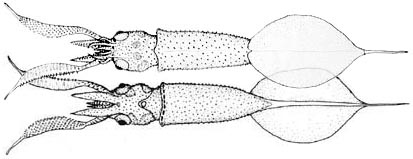

## Phylogeny 

-   « Ancestral Groups  
    -   [Mastigoteuthis](Mastigoteuthis)
    -   [Chiroteuthid families](Chiroteuthid_families)
    -   [Oegopsida](Oegopsida)
    -   [Decapodiformes](Decapodiformes)
    -   [Coleoidea](Coleoidea)
    -   [Cephalopoda](Cephalopoda)
    -   [Mollusca](Mollusca)
    -   [Bilateria](Bilateria)
    -   [Animals](Animals)
    -   [Eukaryotes](Eukaryotes)
    -   [Tree of Life](../../../../../../../../../../Tree_of_Life.md)

-   ◊ Sibling Groups of  Mastigoteuthis
    -   Mastigoteuthis tyroi
    -   [Mastigoteuthis schmidti](Mastigoteuthis_schmidti)
    -   [Mastigoteuthis pyrodes](Mastigoteuthis_pyrodes)
    -   [Mastigoteuthis         psychrophila](Mastigoteuthis_psychrophila)
    -   [Mastigoteuthis magna](Mastigoteuthis_magna)
    -   [Mastigoteuthis hjorti](Mastigoteuthis_hjorti)
    -   [Mastigoteuthis         glaukopis](Mastigoteuthis_glaukopis)
    -   [Mastigoteuthis         grimaldii](Mastigoteuthis_grimaldii)
    -   [Mastigoteuthis flammea](Mastigoteuthis_flammea)
    -   [Mastigoteuthis famelica](Mastigoteuthis_famelica)
    -   [Mastigoteuthis dentata](Mastigoteuthis_dentata)
    -   [Mastigoteuthis danae](Mastigoteuthis_danae)
    -   [Mastigoteuthis         cordiformis](Mastigoteuthis_cordiformis)
    -   [Mastigoteuthis         atlantica](Mastigoteuthis_atlantica)
    -   [Mastigoteuthis         agassizii](Mastigoteuthis_agassizii)

-   » Sub-Groups 

# *Mastigoteuthis tyroi* [Salcedo-Vargas, 1997] 

[Mario Alejandro Salcedo-Vargas and Richard E. Young]()

Containing group: [Mastigoteuthidae](Mastigoteuthidae.md)

## Introduction

This species is known from a single paralarva of 15 mm ML.

#### Diagnosis

A mastigoteuthid \...

-   with expanded clubs in paralarval stage.
-   with tubercules in paralarval stage.

### Characteristics

1.  Arms
    1.  Sucker dentition not examined.

    \
2.  Tentacles
    1.  Tentacle stalk short, thicker than arms IV.
    2.  Club flattened on oral surface and expanded.
    3.  Club suckers in 47 rows with 4-9 series across club.
    4.  Tip of club narrow and elongate, without suckers.
    5.  Sucker dentition not examined.
3.  Mantle
    1.  Transparent, cartilaginous, spiny-like tricuspid tubercules
        present on mantle and most other skin.
4.  Fins
    1.  Fin longer than wide.
    2.  Tail extends 20% of fin length.
5.  Photophores
    1.  Photophores absent.
6.  Pigmentation
    1.  Aboral surface of tentacle club and stalk with transverse
        pigment bands.
    2.  Large chromatophores on both sides of head and at base of
        armature.
    3.  Small chromatophores around anterior edge of mantle.
7.  Measurements
      -------------
      Source                      Salcedo-Vargas, 1997
      Sex ::                       ?
      Mantle length               15
      Mantle width                3.5
      Head length                 3.5
      Head width                  2.5
      Fin length                  8
      Fin width                   12
      Arm I, length               1.2
      Arm II, length              1.8
      Arm III, length             1.2
      Arm IV, length              2.5
      Tentacle length             6
      Club length                 3.5
      Eye diameter / Lens diam.   1.3 / 0.8
      -------------

#### Comments

This paralarva is unlike any other described (although few species have
described paralarvae) and is especially distinctive in having expanded
tentacular clubs. The only species of **Mastigoteuthis** that has
slightly expanded tentacle clubs as a subadult is **M. cordiformis** but
the paralarva of this species is unknown.

### Distribution

Type locality: Indian Ocean off the coast of Somalia at ca. 08.1°N,
56.1°E, 212 m depth. This species is known only from the type specimen.

### References

Salcedo-Vargas, M. A. 1997. Cephalopods from the Netherlands Indian
Ocean Programme (NIOP) - II. Mastigoteuthid lineage and related forms.
Beaufortia, 47: 91-108.

## Title Illustrations



  ------------------------------------------------------------------------------
  Scientific Name ::   Mastigoteuthis tyroi
  Reference          Salcedo-Vargas, M. A. 1997. Cephalopods from the Netherlands Indian Ocean Programme (NIOP) - II. Mastigoteuthid lineage and related forms. Beaufortia, 47: 91-108.
  Life Cycle Stage ::   Paralarva
  View               Dorsal and ventral.
  Size               15 mm ML
  Type               Holotype
  Copyright ::          © 2004 [Mario Alejandro Salcedo-Vargas](mailto:ikatako@hotmail.com) 
  ------------------------------------------------------------------------------

## Confidential Links & Embeds: 

### [tyroi](/_Standards/bio/bio~Domain/Eukaryotes/Animals/Bilateria/Mollusca/Cephalopoda/Coleoidea/Decapodiformes/Oegopsida/Chiroteuthid/Mastigoteuthidae/tyroi.md) 

### [tyroi.public](/_public/bio/bio~Domain/Eukaryotes/Animals/Bilateria/Mollusca/Cephalopoda/Coleoidea/Decapodiformes/Oegopsida/Chiroteuthid/Mastigoteuthidae/tyroi.public.md) 

### [tyroi.internal](/_internal/bio/bio~Domain/Eukaryotes/Animals/Bilateria/Mollusca/Cephalopoda/Coleoidea/Decapodiformes/Oegopsida/Chiroteuthid/Mastigoteuthidae/tyroi.internal.md) 

### [tyroi.protect](/_protect/bio/bio~Domain/Eukaryotes/Animals/Bilateria/Mollusca/Cephalopoda/Coleoidea/Decapodiformes/Oegopsida/Chiroteuthid/Mastigoteuthidae/tyroi.protect.md) 

### [tyroi.private](/_private/bio/bio~Domain/Eukaryotes/Animals/Bilateria/Mollusca/Cephalopoda/Coleoidea/Decapodiformes/Oegopsida/Chiroteuthid/Mastigoteuthidae/tyroi.private.md) 

### [tyroi.personal](/_personal/bio/bio~Domain/Eukaryotes/Animals/Bilateria/Mollusca/Cephalopoda/Coleoidea/Decapodiformes/Oegopsida/Chiroteuthid/Mastigoteuthidae/tyroi.personal.md) 

### [tyroi.secret](/_secret/bio/bio~Domain/Eukaryotes/Animals/Bilateria/Mollusca/Cephalopoda/Coleoidea/Decapodiformes/Oegopsida/Chiroteuthid/Mastigoteuthidae/tyroi.secret.md)

