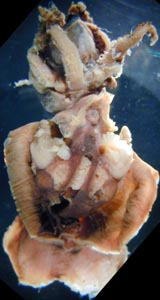

## Phylogeny 

-   « Ancestral Groups  
    -   [Promachoteuthis](Promachoteuthis)
    -   [Chiroteuthid families](Chiroteuthid_families)
    -   [Oegopsida](Oegopsida)
    -   [Decapodiformes](Decapodiformes)
    -   [Coleoidea](Coleoidea)
    -   [Cephalopoda](Cephalopoda)
    -   [Mollusca](Mollusca)
    -   [Bilateria](Bilateria)
    -   [Animals](Animals)
    -   [Eukaryotes](Eukaryotes)
    -   [Tree of Life](../../../../../../../../../../Tree_of_Life.md)

-   ◊ Sibling Groups of  Promachoteuthis
    -   [Promachoteuthis         megaptera](Promachoteuthis_megaptera)
    -   [Promachoteuthis sloani](Promachoteuthis_sloani)
    -   [Promachoteuthis sp. B](Promachoteuthis_sp._B)
    -   [Promachoteuthis sulcus](Promachoteuthis_sulcus)
    -   Promachoteuthis sp. D

-   » Sub-Groups 

# *Promachoteuthis sp. D* 

[Richard E. Young and Michael Vecchione]()

The catalogue number of the holotype is: USNM 00730701.

Containing group: [Promachoteuthidae](Promachoteuthidae.md)

## Introduction

***Promachoteuthis*** sp. D is known from a single incomplete specimen.\

#### Diagnosis

A promachoteuthid\...

-   with nuchal fusion between head and mantle.
-   with mostly 2 series of suckers on arms..
-   with tentacle at base narrower than arm III base.

### Characteristics

1.  Arms and tentacles
    1.  Arm suckers mostly in two series but tend toward three series in
        mid-arm.
    2.  Tentacles missing due to damage; remaining stubs about 75% as
        thick as bases of arms III.

        
        **Figure**. Lateral (**left**) and ventral (**right**) views of
        the head and brachial crown of ***Promachoteuthis*** sp. D
        showing large size of buccal mass. Note the broken stubs of the
        tentacles in the photographs. Photographs by R. Young.

#### Comments

[More details of the description can be found here.](http://www.tolweb.org/notes/?note_id=826)

Unfortunately the specimen is not in good condition. Previous
investigators cut open the mantle then partially dissected the squid
prior to fixation and, subsequently, the gladius was removed. In
addition, the tentacles are missing. In spite of these problems, this is
a very distinctive species. Considerable shrinkage has occurred which
overemphasizes the size of the buccal mass (see Measurements and
counts).

### Life History

Ovary and nidamental glands had been removed by an earlier investigator
and placed in a separate vial. The vial contains mostly large, free,
equally-sized, mature eggs (ca. 170 eggs at 1.8 mm x 1.5 mm) with very
few intermediate size and a small number of small oocytes still attached
to the ovarian strands. The photograph on the right shows

**Figure**. Ventral view of most of the mantle cavity and two eggs of
***Promachoteuthis*** sp. D placed beside it for size comparison. The
large posterior dark area in the visceral sac is where the ovary was
removed. Compare photograph with title photograph to clarify
orientation. Photograph by R. Young.

### Distribution

Type locality: 16°35\'E, 34°15\'S in the south Atlantic Ocean. Captured
from the WALTHER HERWIG at 1550 m depth.

## Title Illustrations



  -----------------------------------------------------------------------
  Scientific Name ::     Promachoteuthis sp. D
  Comments             Bar = 5 mm
  Creator              Keiko Hiratsuka Moore
  Acknowledgements     National Marine Fisheries Service
  Specimen Condition   Dead Specimen
  Sex ::                Female
  View                 Dorsal and ventral
  Type                 Holotype
  Copyright ::            © [Michael Vecchione](mailto:vecchiom@si.edu) 
  -----------------------------------------------------------------------


  --------------------------------------------------------------------------------
  Scientific Name ::     Promachoteuthis sp. D
  Comments             Holotype
  Specimen Condition   Dead Specimen
  View                 Dorsal
  Copyright ::            © 2003 [Richard E. Young](http://www.soest.hawaii.edu/%7Eryoung/rey.html) 
  --------------------------------------------------------------------------------


  --------------------------------------------------------------------------------
  Scientific Name ::     Promachoteuthis sp. D
  Comments             Holotype
  Specimen Condition   Dead Specimen
  View                 Ventral
  Copyright ::            © 2003 [Richard E. Young](http://www.soest.hawaii.edu/%7Eryoung/rey.html) 
  --------------------------------------------------------------------------------
