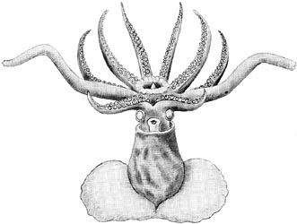
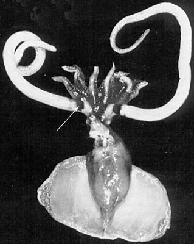

## Phylogeny 

-   « Ancestral Groups  
    -   [Promachoteuthis](Promachoteuthis)
    -   [Chiroteuthid families](Chiroteuthid_families)
    -   [Oegopsida](Oegopsida)
    -   [Decapodiformes](Decapodiformes)
    -   [Coleoidea](Coleoidea)
    -   [Cephalopoda](Cephalopoda)
    -   [Mollusca](Mollusca)
    -   [Bilateria](Bilateria)
    -   [Animals](Animals)
    -   [Eukaryotes](Eukaryotes)
    -   [Tree of Life](../../../../../../../../../../Tree_of_Life.md)

-   ◊ Sibling Groups of  Promachoteuthis
    -   Promachoteuthis megaptera
    -   [Promachoteuthis sloani](Promachoteuthis_sloani)
    -   [Promachoteuthis sp. B](Promachoteuthis_sp._B)
    -   [Promachoteuthis sulcus](Promachoteuthis_sulcus)
    -   [Promachoteuthis sp. D](Promachoteuthis_sp._D)

-   » Sub-Groups 

# *Promachoteuthis megaptera* [Hoyle 1885] 

[Richard E. Young and Michael Vecchione](http://www.tolweb.org/)

Containing group: [Promachoteuthidae](Promachoteuthidae.md)

## Introduction

***Promachoteuthis megaptera*** is known from only two specimens: the
holotype, 15 mm ML captured during the Challenger Expedition in the late
19th century and a female, 52 mm ML, captured 105 years later (1980)
from nearly the same locality. It is most easily distinguished from
congeners by the lack of a head-mantle fusion in the nuchal region, the
long arms and tentacles, and a dark band at the base of the tentacles
(see arrow in title photograph).

#### Diagnosis

A promachoteuthid\...

-   without nuchal fusion between head and mantle.
-   with 2 series of suckers on arms.
-   with pigment band around tentacle at base and without papillae on
    tentacles.

### Characteristics

1.  Tentacles
    1.  Long, thick (length \>2 times ML); base appears much wider than
        arm III (judging from title photograph).

    2.  Club with many series (number uncertain) of small suckers.

    3.  Suckers with smooth inner rings.

    4.  Large arm suckers approximately four times the diameter of large
        club suckers (see drawings with same magnification on the
        right).

    5.  Dark pigment band near tentacle base present (see title
        photograph above and drawing of head below).

        

        **Figure**. **Left** - Lateral view of the head showing the eye
        canal of ***P. megaptera***, 52 mm ML. **Right** - Dorsal view
        of the nuchal cartilage of ***P. megaptera***. Drawings from
        Okutani (1983).

#### Comments

This description, except for comments reflecting uncertainty, is taken
from Okutani (1983). [Additional details of the description can be found here.](http://www.tolweb.org/notes/?note_id=802)

### Life History

The larger squid was a female with small nidamental glands and an
immature ovary.

### Distribution

This species is known from two localities, both near Japan: 34°37\' N,
140°32\' E (type locality; 0-3690 m) and 31°00\' N, 147°00\' E (2750 m).

### References

Okutani, T. 1983. Rare and interesting squid from Japan. VIII.
Rediscovery of *Promachoteuthis megaptera* Hoyle, 1885 (Oegopsida:
Promachoteuthidae). Venus 42: 241-247.

Roper, C. F. E. and R. E. Young (1968). The family Promachoteuthidae
(Cephalopoda: Oegopsida). I. A re-evaluation of its systematic position
based on new material from Antarctic and adjacent waters. Ant. Res.
Ser., 11: 203-214.

## Title Illustrations



  --------------------------------------------------------------
  Scientific Name ::   Promachoteuthis megaptera
  Comments           Arrow points to the unusual pigment band at the base of the tentacle.
  Reference          Okutani, T. 1983. Rare and interesting squid from Japan. VIII. Rediscovery of Promachoteuthis megaptera Hoyle, 1885 (Oegopsida: Promachoteuthidae). Venus 42:241-247. with permission.
  Sex ::              Female
  Life Cycle Stage ::   Immature
  Size               52 mm ML
  --------------------------------------------------------------


  --------------------------------------------------------------------------------------
  Scientific Name ::  Promachoteuthis megaptera
  Reference         redrawn type illustration from Roper, C. F. E. and R. E. Young (1968). The family Promachoteuthidae (Cephalopoda: Oegopsida). I. A re-evaluation of its systematic position based on new material from Antarctic and adjacent waters. Ant. Res. Ser., 11: 203-214.
  View              ventral
  Type              holotype
  Copyright ::         © 1968 [Richard E. Young](http://www.soest.hawaii.edu/%7Eryoung/rey.html) 
  --------------------------------------------------------------------------------------
