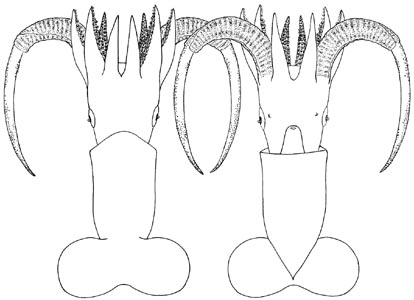

## Phylogeny 

-   « Ancestral Groups  
    -   [Promachoteuthis](Promachoteuthis)
    -   [Chiroteuthid families](Chiroteuthid_families)
    -   [Oegopsida](Oegopsida)
    -   [Decapodiformes](Decapodiformes)
    -   [Coleoidea](Coleoidea)
    -   [Cephalopoda](Cephalopoda)
    -   [Mollusca](Mollusca)
    -   [Bilateria](Bilateria)
    -   [Animals](Animals)
    -   [Eukaryotes](Eukaryotes)
    -   [Tree of Life](../../../../../../../../../../Tree_of_Life.md)

-   ◊ Sibling Groups of  Promachoteuthis
    -   [Promachoteuthis         megaptera](Promachoteuthis_megaptera)
    -   [Promachoteuthis sloani](Promachoteuthis_sloani)
    -   [Promachoteuthis sp. B](Promachoteuthis_sp._B)
    -   Promachoteuthis sulcus
    -   [Promachoteuthis sp. D](Promachoteuthis_sp._D)

-   » Sub-Groups 

# *Promachoteuthis sulcus* [Young, Vecchione and Roper, 2007] 

[Richard E. Young and Michael Vecchione]()

Containing group: [Promachoteuthidae](Promachoteuthidae.md)

## Introduction

***Promachoteuthis sulcus*** (first known as ***Promachoteuthis*** sp. C
on this page) is known from a single, small (25 mm ML, sex unknown) but
distinctive individual from great depths in the south Atlantic Ocean.

#### Brief diagnosis:

A promachoteuthid\...

-   with nuchal fusion between head and mantle.
-   with arm suckers much larger than club suckers.
-   with tentacle base wider than arm base.
-   with recessed club base and aboral tentacle groove.

### Characteristics

1.  Arms
    1.  Arm suckers much larger than club suckers.
    2.  Suckers in three series on all arms.

        
        **Figure**. Ventral and dorsal views of the fins of ***P.
        sulcus***. Photograph.

#### Comments

[More details of the description of ***P. sulcus*** can be found here.](http://www.tolweb.org/notes/?note_id=820)

Clubs were slightly abraided so the number of suckers in a transverse
series could not be determined. The largest number of those present was
12 suckers across. The specimen is an immature female. The mantle was
cut open prior to fixation by a previous investigator. The label in the
specimen jar states that the ML is 40 mm; the squid currently measures
25 mm ML.

### Distribution

Type locality: 36°49\'S, 12°17\'W off Tristan Da Cunha, south Atlantic
Ocean. Captured from WALTHER HERWIG at 1750-2000 m depth (open net).

## Title Illustrations



  -----------------------------------------------------------------------
  Scientific Name ::   Promachoteuthis sulcus
  Location ::         South Atlantic: 37°S, 12°W
  Comments           Holotype
  Creator            Keiko Hiratsuka Moore
  Acknowledgements   National Marine Fisheries Service
  View               Dorsal and ventral
  Size               25 mm ML
  Collection         NMNH 730702
  Type               Holotype
  Copyright ::          © [Michael Vecchione](mailto:vecchiom@si.edu) 
  -----------------------------------------------------------------------


  --------------------------------------------------------------------------------
  Scientific Name ::     Promachoteuthis sulcus
  Location ::           South Atlantic: 37°S, 12°W
  Specimen Condition   Preserved
  Sex ::                Female
  Life Cycle Stage ::     Immature
  View                 Ventrolateral
  Size                 25 mm ML
  Collection           NMNH 730702
  Type                 Holotype
  Copyright ::            © 2003 [Richard E. Young](http://www.soest.hawaii.edu/%7Eryoung/rey.html) 
  --------------------------------------------------------------------------------

## Confidential Links & Embeds: 

### #is_/same_as :: [sulcus](/_Standards/bio/bio~Domain/Eukaryotes/Animals/Bilateria/Mollusca/Cephalopoda/Coleoidea/Decapodiformes/Oegopsida/Chiroteuthid/Promachoteuthidae/sulcus.md) 

### #is_/same_as :: [sulcus.public](/_public/bio/bio~Domain/Eukaryotes/Animals/Bilateria/Mollusca/Cephalopoda/Coleoidea/Decapodiformes/Oegopsida/Chiroteuthid/Promachoteuthidae/sulcus.public.md) 

### #is_/same_as :: [sulcus.internal](/_internal/bio/bio~Domain/Eukaryotes/Animals/Bilateria/Mollusca/Cephalopoda/Coleoidea/Decapodiformes/Oegopsida/Chiroteuthid/Promachoteuthidae/sulcus.internal.md) 

### #is_/same_as :: [sulcus.protect](/_protect/bio/bio~Domain/Eukaryotes/Animals/Bilateria/Mollusca/Cephalopoda/Coleoidea/Decapodiformes/Oegopsida/Chiroteuthid/Promachoteuthidae/sulcus.protect.md) 

### #is_/same_as :: [sulcus.private](/_private/bio/bio~Domain/Eukaryotes/Animals/Bilateria/Mollusca/Cephalopoda/Coleoidea/Decapodiformes/Oegopsida/Chiroteuthid/Promachoteuthidae/sulcus.private.md) 

### #is_/same_as :: [sulcus.personal](/_personal/bio/bio~Domain/Eukaryotes/Animals/Bilateria/Mollusca/Cephalopoda/Coleoidea/Decapodiformes/Oegopsida/Chiroteuthid/Promachoteuthidae/sulcus.personal.md) 

### #is_/same_as :: [sulcus.secret](/_secret/bio/bio~Domain/Eukaryotes/Animals/Bilateria/Mollusca/Cephalopoda/Coleoidea/Decapodiformes/Oegopsida/Chiroteuthid/Promachoteuthidae/sulcus.secret.md)

