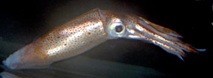

## Phylogeny 

-   « Ancestral Groups  
    -   [Oegopsida](Oegopsida)
    -   [Decapodiformes](Decapodiformes)
    -   [Coleoidea](Coleoidea)
    -   [Cephalopoda](Cephalopoda)
    -   [Mollusca](Mollusca)
    -   [Bilateria](Bilateria)
    -   [Animals](Animals)
    -   [Eukaryotes](Eukaryotes)
    -   [Tree of Life](../../../../../../../../Tree_of_Life.md)

-   ◊ Sibling Groups of  Oegopsida
    -   [Architeuthis](Architeuthis)
    -   [Brachioteuthidae](Brachioteuthidae)
    -   [Chiroteuthid families](Chiroteuthid_families)
    -   [Cranchiidae](Cranchiidae)
    -   [Cycloteuthidae](Cycloteuthidae)
    -   [Enoploteuthid families](Enoploteuthid_families)
    -   [Histioteuthid families](Histioteuthid_families)
    -   Gonatidae
    -   [Lepidoteuthid families](Lepidoteuthid_families)
    -   [Neoteuthidae](Neoteuthidae)
    -   [Ommastrephidae](Ommastrephidae)
    -   [Onychoteuthidae](Onychoteuthidae)
    -   [Thysanoteuthis rhombus](Thysanoteuthis_rhombus)

-   » Sub-Groups
    -   [Berryteuthis](Berryteuthis)
    -   [Eogonatus tinro](Eogonatus_tinro)
    -   [Gonatopsis](Gonatopsis)
    -   [Gonatus](Gonatus)

# Gonatidae [Hoyle, 1886] 

[Tsunemi Kubodera, F. G. Hochberg, Richard E. Young, and Michael Vecchione]()

This family contains the following four genera with 19 species.

Containing group: [Oegopsida](Oegopsida.md)

## Introduction

Gonatids are mostly muscular squids of moderate size but are unusual in
having the armature on the arms in four, rather than two, series
(occasionally more than four series near the arm tips). The two medial
series are usually hooks. Often the tentacular club has one very large
centrally located hook. Species of the genus ***Gonatopsis*** are
unusual in that they lack tentacles which are lost in the early juvenile
stage.

#### Diagnosis

An oegopsid \...

-   with tetraserial armature on arms.
-   usually with hooks on arms and often on tentacular clubs.

### Characteristics

1.  Arms
    1.  Arms with quadraserial armature except at arm tips in some
        species where sucker series increases.

    2.  Arms I-III with hooks in two medial series except in
        ***Berryteuthis anonychus***; the latter with hooks only in
        females at bases of arms I-III.

        

        **Figure**. Oral view of two arms of ***Gonatus steenstrupi***
        with large hooks in the medial two series and a series of small
        suckers on each arm margin. Transmitted-light photograph by M.
        Vecchione aboard the R/V G. O. SARS, MarEco cruise to the
        central North Atlantic.
2.  Tentacles
    1.  Tentacular clubs with numerous irregular series of suckers;
        additional hooks in some genera.

    2.  Tentacular clubs with unique locking-apparatus in ***Gonatus***
        and ***Eogonatus*** consisting of a series of elongated ridges
        with medial suckers and knobs.

        

        **Figure**. Oral view of the proximal region of the club of
        ***G. steenstrupi***. Arrow points to one ridge of the
        locking-apparatus. Transmitted-light photograph by M. Vecchione
        aboard the R/V G. O.SARS, MarEco cruise to the central North
        Atlantic.
3.  Buccal crown
    1.  Buccal-crown connectives attach to ventral margins of arms IV.\
        \
4.  Funnel
    1.  Funnel locking-apparatus with straight groove.\
        \
5.  Photophores
    1.  Photophores absent except in ***G. pyros*** (ocular
        photophores).\
        \
6.  Gladius
    1.  Gladius with primary conus.

#### Comments

The following table compares characteristics of subadults for the genera
of Gonatidae.\

  --------- ---------
  Genus / Character   Tentacles         Hooks present on  Club
                      present           clubs             locking-apparatus 

  **Berryteuthis**     Yes               No               Single series of
                                                          suckers and knobs
                                                          along entire dorsal
                                                          margin of manus.\

  **Eogonatus**        Yes               No               Short series of
                                                          suckers, knobs and 
                                                          elongate ridges at
                                                          base of manus.\

  **Gonatopsis**       No                NA               NA 

  **Gonatus**          Yes               Yes              Short series of
                                                          suckers, knobs and 
                                                          elongate ridges at
                                                          base of manus. \
  --------- ---------

### Discussion of Phylogenetic Relationships

There have been several recent attempts to unravel the phylogeny of the
Gonatidae. Nesis (1997) relied on similarity of morphology and,
apparently, results of protein electrophoresis by Katugin (1993 and
1995) to derive the following relationships:

**Figure**. Phylogeny of the Gonatidae. Chart modified from Nesis
(1997). Subgenera are in red. Nesis included only species that were well
established as valid species. Nesis considered ***Eogonatus*** to be a
subgenus of ***Gonatus***.

Clearly if this phylogeny is correct then ***Gonatopsis*** is
polyphyletic. More recently Katugin (2004) has reassessed the phylogeny
of the gonatidae using electrophoretic analysis of allozymes. His
results are seen below.

**Figure**. Phylogenetic tree of the Gonatidae. Chart modified from
Katugin (2004). Numbers represent genetic distance based on protein
electrophoresis. Branch lengths are not drawn proportional to genetic
distance.

In the paper Katugin proposes a new classification of the Gonatidae with
two subfamilies (Berryteuthinae and Gonatinae) based on the radula.
Within the Berryteuthinae he includes ***Berryteuthis*** (***B.
magister***), ***Boreoteuthis*** (for ***Gonatopsis borealis***; he
elevates the subgenus ***Boreoteuthis*** to generic level) and a new
genus ***Okutania*** for ***Berryteuthis anonychus***. In the Gonatinae
he includes ***Gonatus*** (including ***Eogonatus***) and the remaining
species of ***Gonatopsis***. Katugin\'s phylogeny based on allozymes is
similar to that of Nesis (1997) however the allozyme data shows the
Gonatinae nested within the Berryteuthinae.

Recent molecular data analyzed using parsimony from 12S rRNA, 16S rRNA,
and COI genes (Lindgren et al. 2005) offer a somewhat different
phylogeny of the family but without good bootstrap support for most
nodes. This data suggests that the ***Gonatus*** is paraphyletic.
***Gonatopsis borealis*** groups more closely with ***Berryteuthis***
than other species of ***Gonatopsis*** as suggested by both Nesis (1997)
and Katugin (2004).

**Figure**. Phylogenetic tree of the Gonatidae. Chart simplified from
Lindgren et al. (2005) by collapsing nodes with bootstrap support of 50
or less, and eliminating uncertain identifications. Numbers represent
bootstrap support for relationships derived from combined molecular
analyses. Numberered ***G. middendorffi*** represent different
morphological types.

Because of the uncertainty in gonatid phylogeny, we retain here the
standard classification for the family.

### Nomenclature

[A list of all nominal genera and species in the Gonatidae can be found here](http://www.tolweb.org/accessory/Gonatidae_Taxa?acc_id=2319). The
list includes the current status and type species of all genera, and the
current status, type repository and type locality of all species and all
pertinent references.

### Habitat and distribution

Gonatids are pelagic squids that occur from the surface to over 1000 m
depth. Some species undergo extensive diurnal (diel) vertical
migrations, ascending at night and descending during the day. A few
species are associated with the ocean floor over the continental slope.
Gonatids occur in high latitudes of both hemispheres. One species lives
in antarctic waters, two in the North Atlantic and 16 in the high North
Pacific where they are among the most abundant oceanic squids.

### Life History

Historically the paralarvae of gonatid squids have been virtually
impossible to identify. Recent studies, however, found that the
dorsal-head chromatophores can allow specific identification of the
smallest paralarvae of at least six species in the North Pacific
(Jorgensen, 2006). Jorgensen (2006) recognizes two basic patterns, Type
1 and Type 2, with species-specific variations in each.

{width="324"}

**Figure**. Dorsal view of the two classes of head chromatophores
presently recognized in gonatids. **Type I** has three tear-shaped
chromatophores on each side that come to a point over each eye. **Type
II** has three transverse rows of chromatophores with one chromatophore
in the anterior row, two in the middle row and three in the posterior
row. Drawings from Jorgensen (2006).
### References

Jorgensen, E. M. 2006. Identification, distribution and relative
abundance of paralarval gonatid squids (Cephalopoda: Oegopsida:
Gonatidae)from the Gulf of Alaska, 2001-2003.Journ. Molluscan Studies.
In Review.

Katugin, O. N. 1993. Study of relationships between different species of
squid, family Gonatidae, by protein electrophoresis. In: Biology and
Rational Use of Hydrobionts. Their role in ecosystems. Abstracts of
communications of the TINRO Young Scientisit Conference, Vladivostok,\"
p. 14-15. In Russian.

Katugin, O. N. 1995. Morphology, genetic difference, and evolution of
*Berryteuthis magister*, *Berriteuthis anonychus*, and *Gonatopsis
borealis* (Cephalopoda: Oegopsida). In: \"Unitas Malacologica. 12th
International Malacological Congress. Vigo, Spain. Abstracts.\" p.
312-313.

Katugin, O. N. 2004. Squids of the family Gonatidae from the North
Pacific Ocean and their genetic differentiation: controversial issues in
the systematics and phylogeny.Ruthenica 14(1): 73-87. In Russian with
English abstract.

Lindgren, A. R., O. N. Katugin, E. Amezquita and M. K. Nishiguchi. 2005.
Evolutionary relationships among squids of the family Gonatidae
(Mollusca: Cephalopoda) inferred from three mitochondrial loci.
Molecular Phylogenetics and Evolution 36(1):101-111.

Nesis, K. N. 1982. Abridged dey to the cephalopod mollusks of the
world\'s ocean. 385+ii pp. Light and Food Industry Publishing House,
Moscow. (In Russian.). Translated into English by B. S. Levitov, ed. by
L. A. Burgess (1987), Cephalopods of the world. T. F. H. Publications,
Neptune City, NJ, 351pp.

Nesis, K. N. 1997. Gonatid squids in the Subarctic North Pacific:
Ecology, biogeography, niche diversity and role in the ecosystem.
Advances in Marine Biology. Academic Press, New York, p. 243-324.

Okutani, T. and M. R. Clarke. 1992. Family Gonatidae Hoyle, 1886. P.
139-156. In: Sweeney, M. J., C. F. E. Roper, K. M. Mangold, M. R. Clarke
and S. v. Boletzky (Eds.). \"Larval\" and juvenile cephalopods: A manual
for their identification. Smithson. Contr. Zool. No. 513.

Young, R. E. 1972. The systematics and areal distribution of pelagic
cephalopods from the seas off Southern California. Smithson. Contr.
Zool., 97: 1-159.

## Title Illustrations



  -------------------------------------------------------------------------
  Scientific Name ::     Gonatus steenstrupi
  Location ::           Central North Atlantic
  Comments             Photographed in shipboard aquarium aboard the R/V G. O. SARS, MarEco cruise.
  Specimen Condition   Live Specimen
  View                 Side
  Copyright ::            © 2004 [Michael Vecchione](mailto:vecchiom@si.edu) 
  -------------------------------------------------------------------------


  -------------------------------------------------------------------------------
  Scientific Name ::  Gonatus berryi
  Location ::        Off California, eastern Pacific Ocean
  Reference         Young, R. E. 1972. The systematics and areal distribution of pelagic cephalopods from the seas off Southern California. Smithson. Contr. Zool., 97: 1-159.
  View              Ventral
  Size              119 mm PL
  Copyright ::         © 1972 [Richard E. Young](http://www.soest.hawaii.edu/%7Eryoung/rey.html) 
  -------------------------------------------------------------------------------

## Confidential Links & Embeds: 

### #is_/same_as :: [Gonatidae](/_Standards/bio/bio~Domain/Eukaryotes/Animals/Bilateria/Mollusca/Cephalopoda/Coleoidea/Decapodiformes/Oegopsida/Gonatidae.md) 

### #is_/same_as :: [Gonatidae.public](/_public/bio/bio~Domain/Eukaryotes/Animals/Bilateria/Mollusca/Cephalopoda/Coleoidea/Decapodiformes/Oegopsida/Gonatidae.public.md) 

### #is_/same_as :: [Gonatidae.internal](/_internal/bio/bio~Domain/Eukaryotes/Animals/Bilateria/Mollusca/Cephalopoda/Coleoidea/Decapodiformes/Oegopsida/Gonatidae.internal.md) 

### #is_/same_as :: [Gonatidae.protect](/_protect/bio/bio~Domain/Eukaryotes/Animals/Bilateria/Mollusca/Cephalopoda/Coleoidea/Decapodiformes/Oegopsida/Gonatidae.protect.md) 

### #is_/same_as :: [Gonatidae.private](/_private/bio/bio~Domain/Eukaryotes/Animals/Bilateria/Mollusca/Cephalopoda/Coleoidea/Decapodiformes/Oegopsida/Gonatidae.private.md) 

### #is_/same_as :: [Gonatidae.personal](/_personal/bio/bio~Domain/Eukaryotes/Animals/Bilateria/Mollusca/Cephalopoda/Coleoidea/Decapodiformes/Oegopsida/Gonatidae.personal.md) 

### #is_/same_as :: [Gonatidae.secret](/_secret/bio/bio~Domain/Eukaryotes/Animals/Bilateria/Mollusca/Cephalopoda/Coleoidea/Decapodiformes/Oegopsida/Gonatidae.secret.md)

