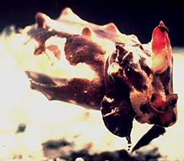

## Phylogeny 

-   « Ancestral Groups  
    -   [Sepiidae](Sepiidae)
    -   [Sepioidea](Sepioidea)
    -   [Decapodiformes](Decapodiformes)
    -   [Coleoidea](Coleoidea)
    -   [Cephalopoda](Cephalopoda)
    -   [Mollusca](Mollusca)
    -   [Bilateria](Bilateria)
    -   [Animals](Animals)
    -   [Eukaryotes](Eukaryotes)
    -   [Tree of Life](../../../../../../../../../Tree_of_Life.md)

-   ◊ Sibling Groups of  Sepiidae
    -   Metasepia
    -   [Sepia](Sepia)
    -   [Sepiella](Sepiella)

-   » Sub-Groups 

# Metasepia [Hoyle, 1885] 

[Katharina M. Mangold (1922-2003) and Richard E. Young]()

This genus contains the following two species:

-   *Metasepia pfefferi*
-   *Metasepia tullbergi*

Containing group: [Sepiidae](Sepiidae.md)

## Introduction

These small sepiids look much like other members of the family but they
differ in having a reduced cuttlebone.

#### Diagnosis:

A sepiid \...

-   with cuttlebone restricted to anterior 75% of mantle.

### Characteristics

1.  Funnel
    1.  Funnel component of locking apparatus with pit-like depression
        at midpoint of groove.\
2.  Mantle
    1.  Mantle nearly as broad as long.
    2.  Posterior gland and pore absent.\
3.  Shell
    1.  Cuttlebone 75% of mantle in length; located in anterior part of
        mantle.
    2.  Cuttlebone with rhomboidal shape.

        
        **Figure**. Dorsal, side and ventral views of the cuttlebone of
        ***M. tullbergi***, 32 mm shell length, Japanese waters. Drawing
        from Sasaki (1929).

### Distribution

Indo-Malayan subregion of the Indo-West Pacific region (Nesis, 1982/7).

### References

Adam, W. and W. J. Rees. 1966. A review of the cephalopod family
Sepiidae. Sci. Rep. John Murray Exped. 11: 1-165.

Khromov, D. N., C. C. Lu, A. Guerra, Zh. Dong and S. v. Boletzky. 1998.
A synopsis of Sepiidae outside Australian waters. Smithson. Contr.
Zool., 586: 77-156.

Lu, C. C. A synopsis of Sepiidae in Australian waters. 1998. Smithson.
Contr. Zool., 586:159-190.

Sasaki, M. 1929. A Monograph of the Dibranchiate Cephalopods of the
Japanese and Adjacent Waters. Journal of the College of Agriculture,
Hokkaido Imperial University, 20(supplement):357 pages.

## Title Illustrations



  ------------
  Scientific Name ::  Metasepia tullbergi
  Location ::        Japan
  Copyright ::         © 1996 Yutaka Natsukari
  ------------

## Confidential Links & Embeds: 

### [Metasepia](/_Standards/bio/bio~Domain/Eukaryotes/Animals/Bilateria/Mollusca/Cephalopoda/Coleoidea/Decapodiformes/Sepioidea/Sepiidae/Metasepia.md) 

### [Metasepia.public](/_public/bio/bio~Domain/Eukaryotes/Animals/Bilateria/Mollusca/Cephalopoda/Coleoidea/Decapodiformes/Sepioidea/Sepiidae/Metasepia.public.md) 

### [Metasepia.internal](/_internal/bio/bio~Domain/Eukaryotes/Animals/Bilateria/Mollusca/Cephalopoda/Coleoidea/Decapodiformes/Sepioidea/Sepiidae/Metasepia.internal.md) 

### [Metasepia.protect](/_protect/bio/bio~Domain/Eukaryotes/Animals/Bilateria/Mollusca/Cephalopoda/Coleoidea/Decapodiformes/Sepioidea/Sepiidae/Metasepia.protect.md) 

### [Metasepia.private](/_private/bio/bio~Domain/Eukaryotes/Animals/Bilateria/Mollusca/Cephalopoda/Coleoidea/Decapodiformes/Sepioidea/Sepiidae/Metasepia.private.md) 

### [Metasepia.personal](/_personal/bio/bio~Domain/Eukaryotes/Animals/Bilateria/Mollusca/Cephalopoda/Coleoidea/Decapodiformes/Sepioidea/Sepiidae/Metasepia.personal.md) 

### [Metasepia.secret](/_secret/bio/bio~Domain/Eukaryotes/Animals/Bilateria/Mollusca/Cephalopoda/Coleoidea/Decapodiformes/Sepioidea/Sepiidae/Metasepia.secret.md)

