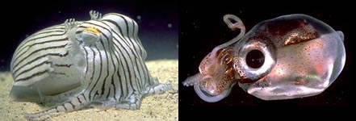

# [[Sepiolida]] 

 

Containing group: [Sepioidea](Sepioidea.md)

## Introduction

[Michael Vecchione and Richard E. Young]() 

Members of the Sepiolida are short (mostly 2-8 cm ML), broad cephalopods
with a rounded posterior mantle.

#### Brief diagnosis

A sepioid ...
-   with a short, rounded body.
-   without a cuttlebone.

### Characteristics

1.  Head
    1.  Eye pore outside of ventral eyelid.

        {height="200" width="222"}
        **Figure**. Ventral view of mantle cavity of ***Rossia*** sp.,
        preserved. Arrow points to the cut surface of the ventral mantle
        adductor where it had attached to the ventral mantle wall.
        Anteriorly the adductor muscles pass to either side of the
        intestine. Photograph by R. Young.

2.  Fins
    1.  Fins broad (length ca. less than two times, usually equal to,
        individual fin width).
    2.  Attachment of posterior fin-lobes broadly separated.\
        \
3.  Shell
    1.  Shell a thin or rudimentary gladius or absent.

## Phylogeny 

-   « Ancestral Groups  
    -   [Sepioidea](Sepioidea)
    -   [Decapodiformes](Decapodiformes)
    -   [Coleoidea](Coleoidea)
    -   [Cephalopoda](Cephalopoda)
    -   [Mollusca](Mollusca)
    -   [Bilateria](Bilateria)
    -   [Animals](Animals)
    -   [Eukaryotes](Eukaryotes)
    -   [Tree of Life](../../../../../../../../Tree_of_Life.md)

-   ◊ Sibling Groups of  Sepioidea
    -   [Sepiidae](Sepiidae)
    -   Sepiolida

-   » Sub-Groups
    -   [Sepiolidae](Sepiolidae.md)
    -   [Sepiadariidae](Sepiadariidae.md)

## Title Illustrations

----------------

Scientific Name ::  Sepioloidea lineolata, Iridoteuthis iris
Copyright ::         © 2004 Mark Noman, Thomas Burch

## Confidential Links & Embeds: 

### #is_/same_as :: [Sepiolida](/_Standards/bio/bio~Domain/Eukaryotes/Animals/Bilateria/Mollusca/Cephalopoda/Coleoidea/Decapodiformes/Sepioidea/Sepiolida.md) 

### #is_/same_as :: [Sepiolida.public](/_public/bio/bio~Domain/Eukaryotes/Animals/Bilateria/Mollusca/Cephalopoda/Coleoidea/Decapodiformes/Sepioidea/Sepiolida.public.md) 

### #is_/same_as :: [Sepiolida.internal](/_internal/bio/bio~Domain/Eukaryotes/Animals/Bilateria/Mollusca/Cephalopoda/Coleoidea/Decapodiformes/Sepioidea/Sepiolida.internal.md) 

### #is_/same_as :: [Sepiolida.protect](/_protect/bio/bio~Domain/Eukaryotes/Animals/Bilateria/Mollusca/Cephalopoda/Coleoidea/Decapodiformes/Sepioidea/Sepiolida.protect.md) 

### #is_/same_as :: [Sepiolida.private](/_private/bio/bio~Domain/Eukaryotes/Animals/Bilateria/Mollusca/Cephalopoda/Coleoidea/Decapodiformes/Sepioidea/Sepiolida.private.md) 

### #is_/same_as :: [Sepiolida.personal](/_personal/bio/bio~Domain/Eukaryotes/Animals/Bilateria/Mollusca/Cephalopoda/Coleoidea/Decapodiformes/Sepioidea/Sepiolida.personal.md) 

### #is_/same_as :: [Sepiolida.secret](/_secret/bio/bio~Domain/Eukaryotes/Animals/Bilateria/Mollusca/Cephalopoda/Coleoidea/Decapodiformes/Sepioidea/Sepiolida.secret.md)

