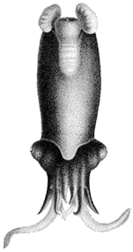
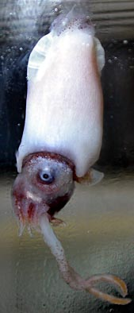

## Phylogeny 

-   « Ancestral Groups  
    -   [Decapodiformes](Decapodiformes)
    -   [Coleoidea](Coleoidea)
    -   [Cephalopoda](Cephalopoda)
    -   [Mollusca](Mollusca)
    -   [Bilateria](Bilateria)
    -   [Animals](Animals)
    -   [Eukaryotes](Eukaryotes)
    -   [Tree of Life](../../../../../../../Tree_of_Life.md)

-   ◊ Sibling Groups of  Decapodiformes
    -   [Bathyteuthoida](Bathyteuthoida)
    -   [Idiosepiidae](Idiosepiidae)
    -   [Myopsida](Myopsida)
    -   [Oegopsida](Oegopsida)
    -   [Sepioidea](Sepioidea)
    -   Spirula spirula

-   » Sub-Groups 

# [[Spirulida]] 
## Spirulida [Haeckel, 1896], Spirulidae [Owen, 1836] 

# *Spirula spirula* [Linnaeus, 1758] 

     

## #has_/text_of_/abstract 

> **Spirulida** is an order of cephalopods comprising one extant species (Spirula spirula) 
> and several extinct taxa.
>
> [Wikipedia](https://en.wikipedia.org/wiki/Spirulida) 

## Introduction

[Richard E. Young]()

*Spirula spirula* is a small, muscular species (45 mm ML) found in
mesopelagic waters of the tropical open ocean. In the title photographs,
the skin of the mantle is missing. The intact mantle is covered with
regularly aligned collagen fibers that produce a silvery sheen, as seen
on the head in the title photographs (Herring et al., 1981). *Spirula*
carries an unusual internal shell that is calcareous and has the shape
of a horn coiled in a single plane without the coils touching one
another (open planispiral).

**Figure**. **Left** - Side view of the shell of *Spirula***.**
Photograph by R. Young of a shell found on a Florida beach. **Right** -
Cut-away view of the shell provided by ray tomography showing the
phragmocone with septa and siphuncle. Photograph taken by the atomic and
nuclear physics group from the University of Fribourg in Switzerland,
and provided by Hans Ueli Johner.

The shell, which retains the phragmocone and siphuncle of its distant
ancestors, is used as a buoyancy device. The posterior position of the
shell within the body causes the animal to generally orient vertically
with the head downward. The unusual general appearance of *Spirula* with
a narrow arm crown, bulging eyes, the peculiar structure of the mantle,
the transverse orientation of the fins and the presence of the coiled
shell makes this species very different in appearance from all other
cephalopods.

The large posterior guard-like sheath of fossil relatives of *Spirula*
seems to be designed to function as a counterweight to maintain the
animal in a horizontal position. Such an orientation is particularly
important for a bottom-associated animal that swims just above the ocean
floor (Naef 1921-23). Presumably the ancestors of *Spirula* were bottom
associated and some remnants of this behavior apparently remains in
their life history and distribution (Young, et al., 1998). A small
remnant of the sheath exists on the *Spirula* shell and a remnant of the
ancestral habitat remains in *Spirula*\'s apparent benthic spawning
(Young, *et al.*, 1999).\

#### Diagnosis

A decapodiform \...

-   with a calcareous shell that is a phragmocone and has the shape of a
    coiled horn.

### Characteristics

1.  Arms
    1.  Arms with suckers in four series.
    2.  Both arms IV hectocotylized.\
2.  Tentacles
    1.  Tentacular clubs without proximal locking apparatus.
    2.  Tentacular clubs with suckers in 16 series; not divided into
        manus and dactylus.
    3.  Club suckers without circularis muscles.

        
        **Figure**. Oral view of tentacular club of *S. spirula*.
        Drawing from Chun (1910).

3.  Head
    1.  Head with tentacle pockets.
    2.  Eyes without corneas.\
4.  Funnel
    1.  Funnel without lateral adductor muscles.\
5.  Mantle
    1.  Mantle locking-apparatus does not reach anterior mantle margin.\
6.  Fins
    1.  Fins separate, terminal and lie in a plane nearly transverse to
        body axis.
    2.  Fins with posterior lobes.\
7.  Photophores
    1.  Large photophore at posterior end of body.\
8.  Shell
    1.  Calcareous shell a phragmocone, curved ventrally in open
        planispiral; round in cross section and possessing a ventral
        siphuncle and transverse septa.\
9.  Viscera
    1.  Gills without brachial canal.
    2.  Right oviduct absent.
    3.  Females with accessory nidamental glands.
    4.  Radula absent.
    5.  Ink sac reduced.
    6.  Anal flaps absent.
    7.  Digestive gland paired; esophagus passes between members of the
        pair.

### Nomenclature

[A list of all nominal genera and species in the Spirulidae can be found here](http://www.tolweb.org/accessory/Spriulidae_Taxa?acc_id=2337). The
list includes the current status and type species of all genera, and the
current status, type repository and type locality of all species and all
pertinent references.

### Behavior

*Spirula* is able to withdraw its head and arms completely within the
mantle; the mantle opening can then be closed by folding over the large
dorsal and ventrolateral extensions (= flaps) of the mantle margin
(Bruun, 1943). The photophore at the posterior end of the body is known
to glow for hours at a time (Schmidt, 1922). When swimming slowly
downward, head first, the terminal fins are pointed upward (i.e.
posteriorly) and move with a rapid \"waving or fluttering motion\" that
propels the animal downward (Bruun, 1943).

Virtually all cephalopods have mobile irises but for an oceanic, pelagic
decapodiform the extreme contraction seen below in *Spirula* is unusual.

**Figure**. Views of the iris of *Spirula spirula*, 23 mm ML, western
North Atlantic. Left - Dorsal view. Right - Dorsal-oblique view. Note
the wide-open eyelid and the strongly contracted iris leaving a tiny
pupil. Photogaphs by M. Vecchione.
### Life History

Mature ovarian eggs are 1.7 mm in the longest diameter (Bruun, 1943).
Bruun (1943) suggests that the eggs are laid on the ocean floor and the
capture of very small animals in deep water supports this idea (Bruun,
1943; Clarke, 1970). Clarke (1970) described a small squid with a mantle
length of just over 2 mm and Bruun (1943) illustrated a similar squid
that had a shell with just two chambers. These squid are, or are very
close to being, hatchlings. The eyes in these individual are small and
the buccal mass is very large with the beaks extending beyond the short
arms. Note that only three arm pairs are present.

**Figure**. Views of paralarvae of *Spirula spirula*. **Left** - Ventral
view. Drawing from Clarke (1970). **Right** - Drawing from Bruun (1943).

The shift in size frequency distribution over time in the region of the
Canary Islands suggests to Clarke (1970) that this cephalopod has a
life-span of 18-20 months. The ventral arms of the male are
hectocotylized: They are much longer and thicker than the other arms
(see title photograph) and possess a variety of unusual flaps and
papillae but lack suckers.

### Distribution

#### Vertical distribution

Clarke (1969) found that *Spirula* occurs at depths between 550 and 1000
m during the day (peak distribution is at 600-700 m) and at night
migrates into the upper 100-300 m (peak at 200-300 m).

**Figure**. Graph of 70 *Spirula spirula* captured with opening/closing
nets near the Canary Islands, eastern North Atlantic (Clarke, 1969).
Yellow circles- Day captures. Blue triangles- Night captures. Oversized
symbols represent two captures.

#### Geographical distribution

Most captures come from the tropical Atlantic and tropical IndoWest
Pacific Oceans. Bruun (1943) found that *Spirula* is distributed mostly
over the slopes of continents or islands where the bottom depth is
between 1000 and 2000 m. The most numerous captures came from the
vicinity of oceanic islands. Indeed, this animal was the most abundant
midwater cephalopod collected in the region of the Canary Islands by
Clark (1969).

## Title Illustrations

------------------------------------------------------------------------

Scientific Name ::  Spirula spirula
Sex ::             Male
View              lateral
Copyright ::         © 1998 Martina A. Compagno Roeleveld (ca. 1946-2006) 

---------

Scientific Name ::  Spirula spirula
Reference         from Chun, 1910
Sex ::             Female
View              dorsal

------------------------------------------------------------------------

Scientific Name ::  Spirula spirula
Location ::        western North Atlantic
View              Side
Size              23 mm ML
Copyright ::         © 2004 [Michael Vecchione](mailto:vecchiom@si.edu) 

## Confidential Links & Embeds: 

### [Spirulida](/_Standards/bio/bio~Domain/Eukaryotes/Animals/Bilateria/Mollusca/Cephalopoda/Coleoidea/Decapodiformes/Spirulida.md) 

### [Spirulida.public](/_public/bio/bio~Domain/Eukaryotes/Animals/Bilateria/Mollusca/Cephalopoda/Coleoidea/Decapodiformes/Spirulida.public.md) 

### [Spirulida.internal](/_internal/bio/bio~Domain/Eukaryotes/Animals/Bilateria/Mollusca/Cephalopoda/Coleoidea/Decapodiformes/Spirulida.internal.md) 

### [Spirulida.protect](/_protect/bio/bio~Domain/Eukaryotes/Animals/Bilateria/Mollusca/Cephalopoda/Coleoidea/Decapodiformes/Spirulida.protect.md) 

### [Spirulida.private](/_private/bio/bio~Domain/Eukaryotes/Animals/Bilateria/Mollusca/Cephalopoda/Coleoidea/Decapodiformes/Spirulida.private.md) 

### [Spirulida.personal](/_personal/bio/bio~Domain/Eukaryotes/Animals/Bilateria/Mollusca/Cephalopoda/Coleoidea/Decapodiformes/Spirulida.personal.md) 

### [Spirulida.secret](/_secret/bio/bio~Domain/Eukaryotes/Animals/Bilateria/Mollusca/Cephalopoda/Coleoidea/Decapodiformes/Spirulida.secret.md)

