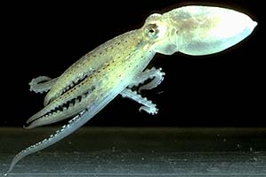

---
aliases:
- Octopoda
- Octopod
title: Octopoda
---

## Phylogeny 

-   « Ancestral Groups  
    -   [Octopodiformes](Octopodiformes)
    -   [Coleoidea](Coleoidea)
    -   [Cephalopoda](Cephalopoda)
    -   [Mollusca](Mollusca)
    -   [Bilateria](Bilateria)
    -   [Animals](Animals)
    -   [Eukaryotes](Eukaryotes)
    -   [Tree of Life](../../../../../../../Tree_of_Life.md)

-   ◊ Sibling Groups of  Octopodiformes
    -   Octopoda
    -   [Vampyroteuthis         infernalis](Vampyroteuthis_infernalis)

-   » Sub-Groups
    -   [Cirrata](Octopod/Cirrata.md)
    -   [Incirrata](Octopod/Incirrata.md)

# [[Octopod]] 

Octopods or devilfishes 

 

The Octopoda contains about 200 species placed in two very different
groups.

-   *[Cirrata](Octopod/Cirrata.md "go to ToL page")*[ Grimpe,1916]
-   *[Incirrata](Octopod/Incirrata.md "go to ToL page")*[ Grimpe,1916]

## #has_/text_of_/abstract 

> An octopus (pl.: octopuses or octopodes) is a soft-bodied, eight-limbed mollusc of the order **Octopoda** (, ok-TOP-ə-də). The order consists of some 300 species and is grouped within the class Cephalopoda with squids, cuttlefish, and nautiloids. Like other cephalopods, an octopus is bilaterally symmetric with two eyes and a beaked mouth at the centre point of the eight limbs. An octopus can radically deform its shape, enabling it to squeeze through small gaps. They trail their appendages behind them as they swim. The siphon is used for respiration and locomotion (by water jet propulsion). Octopuses have a complex nervous system and excellent sight, and are among the most intelligent and behaviourally diverse invertebrates.
>
> Octopuses inhabit various ocean habitats, including coral reefs, pelagic waters, and the seabed; some live in the intertidal zone and others at abyssal depths. Most species grow quickly, mature early, and are short-lived. In most species, the male uses a specially-adapted arm to deliver sperm directly into the female's mantle cavity, after which he becomes senescent and dies, while the female deposits fertilised eggs in a den and cares for them until they hatch, after which she also dies. Strategies to defend themselves against predators include expelling ink, camouflage, and threat displays, the ability to jet quickly through the water and hide, and deceit. All octopuses are venomous, but only the blue-ringed octopuses are known to be deadly to humans.
>
> Octopuses appear in mythology as sea monsters such as the kraken of Norway and the Akkorokamui of the Ainu, and possibly the Gorgon of ancient Greece. A battle with an octopus appears in Victor Hugo's book Toilers of the Sea. Octopuses appear in Japanese shunga erotic art. They are eaten and considered a delicacy by humans in many parts of the world, especially the Mediterranean and Asia.
>
> [Wikipedia](https://en.wikipedia.org/wiki/Octopus) 

## Introduction

[Katharina M. Mangold (1922-2003), Richard E. Young, and Michael Vecchione]() 

Octopods have rather short, compact bodies and only eight arms; no trace
of the missing second arm pair remains even during embryonic
development. Many species are benthic (bottom-living) and crawl over the
ocean floor with the mouth facing the substratum. Others alternate
between a benthic and a pelagic (free-swimming) habitat and some species
are completely pelagic. The two suborders of Octopoda are very different
in appearance but there is little doubt that it is a natural group as
the monophyly of the Octopoda is supported by a large variety of
characters. The Cirrata is a group of deep-sea octopods commonly known
as the \"finned octopods\" due to their large, wing-like fins. The
Incirrata contain the common (benthic), shallow-water octopods as well
as many deep-sea benthic and pelagic species.

### Characteristics

1.  Head
    1.  Head and mantle fused in nuchal region.\
2.  Viscera
    1.  Visceropericardial coelom reduced.
    2.  Oviducal glands act, in part, as spermathecae.
    3.  Oviducts with oviducal glands subterminally located on oviducts.
    4.  Dorsal mantle cavity present.
    5.  Nuchal cartilage absent.\
3.  Arms
    1.  Sucker stalks are broad, muscular cylinders.\
4.  Photosensitive vesicles
    1.  Located on stellate ganglia.\
5.  Funnel valve
    1.  Absent.\
6.  Central nervous system
    1.  Inferior frontal lobe system present.
    2.  Superior buccal and posterior buccal lobes fused.
    3.  Suprabrachial commissure separate from brain (absent in
        **Japetella)**.

### Discussion of Phylogenetic Relationships

The monophyly of both suborders is well established. Young and Vecchione
(1996) found two apomorphic character states that defined the monophyly
of the Incirrata:

-   Presence of a cornea.
-   Hectocotylization of one of the third arms.

Another character can probably be added to the list of apomorphies
although it hasn\'t been included in a cladistic study:

-   Chorion of egg drawn out into a stalk (Young, *et al.*, 1999).

Young and Vecchione (1996) found three character states that defined the
monophyly of the Cirrata:

-   Spermatophores as sperm packets without ejaculatory apparatus.
-   Presence of horizontal arm septa.
-   Buccal position of posterior salivary glands.

Voight (1997) also found morphological, cladistic support for the
Cirrata and Incirrata but her study is controversial. Carlini (1998)
found molecular analyses supported the monophyly of both groups.

## Title Illustrations

--------------------------------------------------------------------------------

Scientific Name ::   Octopus
Location ::         Hawaii
Life Cycle Stage ::   young
Copyright ::          © 1996 [Richard E. Young](http://www.soest.hawaii.edu/%7Eryoung/rey.html) 

## Confidential Links & Embeds: 

### #is_/same_as :: [Octopod](/_Standards/bio/bio~Domain/Eukaryotes/Animals/Bilateria/Mollusca/Cephalopoda/Coleoidea/Octopodiformes/Octopod.md) 

### #is_/same_as :: [Octopod.public](/_public/bio/bio~Domain/Eukaryotes/Animals/Bilateria/Mollusca/Cephalopoda/Coleoidea/Octopodiformes/Octopod.public.md) 

### #is_/same_as :: [Octopod.internal](/_internal/bio/bio~Domain/Eukaryotes/Animals/Bilateria/Mollusca/Cephalopoda/Coleoidea/Octopodiformes/Octopod.internal.md) 

### #is_/same_as :: [Octopod.protect](/_protect/bio/bio~Domain/Eukaryotes/Animals/Bilateria/Mollusca/Cephalopoda/Coleoidea/Octopodiformes/Octopod.protect.md) 

### #is_/same_as :: [Octopod.private](/_private/bio/bio~Domain/Eukaryotes/Animals/Bilateria/Mollusca/Cephalopoda/Coleoidea/Octopodiformes/Octopod.private.md) 

### #is_/same_as :: [Octopod.personal](/_personal/bio/bio~Domain/Eukaryotes/Animals/Bilateria/Mollusca/Cephalopoda/Coleoidea/Octopodiformes/Octopod.personal.md) 

### #is_/same_as :: [Octopod.secret](/_secret/bio/bio~Domain/Eukaryotes/Animals/Bilateria/Mollusca/Cephalopoda/Coleoidea/Octopodiformes/Octopod.secret.md)

