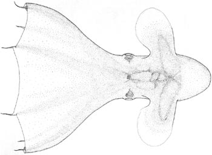

## Phylogeny 

-   « Ancestral Groups  
    -   [Cirroteuthidae](../Cirroteuthidae.md)
    -   [Cirrata](../../Cirrata.md)
    -   [Octopod](../../../Octopod.md)
    -   [Octopodiformes](Octopodiformes)
    -   [Coleoidea](Coleoidea)
    -   [Cephalopoda](Cephalopoda)
    -   [Mollusca](Mollusca)
    -   [Bilateria](Bilateria)
    -   [Animals](Animals)
    -   [Eukaryotes](Eukaryotes)
    -   [Tree of Life](../../../../../../../../../../Tree_of_Life.md)

-   ◊ Sibling Groups of  Cirroteuthidae
    -   Cirroteuthis muelleri
    -   [Cirrothauma](Cirrothauma.md)

-   » Sub-Groups 

## *Cirroteuthis* [Eschricht, 1836] 

# *Cirroteuthis muelleri* [Eschricht, 1836] 

[Michael Vecchione and Richard E. Young](http://www.tolweb.org/)

A single species is presently recognized in the genus.

Containing group: [Cirroteuthidae](../Cirroteuthidae.md)

## Introduction

These are among the largest cirrates reaching lengths up to 1.5 m
(Nesis, 1982/87). They are often found in deep water swimming or
drifting near the ocean floor. Very little is known about their biology.

Voss (1988) considered ***C. muelleri*** to be the only valid species in
the genus.

#### Diagnosis

 A cirroteuthid \...

-   with shell having very wide saddle and oval wings.\
-   with normal, lens-bearing eyes. 

### Characteristics

Eyes

1.  Eyes well developed; lenses present.\
    \

Arms and web

1.  Arm tips devoid of suckers and cirri.
2.  Web nodules present.\
    \

Shell

Saddle and wings very broad in the anterior-posterior plane.

Anterior-posterior length of wings less than 2.0 times length of saddle
in this direction.

Wings elliptical in lateral view.

**Figure**. Shell of ***Cirroteuthis muelleri***. **A** - Dorsal view,
male, 74 mm ML. **B** - Ventral view, male, 74 mm ML. **C** - Dorsal
view, male, 53 mm ML. **D** - Ventral view, male, 53 mm ML. Lateral view
of the shell of Cirroteuthis muelleri, male, 74 mm ML. Drawings from
Voss and Pearcy,1990.

#### Comments 

The above description was taken from Voss and Pearcy (1990). [Additional features of the description of ***C. muelleri*** can be found here.](http://www.tolweb.org/accessory/Cirroteuthis_muelleri_Description_Continued?acc_id=1495)

Two other species (***Cirroteuthis hoylei***, Robson, 1932, off Chile
and ***Cirroteuthis massyae***, Grimpe, 1920, off Ireland) have been
described in the genus but have not been recognized as valid by recent
authors (e.g., Voss and Pearcy, 1990; O\'Shea, 1999). ***C. massyae***
may be a species of ***Opisthoteuthis*** (ref.?).

### Distribution

#### Type locality

Off Greenland.

#### Geographical distribution

***C. muelleri*** is known from the North Atlantic, Arctic Ocean, North
Pacific (Guerra, et al., 1998) and off New Zealand O\'Shea (1999).

#### Vertical distribution

Collins *et al.* found that peak abundance (6/km2) occurred at 3000 -
3500 m in the Porcupine Seabight in the North Atlantic. At all of their
sampling sites they recorded the presence of this species between 700
and 4854 m.

### References

Collins, M. A., C. Yau, L. Allcock and M. H. Thurston. 2001.
Distribution of deep-water benthic and bentho-pelagic cephalopods from
the north-east Atlantic. Jour. Mar. Biol. Ass. U.K., 81: 105-117.

Guerra, R., R. Villanueva, K. N. Nesis and J. Bedoya. 1998.
Redescription of the deep-sea cirrate octopod *Cirroteuthis magna*
Hoyle, 1885, and considerations on the genus *Cirroteuthis* (Mollusca:
Cephalopoda). Bull. Mar. Sci., 63: 51-81.

Hoyle, W. E. 1886. Report on the Cephalopoda. Rept. Sci. Res.
Challenger. 16 (44): 246 pp.

O\'Shea, Steve. 1999. The Marine Fauna of New Zealand: Octopoda
(Mollusca: Cephalopoda). NIWA Biodiversity Memoir 112: 280pp.

Voss, G. L. (1988). Evolution and phylogenetic relationships of deep-sea
octopods (Cirrata and Incirrata). P. 253-276. In: Clarke, M. R. and E.
R. Trueman (Eds.). The Mollusca. Vol. 12. Paleontology and Neontology of
Cephalopods. Academic Press, New York. 355pp.

Voss, G. L. and W. G. Pearcy. 1990. Deep-water octopods (Mollusca:
Cephalopoda) of the Northeastern Pacific. Proc. Calif. Acad. Sci. 47:
47-94.

## Title Illustrations



  -------------------------------------------------
  Scientific Name ::  Cirroteuthis muelleri
  Location ::        North Pacific
  Reference         Voss, G. L. and W. G. Pearcy. 1990. Deep-water octopods (Mollusca: Cephalopoda) of the Northeastern Pacific. Proc. Calif. Acad. Sci. 47: 47-94.
  View              Ventral
  Copyright ::         © 1990 G.L. Voss and W.G. Pearcy
  -------------------------------------------------
