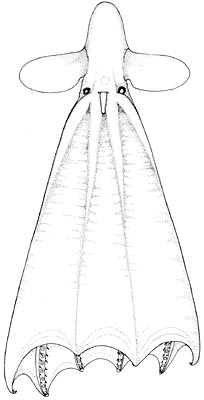
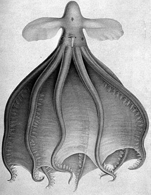
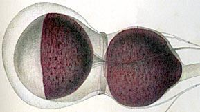
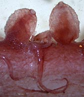
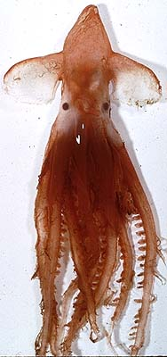

---
title: "Cirrothauma murrayi"
---

## Phylogeny 

-   « Ancestral Groups  
    -   [Cirrothauma](../Cirrothauma.md)
    -   [Cirroteuthidae](../../Cirroteuthidae.md)
    -   [Cirrata](../../../Cirrata.md)
    -   [Octopod](../../../../Octopod.md)
    -   [Octopodiformes](Octopodiformes)
    -   [Coleoidea](Coleoidea)
    -   [Cephalopoda](Cephalopoda)
    -   [Mollusca](Mollusca)
    -   [Bilateria](Bilateria)
    -   [Animals](Animals)
    -   [Eukaryotes](Eukaryotes)
    -   [Tree of Life](../../../../../../../../../../../Tree_of_Life.md)

-   ◊ Sibling Groups of  Cirrothauma
    -   [Cirrothauma magna](Cirrothauma_magna)
    -   Cirrothauma murrayi

-   » Sub-Groups 

# *Cirrothauma murrayi* [Chun, 1911] 

[Richard E. Young and Michael Vecchione](http://www.tolweb.org/)

Containing group: *[Cirrothauma](../Cirrothauma.md)*

## Introduction

 

***C. murrayi*** is virtually blind. The eye lacks a lens; the retina is
reduced and continuous with a cornea. The eye is embedded within the
gelatinous tissue of the head without connection to the surface.
Nevertheless, the eye still functions as a simple photoreceptor that
cannot form images (Aldred et al, 1983). This species is worldwide in
distribution and occupies great depths primarily between 1500 and 4500 m
(Nesis, 1982/87) although it has been captured at the surface in an ice
hole in the Arctic Ocean (Aldred *et al.*, 1983).

#### Diagnosis

A Cirrothauma \...

-    with reduced eyes lacking lenses.\

### Characteristics

1.  Eyes
    1.  Each eye small and without lens.
    2.  Outer eyelid absent.

        
        **Figure**. Eye and white body of ***C. murrayi***. Drawing from
        Chun, 1910.

        The back, purple part of the eye is the pigmented retina which
        is continuous in the front with a transparent cornea (this is
        not homologous with the incirrate cornea). The eye therefore is
        a sphere with a smooth, curved window in front. The eye is
        completely embedded in the gelatinous tissue of the head without
        any external opening. The eye, however is surrounded by a space
        that is filled with water. An iris and ciliary body are absent.
        Most of the retina has rhabdomes of normal form that are
        apparently functional. The purple-colored spherical structure
        behind the eye (at right in the figure) is the white body. (from
        Chun, 1910, Aldred, et al., 1983).

2.  Suckers
    1.  Proximal 6 suckers sessile.
    2.  Suckers over most of arm tiny on long, spindle-shaped,
        gelatinous stalks.
    3.  Sucker orifice minute or absent.
    4.  Acetabulum absent.

        
        **Figure**. **Left** - Longitudinal section through a sucker of
        ***C. murrayi***, male, 155 mm ML, North Atlantic. Drawing from
        Aldred et al (1983). The drawing is a section through the tiny
        sucker that lies at the tip of the long, swollen stalks. The
        structure labeled \"cylinder\"appears to consist of acid
        mucopolysaccharide-containing tissue and internal to it are many
        small bundles of longitudinal muscle fibres (not shown in
        drawing) (Aldred et al, 1983). **Right** - Side view of a
        portion of an arm of ***C. murrayi*** showing the swollen sucker
        stalks and the tiny apical suckers, fresh (=unfixed) octopod.
        Photograph by M. Vecchione, R/V G. O. Sars, Mar-Eco cruise,
        central North Atlantic.

3.  Web
    1.  Distal web attachments to each arm symmetrical.
4.  Photophores
    1.  Possible photophore: a small structure located internally at the
        base of each sucker stalk.

#### Comments

The above description is taken from Chun (1910) and Aldrich, et al.
(1983). [More details of the description can be found here.](http://www.tolweb.org/accessory/Cirrothauma_murrayi_Description_Continued?acc_id=1508)

The reduced suckers are still thought to provide suction but clearly by
a somewhat different mechanism than typically seen in octopods.
Contraction of the radial muscles near the center of a flat infundibulum
that adheres to a surface, should provide suction. Aldred et al. (1983)
suggest, however, that adhesion may arise from capillary action of the
many minute tubes that make up the cuticle of the infundibulum and that
this is especially effective in very deep-living octopods.

### Distribution

Type locality: The North Atlantic at 48°24\'N, 36°53\'W. It is known
from the Pacific, Atlantic and Arctic Oceans. In the Northeast Atlantic
one study that captured 27 individuals, found they occurred from
2430-4846 m depth, with most captures below 3000 m (Collins, *et al.*,
2001)

### References

Aldred, R. G., M. Nixon and J. Z. Young. 1983. *Cirrothauma murrayi*
Chun, a finned octopod. Phil. Trans. Roy. Soc. Lond., 301: 1-54.

Collins, M. A., C. Yau, L. Allcock and M. H. Thurston. 2001.
Distribution of deep-water benthic and bentho-pelagic cephalopods from
the north-east Atlantic. Jour. Mar. Biol. Ass. U.K., 81: 105-117.

Chun, C. 1910. Die Cephalopoden. Oegopsida. Wissenschaftliche Ergebnisse
der Deutschen Tiefsee-Expedition, \"Valdivia\" 1898-1899, 18: 1-522 +
Atlas.

Nesis, K. N. 1982/87. Abridged key to the cephalopod mollusks of the
world\'s ocean. 385+ii pp. Light and Food Industry Publishing House,
Moscow. (In Russian.). Translated into English by B. S. Levitov, ed. by
L. A. Burgess (1987), Cephalopods of the world. T. F. H. Publications,
Neptune City, NJ, 351pp.

## Title Illustrations



  ---------
  Scientific Name ::  Cirrothauma murrayi
  Location ::        Antarctic waters
  Creator           E. McSweeny
  Copyright ::         © 1996 E. McSweeny
  ---------


  ---------------------------------------------
  Scientific Name ::  Cirrothauma murrayi
  Location ::        North Atlantic
  Reference         Aldred, R. G., M. Nixon and J. Z. Young. 1983. Cirrothauma murrayi Chun, a finned octopod. Phil. Trans. Roy. Soc. Lond., 301: 1-54.
  Sex ::             Male
  Size              155 mm ML
  Copyright ::         © 1983 R.G. Aldred et al.
  ---------------------------------------------


  ---------------------------------------------------
  Scientific Name ::  Cirrothauma murrayi
  Reference         Chun, C. 1910. Die Cephalopoden. Oegopsida. Wissenschaftliche Ergebnisse der Deutschen Tiefsee-Expedition, \"Valdivia\" 1898-1899, 18: 1-522 + Atlas.
  Size              37 mm ML
  ---------------------------------------------------

## Confidential Links & Embeds: 

### #is_/same_as :: [murrayi](/_Standards/bio/bio~Domain/Eukaryotes/Animals/Bilateria/Mollusca/Cephalopoda/Coleoidea/Octopodiformes/Octopod/Cirrata/Cirroteuthidae/Cirrothauma/murrayi.md) 

### #is_/same_as :: [murrayi.public](/_public/bio/bio~Domain/Eukaryotes/Animals/Bilateria/Mollusca/Cephalopoda/Coleoidea/Octopodiformes/Octopod/Cirrata/Cirroteuthidae/Cirrothauma/murrayi.public.md) 

### #is_/same_as :: [murrayi.internal](/_internal/bio/bio~Domain/Eukaryotes/Animals/Bilateria/Mollusca/Cephalopoda/Coleoidea/Octopodiformes/Octopod/Cirrata/Cirroteuthidae/Cirrothauma/murrayi.internal.md) 

### #is_/same_as :: [murrayi.protect](/_protect/bio/bio~Domain/Eukaryotes/Animals/Bilateria/Mollusca/Cephalopoda/Coleoidea/Octopodiformes/Octopod/Cirrata/Cirroteuthidae/Cirrothauma/murrayi.protect.md) 

### #is_/same_as :: [murrayi.private](/_private/bio/bio~Domain/Eukaryotes/Animals/Bilateria/Mollusca/Cephalopoda/Coleoidea/Octopodiformes/Octopod/Cirrata/Cirroteuthidae/Cirrothauma/murrayi.private.md) 

### #is_/same_as :: [murrayi.personal](/_personal/bio/bio~Domain/Eukaryotes/Animals/Bilateria/Mollusca/Cephalopoda/Coleoidea/Octopodiformes/Octopod/Cirrata/Cirroteuthidae/Cirrothauma/murrayi.personal.md) 

### #is_/same_as :: [murrayi.secret](/_secret/bio/bio~Domain/Eukaryotes/Animals/Bilateria/Mollusca/Cephalopoda/Coleoidea/Octopodiformes/Octopod/Cirrata/Cirroteuthidae/Cirrothauma/murrayi.secret.md)

