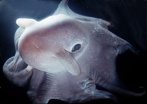
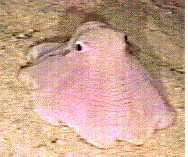
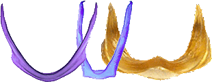
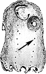

## Phylogeny 

-   « Ancestral Groups  
    -   [Cirrata](../Cirrata.md)
    -   [Octopod](../../Octopod.md)
    -   [Octopodiformes](Octopodiformes)
    -   [Coleoidea](Coleoidea)
    -   [Cephalopoda](Cephalopoda)
    -   [Mollusca](Mollusca)
    -   [Bilateria](Bilateria)
    -   [Animals](Animals)
    -   [Eukaryotes](Eukaryotes)
    -   [Tree of Life](../../../../../../../../../Tree_of_Life.md)

-   ◊ Sibling Groups of  Cirrata
    -   Opisthoteuthidae
    -   [Cirroteuthidae](Cirroteuthidae.md)
    -   [Stauroteuthis](Stauroteuthis)

-   » Sub-Groups
    -   [Cirroctopus](Opisthoteuthidae/Cirroctopus.md)
    -   [Grimpoteuthis](Opisthoteuthidae/Grimpoteuthis.md)
    -   [Luteuthis](Opisthoteuthidae/Luteuthis.md)
    -   [Opisthoteuthis](Opisthoteuthidae/Opisthoteuthis.md)

# Opisthoteuthidae [Verrill 1896] 

[Michael Vecchione, Katharina M. Mangold (1922-2003), and Richard E. Young](http://www.tolweb.org/)

We place four genera in the family. The generic composition of the
family, however, is not stable at present.

-   *[Cirroctopus](Opisthoteuthidae/Cirroctopus.md "go to ToL page")* [Naef,
    1923]
-   *[Grimpoteuthis](Opisthoteuthidae/Grimpoteuthis.md "go to ToL page")*
    [Robson, 1932]
-   *[Luteuthis](Opisthoteuthidae/Luteuthis.md "go to ToL page")* [O\'Shea,
    1999]
-   *[Opisthoteuthis](Opisthoteuthidae/Opisthoteuthis.md "go to ToL page")*
    [Verrill, 1883]

Containing group: [Cirrata](../Cirrata.md)

## Introduction

**Opisthoteuthis agassizii** (?) on the bottom (video frame). JSL II
dive 1746; 25 April 1989; St. Vincent I.; depth = 586 m; temp. = 6.6°C
(from Vecchione and Roper, 1991).

The body of these octopods is foreshortened along the anterior/posterior
axis. The foreshortening is extreme in **Opisthoteuthis** which is known
as the \"flapjack\" (pancake) devilfish due to its flattened appearance.
The secondary web is absent. The radula is reduced or absent apparently
reflecting the habit of swallowing prey whole (Aldred, *et al.*, 1983).
The cirri are short when compared to those of the Cirroteuthidae. Most
opisthoteuthids alternate between sitting on the ocean floor and
swimming just above it (e.g., Peyera, 1965). **Opisthoteuthis** swims
mainly by contraction of the arm-web complex while **Grimpoteuthis**
uses primarily powerful fin strokes to swim (Vecchione and Young, 1997).
Some opisthoteuthids (species of **Luteuthis** and some species of
**Grimpoteuthis**) apear, judging from their very gelatinous
consistency, to be entirely pelagic. An AVI format video clip of the
**Opsithoteuthis** shown at the right is available at [Cephalopods in Action.](http://www.mnh.si.edu/cephs/vr91/cephs4.html#oagassi1)

### Characteristics

Oral view of arm of **Grimpoteuthis bathynectes**. Drawing modified from
Voss and Pearcy, 1990.

Left to right - **Opisthoteuthis grimaldii** shell (U-shaped), stained,
photographed by R. Young; **Cirroctopus glacialis** shell (V-shaped),
stained, photographed by R. Young; **Luteuthis shuishi** shell
(W-shaped), photograph from O\'Shea and Lu, 2002.

1.  Shape and consistency
    1.  Anterior-posteriorly compressed (shell reaches, or nearly
        reaches, posterior end of body; i.e., no gelatinous extension of
        the body exists posterior to the shell).
2.  Arms and web
    1.  Suckers and cirri extend to tips of arms.
    2.  Primary web only.
    3.  Web nodules present (arrow) in some genera.
3.  Cirri
    1.  Cirri short (length 0.4 - 2.5 times diameter of largest sucker).
4.  Shell
    1.  Simple U-, V- or W-shaped.
    2.  Lateral wings not expanded or only slightly expanded.
5.  Pigmentation
    1.  Areolar spots present (arrow) in some genera.

Side view of a young **Opisthoteuthis albatrossi** showing areolae
(arrow). Drawing modified from Sasaki, 1929.
### Nomenclature

O\'Shea (1999) described a new genus, **Enigmatiteuthis**, which he
placed in his family Grimpoteuthidae. He also placed **Grimpoteuthis
wulkeri**, **G. bathynectes** and **G. pacifica** in his new genus.
Collins (in press) in his examination of the North Atlantic species of
**Grimpoteuthis** concluded that species of **Enigmatiteuthis** should
be placed in **Grimpoteuthis** (i.e., **Enigmatiteuthis** is a junior
synonym of **Grimpoteuthis**).

### Discussion of Phylogenetic Relationships

The systematic positions of **Grimpoteuthis** and **Luteuthis** are
uncertain. Voss and Pearcy (1990) place **Grimpoteuthis** in the family
Opisthoteuthidae and O\'Shea (1999) places it in its own family. O\'Shea
also places **Luteuthis** in its own family. Collins (in press) places
**Luteuthis** in the Opisthoteuthidae but leaves **Grimpoteuthis** in
its own family. We have adopted a conservative approach here pending a
more thorough understanding of the family.

### References

Aldred, R. G., M. Nixon and J. Z. Young. 1983. *Cirrothauma murrayi*
Chun, a finned octopod. Phil. Trans. Roy. Soc. Lond., 301: 1-54.

Nesis, K. N. 1982/87. Abridged key to the cephalopod mollusks of the
world\'s ocean. 385+ii pp. Light and Food Industry Publishing House,
Moscow. (In Russian.). Translated into English by B. S. Levitov, ed. by
L. A. Burgess (1987), Cephalopods of the world. T. F. H. Publications,
Neptune City, NJ, 351pp.

O\'Shea, Steve. 1999. The Marine Fauna of New Zealand: Octopoda
(Mollusca: Cephalopoda). NIWA Biodiversity Memoir 112: 280pp.

O\'Shea, S. and C. C. Lu. 2002. A New Species of *Luteuthis* (Mollusca:
Cephalopoda: Cirroctopoda) from the South China Sea. Zoological Studies,
4: 119-126.

Pereya, W. T. 1965. New records and observations on the flapjack
devilfish *Opisthoteuthis californiana* Berry. Pacif. Sci., 19: 427-441.

Voss, G. L. 1988. Evolution and phylogenetic relationships of deep-sea
octopods (Cirrata and Incirrata). P. 253-276. In: Clarke, M. R. and E.
R. Trueman (Eds.). The Mollusca. Vol. 12. Paleontology and Neontology of
Cephalopods. Academic Press, New York. 355pp.

Voss, G. L. and W. G. Pearcy (1990). Deep-water octopods (Mollusca:
Cephalopoda) of the Northeastern Pacific. Proc. Calif. Acad. Sci., 47:
47-94.

Vecchione, M. and C. F.E. Roper. 1991 Cephalopods observed from
submersibles in the western North Atlantic. Bull. Mar. Sci.,
49(1-2):433-445.

Vecchione, M. and R. E. Young. 1997. Aspects of the functional
morphology of cirrate octopods: locomotion and feeding. Vie Milieu
47(2):101-110..

## Title Illustrations

  ----------------------------------------------------------------------
  Scientific Name ::  Opisthoteuthis grimaldii
  Location ::        Bahamas
  Comments          Captured by submersible
  Copyright ::         © [Michael Vecchione](mailto:vecchiom@si.edu) 
  ----------------------------------------------------------------------

## Confidential Links & Embeds: 

### [Opisthoteuthidae](/_Standards/bio/bio~Domain/Eukaryotes/Animals/Bilateria/Mollusca/Cephalopoda/Coleoidea/Octopodiformes/Octopod/Cirrata/Opisthoteuthidae.md) 

### [Opisthoteuthidae.public](/_public/bio/bio~Domain/Eukaryotes/Animals/Bilateria/Mollusca/Cephalopoda/Coleoidea/Octopodiformes/Octopod/Cirrata/Opisthoteuthidae.public.md) 

### [Opisthoteuthidae.internal](/_internal/bio/bio~Domain/Eukaryotes/Animals/Bilateria/Mollusca/Cephalopoda/Coleoidea/Octopodiformes/Octopod/Cirrata/Opisthoteuthidae.internal.md) 

### [Opisthoteuthidae.protect](/_protect/bio/bio~Domain/Eukaryotes/Animals/Bilateria/Mollusca/Cephalopoda/Coleoidea/Octopodiformes/Octopod/Cirrata/Opisthoteuthidae.protect.md) 

### [Opisthoteuthidae.private](/_private/bio/bio~Domain/Eukaryotes/Animals/Bilateria/Mollusca/Cephalopoda/Coleoidea/Octopodiformes/Octopod/Cirrata/Opisthoteuthidae.private.md) 

### [Opisthoteuthidae.personal](/_personal/bio/bio~Domain/Eukaryotes/Animals/Bilateria/Mollusca/Cephalopoda/Coleoidea/Octopodiformes/Octopod/Cirrata/Opisthoteuthidae.personal.md) 

### [Opisthoteuthidae.secret](/_secret/bio/bio~Domain/Eukaryotes/Animals/Bilateria/Mollusca/Cephalopoda/Coleoidea/Octopodiformes/Octopod/Cirrata/Opisthoteuthidae.secret.md)

