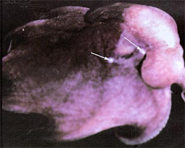
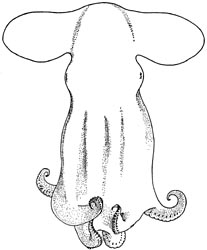

## Phylogeny 

-   « Ancestral Groups  
    -   [Cirroctopus](../Cirroctopus.md)
    -   [Opisthoteuthidae](../../Opisthoteuthidae.md)
    -   [Cirrata](../../../Cirrata.md)
    -   [Octopod](../../../../Octopod.md)
    -   [Octopodiformes](Octopodiformes)
    -   [Coleoidea](Coleoidea)
    -   [Cephalopoda](Cephalopoda)
    -   [Mollusca](Mollusca)
    -   [Bilateria](Bilateria)
    -   [Animals](Animals)
    -   [Eukaryotes](Eukaryotes)
    -   [Tree of Life](../../../../../../../../../../../Tree_of_Life.md)

-   ◊ Sibling Groups of  Cirroctopus
    -   [Cirroctopus antarctica](Cirroctopus_antarctica)
    -   Cirroctopus glacialis
    -   [Cirroctopus hochbergi](Cirroctopus_hochbergi)
    -   [Cirroctopus mawsoni](Cirroctopus_mawsoni)

-   » Sub-Groups 

# *Cirroctopus glacialis* [(Robson, 1930)] 

[Michael Vecchione and Richard E. Young](http://www.tolweb.org/)

Containing group: [Cirroctopus](../Cirroctopus.md)

### Characteristics

1.  Shell
    1.  Shell V-shaped.
    2.  Shell surface smooth.
    3.  Basal shelf present.
2.  Color
    1.  The oral surface of the arms and web with distinctive
        appearance. \"\...circumoral ring of white patches, each of
        which lies astride an arm. Between this ring and the mouth, the
        web was bright reddish purple; peripherally and beyong the ring
        it was of an intense bluish purple. The pattern and coloration
        are extremely vivid\...\" (Robson, 1930).

#### Comments

[Additional features of the description of ***C. glacialis*** can be found here.](http://www.tolweb.org/accessory/Cirroctopus_glacialis_Description_Continued?acc_id=1523)

***C. glacialis*** differs from ***C. hochbergi*** in having a smooth
rather than a rugose shell, a thick rather than a thin mantle septum, a
peculiar pattern of pigmentation on the oral face of the arms and web
and a caecum that is much larger than the stomach. Unfortunately,
differences in fixation and physiological state could account for some
or all of these apparent species characteristics.

### Distribution

Type locality: Schollaert Channel, Palmer Archipelago; 64°21\'S,
62°58\'W.

### References

O'Shea, Steve. 1999. The Marine Fauna of New Zealand: Octopoda
(Mollusca: Cephalopoda). NIWA Biodiversity Memoir 112: 280pp.

Robson, G. C. (1930). Cephalopoda, I. Octopoda. Discovery Report,
2:371-401.

Vecchione, M., U. Piatkowski and A. L. Allcock. 1998. Biology of the
cirrate octopod *Grimpoteuthis glacialis* (Cephalopoda;
Opisthoteuthidae) in the South Shetland Islands, Antarctica. S. Afr. J.
Mar. Sci. 20: 421-428.

## Title Illustrations



  ------------------------------------------------------------------------
  Scientific Name ::  Cirroctopus glacialis
  Reference         Vecchione, M., U. Piatkowski and A. L. Allcock. 1998. Biology of the cirrate octopod Grimpoteuthis glacialis (Cephalopoda; Opisthoteuthidae) in the South Shetland Islands, Antarctica. S. Afr. J. Mar. Sci. 20: 421-428.
  Copyright ::         © 1998 [Michael Vecchione](mailto:vecchiom@si.edu) 
  ------------------------------------------------------------------------


  ------------------------------------------------------------------------
  Scientific Name ::  Cirroctopus glacialis
  Reference         Vecchione, M., U. Piatkowski and A. L. Allcock. 1998. Biology of the cirrate octopod Grimpoteuthis glacialis (Cephalopoda; Opisthoteuthidae) in the South Shetland Islands, Antarctica. S. Afr. J. Mar. Sci. 20: 421-428.
  Copyright ::         © 1998 [Michael Vecchione](mailto:vecchiom@si.edu) 
  ------------------------------------------------------------------------
