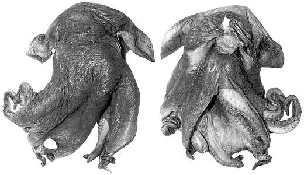

## Phylogeny 

-   « Ancestral Groups  
    -   [Cirroctopus](../Cirroctopus.md)
    -   [Opisthoteuthidae](../../Opisthoteuthidae.md)
    -   [Cirrata](../../../Cirrata.md)
    -   [Octopod](../../../../Octopod.md)
    -   [Octopodiformes](Octopodiformes)
    -   [Coleoidea](Coleoidea)
    -   [Cephalopoda](Cephalopoda)
    -   [Mollusca](Mollusca)
    -   [Bilateria](Bilateria)
    -   [Animals](Animals)
    -   [Eukaryotes](Eukaryotes)
    -   [Tree of Life](../../../../../../../../../../../Tree_of_Life.md)

-   ◊ Sibling Groups of  Cirroctopus
    -   [Cirroctopus antarctica](Cirroctopus_antarctica)
    -   [Cirroctopus glacialis](Cirroctopus_glacialis)
    -   Cirroctopus hochbergi
    -   [Cirroctopus mawsoni](Cirroctopus_mawsoni)

-   » Sub-Groups 

# *Cirroctopus hochbergi* 

[Steve O\'Shea, Richard E. Young, and Michael Vecchione](http://www.tolweb.org/)

Containing group: [Cirroctopus](../Cirroctopus.md)

## Introduction

***Cirroctopus hochbergi*** was described from 48 specimens but is known
only from a restricted area off the northeast coast of New Zealand.

### Characteristics

1.  Shell
    1.  Shell V-shaped with short saddle.
    2.  Shell surface rugose.
    3.  Basal shelf absent.
2.  Oral-surface pigmentation
    1.  Oral surfaces of web sectors A, B and C (to sucker 16-18) and D
        and E (to sucker 12-13) deep mauve to purple; outer oral
        surfaces of web and oral surfaces of arms and suckers white to
        pale mauve.

#### Comments

The above description is taken from O\'Shea (1999). [More descriptive features of ***C. hochbergi*** can be found here](http://www.tolweb.org/accessory/Cirroctopus_hochbergi_Description?acc_id=1529)

The highly rugose nature of the shell is in marked contrast to that of
***C. glacialis***. However, the shells of ***C. hochbergi*** were from
specimens frozen prior to fixation. The effect of freezing on the
surface texture of the shell is unknown. The mantle septum also differs
greatly between these species. The thick, gelatinous septum of ***C.
glacialis*** is represented by a thin membrane in ***C. hochbergi***
although this, also, could be an artifact of freezing prior to fixation.
A third feature that may separate these species is the presence of a
peculiar pigmentation pattern on the oral surface of the web and arms in
***C. glacialisC. hochbergi*** although, has a pattern to the oral
surfaces (see above).

***C. hochbergi*** differs from ***C. mawsoni*** in having dorsal and
ventral pigmentation similar (in ***C. mawsoni*** the ventral
pigmentation is much lighter) (O\'Shea, 1999).

### Distribution

Type locality:39 58.9\'S, 178 14.27\'E, 800-1070 m depth off northern
New Zealand. This species is known only from the vicinity of the type
locality.

### References

O\'Shea, Steve. 1999. The Marine Fauna of New Zealand: Octopoda
(Mollusca: Cephalopoda). NIWA Biodiversity Memoir 112: 280pp.

Vecchione, M., U. Piatkowski and A. L. Allcock. 1998. Biology of the
cirrate octopod *Grimpoteuthis glacialis* (Cephalopoda;
Opisthoteuthidae) in the South Shetland Islands, Antarctica. S. Afr. J.
Mar. Sci. 20: 421-428.\'

## Title Illustrations



  ------------------------------------------------------------------------
  Scientific Name ::  Cirroctopus hochbergi
  Reference         O\'Shea, Steve. 1999. The Marine Fauna of New Zealand: Octopoda (Mollusca: Cephalopoda). NIWA Biodiversity Memoir 112: 280pp.
  Sex ::             Male
  View              Dorsa, ventral
  Size              90 mm ML
  Type              Holotype
  Copyright ::         © [Steve O\'Shea](mailto:steve.oshea@aut.ac.nz) 
  ------------------------------------------------------------------------

## Confidential Links & Embeds: 

### #is_/same_as :: [hochbergi](/_Standards/bio/bio~Domain/Eukaryotes/Animals/Bilateria/Mollusca/Cephalopoda/Coleoidea/Octopodiformes/Octopod/Cirrata/Opisthoteuthidae/Cirroctopus/hochbergi.md) 

### #is_/same_as :: [hochbergi.public](/_public/bio/bio~Domain/Eukaryotes/Animals/Bilateria/Mollusca/Cephalopoda/Coleoidea/Octopodiformes/Octopod/Cirrata/Opisthoteuthidae/Cirroctopus/hochbergi.public.md) 

### #is_/same_as :: [hochbergi.internal](/_internal/bio/bio~Domain/Eukaryotes/Animals/Bilateria/Mollusca/Cephalopoda/Coleoidea/Octopodiformes/Octopod/Cirrata/Opisthoteuthidae/Cirroctopus/hochbergi.internal.md) 

### #is_/same_as :: [hochbergi.protect](/_protect/bio/bio~Domain/Eukaryotes/Animals/Bilateria/Mollusca/Cephalopoda/Coleoidea/Octopodiformes/Octopod/Cirrata/Opisthoteuthidae/Cirroctopus/hochbergi.protect.md) 

### #is_/same_as :: [hochbergi.private](/_private/bio/bio~Domain/Eukaryotes/Animals/Bilateria/Mollusca/Cephalopoda/Coleoidea/Octopodiformes/Octopod/Cirrata/Opisthoteuthidae/Cirroctopus/hochbergi.private.md) 

### #is_/same_as :: [hochbergi.personal](/_personal/bio/bio~Domain/Eukaryotes/Animals/Bilateria/Mollusca/Cephalopoda/Coleoidea/Octopodiformes/Octopod/Cirrata/Opisthoteuthidae/Cirroctopus/hochbergi.personal.md) 

### #is_/same_as :: [hochbergi.secret](/_secret/bio/bio~Domain/Eukaryotes/Animals/Bilateria/Mollusca/Cephalopoda/Coleoidea/Octopodiformes/Octopod/Cirrata/Opisthoteuthidae/Cirroctopus/hochbergi.secret.md)

