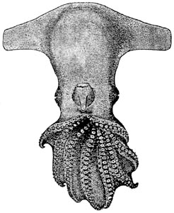
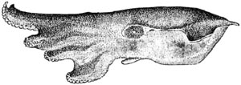

## Phylogeny 

-   « Ancestral Groups  
    -   [Cirroctopus](../Cirroctopus.md)
    -   [Opisthoteuthidae](../../Opisthoteuthidae.md)
    -   [Cirrata](../../../Cirrata.md)
    -   [Octopod](../../../../Octopod.md)
    -   [Octopodiformes](Octopodiformes)
    -   [Coleoidea](Coleoidea)
    -   [Cephalopoda](Cephalopoda)
    -   [Mollusca](Mollusca)
    -   [Bilateria](Bilateria)
    -   [Animals](Animals)
    -   [Eukaryotes](Eukaryotes)
    -   [Tree of Life](../../../../../../../../../../../Tree_of_Life.md)

-   ◊ Sibling Groups of  Cirroctopus
    -   [Cirroctopus antarctica](Cirroctopus_antarctica)
    -   [Cirroctopus glacialis](Cirroctopus_glacialis)
    -   [Cirroctopus hochbergi](Cirroctopus_hochbergi)
    -   Cirroctopus mawsoni

-   » Sub-Groups 

# *Cirroctopus mawsoni* 

[Richard E. Young and Michael Vecchione](http://www.tolweb.org/)

Containing group: [Cirroctopus](../Cirroctopus.md)

## Introduction

***Cirroctopus mawsoni*** is the type species of the genus. It was
described from a single specimen.

### Characteristics

1.  Arms and web

    1.  Arm sucker count 27-31 \[arms I-IV, holotye (O\'Shea, 1999)\].
    2.  Measurements
        1.  Mantle length\...\...\...\...\...\...\...12 mm\*
        2.  Total length\...\...\...\...\...\...\....32 mm
        3.  Posterior mantle to base arms I\...15 mm
        4.  Mantle width\...\...\...\...\...\...\....09 mm
        5.  Head width\...\...\...\...\...\...\...\...09 mm
        6.  Width across fins\...\...\...\...\.....28 mm
        7.  Fin length\...\...\...\...\...\...\...\...08 mm; 12 mm\*
        8.  Fin width (midpoint)\...\...\...\.....06.5 mm
        9.  Funnel length\...\...\...\...\...\...\...03.5 mm
        10. Length, arms I\...\...\...\...\...\.....17 mm; 12.3\*
        11. Length, arms II\...\...\...\...\...\....10.8 mm\*
        12. Length, arms III\...\...\...\...\...\...10 mm\*
        13. Length, arms IV\...\...\...\...\...\....10 mm\*
        14. Web depth, sector A\...\...\...\...\...11 mm\*
        15. Web depth, sector B\...\...\...\...\...10 mm\*
        16. Web depth, sector C\...\...\...\...\...09.4 mm\*
        17. Web depth, sector D\...\...\...\...\...06.6 mm\*
        18. Web depth, sector E\...\...\...\...\...05.4 mm\*
        19. Sucker counts, arms I\...\...\...\....28/28\*
        20. Sucker counts, arms II\...\...\...\...27/27\*
        21. Sucker counts, arms III\...\...\.....27/31\*
        22. Sucker counts, arms IV\...\...\...\...29/27\*
        23. Largest arm sucker diameter\...\....0.6 mm\*
        24. Largest cirri\...\...\...\...\...\...\...0.5-1.0 mm\*
        25. Gill lamellae\...\...\...\...\...\...\...4?\*
        26. Sex\...\...\...\...\...\...\...\...\...\....?\
            \* - Measurements of holotype from O\'Shea, 1999. Other
            measurements from Berry, 1917.

    #### Comments

    Insufficient information exists to separate this species from ***G.
    glacialis*** although it has a lower arm sucker count
    (O\'Shea, 1999) (but the holotype is smaller). If they prove to be
    synonymous, ***G. mawsoni*** has priority. Descriptions of animals
    in good condition from the type locality are needed.

    This species differs from ***G. hochbergi*** in having a much
    lighter ventral mantle surface and a lower arm sucker count
    (O\'Shea, 1999). Some specimens of ***G. glacialis***, at least,
    also have a much lighter ventral mantle (see photos under
    \"Pigmentation\" for that species).

### Distribution

Type locality: Off Adelie Land, Antarctic waters at 66°55\'S, 145°21\'E,
530-550 m.

### References

O'Shea, Steve. 1999. The Marine Fauna of New Zealand: Octopoda
(Mollusca: Cephalopoda). NIWA Biodiversity Memoir 112: 280pp.

Vecchione, M., U. Piatkowski and A. L. Allcock. 1998. Biology of the
cirrate octopod *Grimpoteuthis glacialis* (Cephalopoda;
Opisthoteuthidae) in the South Shetland Islands, Antarctica. S. Afr. J.
Mar. Sci. 20: 421-428.

## Title Illustrations



  -------------------------------------------
  Scientific Name ::  Cirroctopus mawsoni
  Reference         Berry, S.S. 1917. Cephalopoda. Scientific Reports of the Australasian Antarctic Expedition 1911-1914, (series C)14(2):1-39.
  View              Ventral
  Type              Holotype
  -------------------------------------------


  -------------------------------------------
  Scientific Name ::  Cirroctopus mawsoni
  Reference         Berry, S.S. 1917. Cephalopoda. Scientific Reports of the Australasian Antarctic Expedition 1911-1914, (series C)14(2):1-39.
  View              Side
  Type              Holotype
  -------------------------------------------

## Confidential Links & Embeds: 

### [mawsoni](/_Standards/bio/bio~Domain/Eukaryotes/Animals/Bilateria/Mollusca/Cephalopoda/Coleoidea/Octopodiformes/Octopod/Cirrata/Opisthoteuthidae/Cirroctopus/mawsoni.md) 

### [mawsoni.public](/_public/bio/bio~Domain/Eukaryotes/Animals/Bilateria/Mollusca/Cephalopoda/Coleoidea/Octopodiformes/Octopod/Cirrata/Opisthoteuthidae/Cirroctopus/mawsoni.public.md) 

### [mawsoni.internal](/_internal/bio/bio~Domain/Eukaryotes/Animals/Bilateria/Mollusca/Cephalopoda/Coleoidea/Octopodiformes/Octopod/Cirrata/Opisthoteuthidae/Cirroctopus/mawsoni.internal.md) 

### [mawsoni.protect](/_protect/bio/bio~Domain/Eukaryotes/Animals/Bilateria/Mollusca/Cephalopoda/Coleoidea/Octopodiformes/Octopod/Cirrata/Opisthoteuthidae/Cirroctopus/mawsoni.protect.md) 

### [mawsoni.private](/_private/bio/bio~Domain/Eukaryotes/Animals/Bilateria/Mollusca/Cephalopoda/Coleoidea/Octopodiformes/Octopod/Cirrata/Opisthoteuthidae/Cirroctopus/mawsoni.private.md) 

### [mawsoni.personal](/_personal/bio/bio~Domain/Eukaryotes/Animals/Bilateria/Mollusca/Cephalopoda/Coleoidea/Octopodiformes/Octopod/Cirrata/Opisthoteuthidae/Cirroctopus/mawsoni.personal.md) 

### [mawsoni.secret](/_secret/bio/bio~Domain/Eukaryotes/Animals/Bilateria/Mollusca/Cephalopoda/Coleoidea/Octopodiformes/Octopod/Cirrata/Opisthoteuthidae/Cirroctopus/mawsoni.secret.md)

