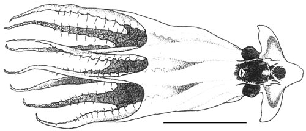
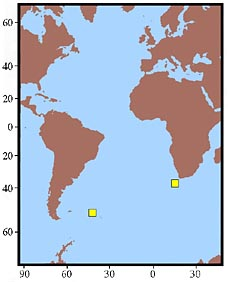

# Stauroteuthis gilchristi [(Robson 1924)] 

Containing group: [Stauroteuthidae](../Stauroteuthidae.md)

## Characteristics

[Martin Collins, Richard E. Young, and Michael Vecchione]() 

1.  Arms
    1.  Proximal 4-5 suckers small, barrel shaped, closely packed.
    2.  Suckers 5 to 20-25 with more conical shape; suckers 5-13 closely
        packed; suckers 14 to 20-24 broadly spaced, up to 15 mm apart
        (intersucker distance about twice sucker diameter).
    3.  Suckers 6-12 with largest diameters (up to 9 mm or 13% of head
        width in males and 4.8 mm or 12% of head width in females). See
        chart below.
    4.  Distal suckers (beyond suckers 19-24) in both sexes closely
        packed, cyclindical in shape and decline rapidly in size.

    

    **Figure**. Oral view of Arm I of ***S. gilchristi***, male, and
    side view of selected suckers. Suckers from arm I - (left to right)
    Distal sucker, mid-arm conical sucker, proximal sucker. Drawing from
    Collins and Henriques, 2000. Horizontal scale bar = 100 mm; vertical
    scale bars = 2 mm. Drawing from Collins and Henriques, 2000.

### Life History

A nearly mature female had 746 oocytes in the ovary of which 31 were
larger than 3 mm and 5 larger than 7 mm. Maximum oocyte size was 9.5 mm.

### Distribution

Distribution records given here are for octopods examined by Collins and
Henriques, 2000. Most specimens examined were from the western South
Atlantic (off South Georgia). The holotype from off South Africa has the
cirri beginning prior to sucker 2 rather than 3. As a result, Collins
and Henriques (2000) suggest the possibility that better material could
indicate that the octopods from opposides of the South Atlantic are
different species. Presently this species is known only from these two
localities.

**Figure**. Geographical distribution of ***S. gilchristi***. Chart
modified from Collins and Henriques, 2000.

## Phylogeny 

-   « Ancestral Groups  
    -   [Stauroteuthis](Stauroteuthis)
    -   [Cirrata](../../Cirrata.md)
    -   [Octopod](../../../Octopod.md)
    -   [Octopodiformes](Octopodiformes)
    -   [Coleoidea](Coleoidea)
    -   [Cephalopoda](Cephalopoda)
    -   [Mollusca](Mollusca)
    -   [Bilateria](Bilateria)
    -   [Animals](Animals)
    -   [Eukaryotes](Eukaryotes)
    -   [Tree of Life](../../../../../../../../../../Tree_of_Life.md)

-   ◊ Sibling Groups of  Stauroteuthis
    -   Stauroteuthis gilchristi
    -   [Stauroteuthis syrtensis](Stauroteuthis_syrtensis)

-   » Sub-Groups 

## Title Illustrations

--------------------------------------------------------------------
Scientific Name ::  Stauroteuthis gilchristi
Reference         Collins, M. A. and C. Henriques. 2000. A revision of the family Stauroteuthidae (Octopoda: Cirrata) with redescriptions of Stauroteuthis syrtensis and S. gilchristi. J. Mar. Biol. Ass. U.K., 80: 685-697.
Sex ::             Male
View              ventral
Size              600 mm total length before fixation, Scale bar = 100 mm
--------------------------------------------------------------------

## Confidential Links & Embeds: 

### [gilchristi](/_Standards/bio/bio~Domain/Eukaryotes/Animals/Bilateria/Mollusca/Cephalopoda/Coleoidea/Octopodiformes/Octopod/Cirrata/Stauroteuthidae/gilchristi.md) 

### [gilchristi.public](/_public/bio/bio~Domain/Eukaryotes/Animals/Bilateria/Mollusca/Cephalopoda/Coleoidea/Octopodiformes/Octopod/Cirrata/Stauroteuthidae/gilchristi.public.md) 

### [gilchristi.internal](/_internal/bio/bio~Domain/Eukaryotes/Animals/Bilateria/Mollusca/Cephalopoda/Coleoidea/Octopodiformes/Octopod/Cirrata/Stauroteuthidae/gilchristi.internal.md) 

### [gilchristi.protect](/_protect/bio/bio~Domain/Eukaryotes/Animals/Bilateria/Mollusca/Cephalopoda/Coleoidea/Octopodiformes/Octopod/Cirrata/Stauroteuthidae/gilchristi.protect.md) 

### [gilchristi.private](/_private/bio/bio~Domain/Eukaryotes/Animals/Bilateria/Mollusca/Cephalopoda/Coleoidea/Octopodiformes/Octopod/Cirrata/Stauroteuthidae/gilchristi.private.md) 

### [gilchristi.personal](/_personal/bio/bio~Domain/Eukaryotes/Animals/Bilateria/Mollusca/Cephalopoda/Coleoidea/Octopodiformes/Octopod/Cirrata/Stauroteuthidae/gilchristi.personal.md) 

### [gilchristi.secret](/_secret/bio/bio~Domain/Eukaryotes/Animals/Bilateria/Mollusca/Cephalopoda/Coleoidea/Octopodiformes/Octopod/Cirrata/Stauroteuthidae/gilchristi.secret.md)

