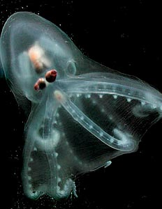
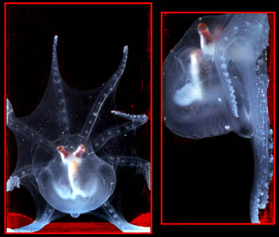
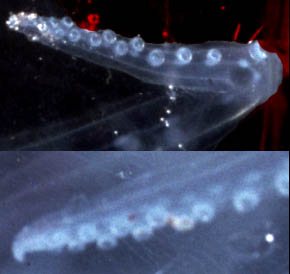
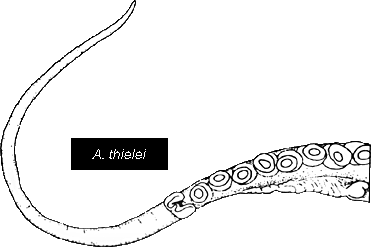

## Phylogeny 

-   « Ancestral Groups  
    -   [Incirrata](../Incirrata.md)
    -   [Octopod](../../Octopod.md)
    -   [Octopodiformes](Octopodiformes)
    -   [Coleoidea](Coleoidea)
    -   [Cephalopoda](Cephalopoda)
    -   [Mollusca](Mollusca)
    -   [Bilateria](Bilateria)
    -   [Animals](Animals)
    -   [Eukaryotes](Eukaryotes)
    -   [Tree of Life](../../../../../../../../../Tree_of_Life.md)

-   ◊ Sibling Groups of  Incirrata
    -   Amphitretidae
    -   [Octopodidae](Octopodidae.md)
    -   [Argonautoida](Argonautoida.md)
    -   [Bolitaenidae](Bolitaenidae.md)
    -   [Vitreledonella richardi](Vitreledonella_richardi)

-   » Sub-Groups 

# Amphitretidae [Hoyle, 1886] 

[Richard E. Young, Katharina M. Mangold (1922-2003), and Michael Vecchione](http://www.tolweb.org/)

A single genus and two species are recognized in this family.

-   *Amphitretus pelagicus*
-   *Amphitretus thielei*

Containing group: [Incirrata](../Incirrata.md)

## Introduction

This transparent, gelatinous and nearly colourless octopod is small (90
mm ML, Nesis, 1982/7) and has the body foreshortened in the
anterior-posterior axis. The arms bear one row of suckers proximally but
two rows near the arm tips; the web is deep. The mantle is fused to the
posterior end of the funnel leaving three openings into the mantle
cavity. One is the funnel orifice and the other two are the remnants of
the mantle aperature located lateral to the funnel. The eyes are in a
dorsal position, tubular in shape and with their bases in contact;
however, the optical axes diverge by 70° (see photograph below). This is
the only octopod known to have tubular eyes. The stomach is reported to
be anterior to the digestive gland but actually lies on the dorsal
surface of the gland. The third right arm is hectocotylized. Young
***Amphitretus*** probably occupy upper mesopelagic depths during the
day, judging by their morphology and a few captures. Little is known of
the life history and biology of this unusual octopod.

**Figure**. Dorsal and side views of ***A. pelagicus*** photographed in
a small ship-board aquarium off Hawaii. The octopod is crawling on the
side of the tank (from Young et al., 1999).

#### Diagnosis

An incirrate \...

-   with tubular eyes.
-   with funnel fused ventrally to mantle.

### Characteristics

Arms

1.  Arm suckers in single series proximally, double series distally (see
    below).
2.  Right arm III of male hectoctoylized.\
    \

Head

1.  Eyes tubular in shape.\
    \

Funnel

Funnel fused to mantle ventrally; mantle opening reduced to broad pores
lateral to funnel.

{width="290"}

**Figure**. Two views of the arm tips of a living ***A. pelagicus*** in
a shipboard aquarium with suckers apparently in a double series.
Photographs by R. Young.
### Nomenclature

***Idioctopus gracilipes*** Taki, 1962 is probably a synonym (see
Hochberg, et al., 1992).

[A list of all nominal genera and species in the Amphitretidae can be found here.](http://www.tolweb.org/accessory/Amphitretidae_Taxa?acc_id=2424)
The list includes the current status and type species of all genera, and
the current status, type repository and type locality of all species and
all pertinent references.

### Species

The family was thought to have only a single species until O\'Shea
(1999) demonstrated that two species occurred off New Zealand, although
Nesis (1982/87) recognized two subspecies.

The species are separated most clearly by the structure of the
hectocotylus: In ***A. pelagicus*** the ligula lacks suckers but has two
series of papillae and the sucker count is 27-28. In ***A. thielei***
the ligula lacks both suckers and papillae, and the sucker count is
21-24. In addition, ***A. pelagicus*** has 10 lamellae in the outer
demibranch of the gill and non-hectocotylized arms that each bear 22-32
(generally below 30) suckers, while ***A. thielei*** has 8 outer gill
lamellae and non-hectocotylized arms with 24-41 (generally above 30)
suckers.

{width="371"}

**Figure**. **Left** - Distal portions of the hectocotyli of ***A.
pelagicus***. **Right** - Distal portion of the hectocotylus of ***A.
thielei***. Drawings from O\'Shea, 1999.
### Distribution

The distribution of ***A. pelagicus*** probably includes the tropical
and subtropical waters of the world\'s oceans. Off New Zealand, ***A.
pelagicus*** is found in subtropical waters while ***A. thielei*** is
found further south in temperate waters (O\'Shea, 1999).

### References

Hochberg, F. G., M. Nixon and R. B. Toll. 1992. Order Octopoda Leach,
1818. In: Sweeney, M. J., C. F. E. Roper, K. M. Mangold, M. R. Clarke
and S. v. Boletzky (eds.) \"Larval\" and juvenile cephalopods: A manual
for their identification. Smithson. Contr. Zool., 513:1-282.

Nesis, K. N. 1982. Abridged key to the cephalopod mollusks of the
world\'s ocean. 385+ii pp. Light and Food Industry Publishing House,
Moscow. (In Russian.). Translated into English by B. S. Levitov, ed. by
L. A. Burgess (1987), Cephalopods of the world. T. F. H. Publications,
Neptune City, NJ, 351pp.

O\'Shea, Steve. 1999. The Marine Fauna of New Zealand: Octopoda
(Mollusca: Cephalopoda). NIWA Biodiversity Memoir 112: 280pp.

Thore, S. 1949. Investigations on the \"Dana\" Octopoda. Dana-Report No.
33, 85pp.

Voight, J. R. 1997 \-- Cladistic analysis of the octopods based on
anatomical characters. J. Moll. Stud., 63: 311-325.

Young, R. E., M. Vecchione and D. Donovan. 1999. The evolution of
coleoid cephalopods and their present biodiversity and ecology. South
African Jour. Mar. Sci. (in press).

## Title Illustrations



  --------------------------------
  Scientific Name ::     Amphitretus pelagicus
  Location ::           Central North Pacific
  Specimen Condition   Live Specimen
  Copyright ::            © 2001 [Monterey Bay Aquarium Research Institution](http://www.mbari.org/rd/midwater)
  --------------------------------

## Confidential Links & Embeds: 

### #is_/same_as :: [Amphitretidae](/_Standards/bio/bio~Domain/Eukaryotes/Animals/Bilateria/Mollusca/Cephalopoda/Coleoidea/Octopodiformes/Octopod/Incirrata/Amphitretidae.md) 

### #is_/same_as :: [Amphitretidae.public](/_public/bio/bio~Domain/Eukaryotes/Animals/Bilateria/Mollusca/Cephalopoda/Coleoidea/Octopodiformes/Octopod/Incirrata/Amphitretidae.public.md) 

### #is_/same_as :: [Amphitretidae.internal](/_internal/bio/bio~Domain/Eukaryotes/Animals/Bilateria/Mollusca/Cephalopoda/Coleoidea/Octopodiformes/Octopod/Incirrata/Amphitretidae.internal.md) 

### #is_/same_as :: [Amphitretidae.protect](/_protect/bio/bio~Domain/Eukaryotes/Animals/Bilateria/Mollusca/Cephalopoda/Coleoidea/Octopodiformes/Octopod/Incirrata/Amphitretidae.protect.md) 

### #is_/same_as :: [Amphitretidae.private](/_private/bio/bio~Domain/Eukaryotes/Animals/Bilateria/Mollusca/Cephalopoda/Coleoidea/Octopodiformes/Octopod/Incirrata/Amphitretidae.private.md) 

### #is_/same_as :: [Amphitretidae.personal](/_personal/bio/bio~Domain/Eukaryotes/Animals/Bilateria/Mollusca/Cephalopoda/Coleoidea/Octopodiformes/Octopod/Incirrata/Amphitretidae.personal.md) 

### #is_/same_as :: [Amphitretidae.secret](/_secret/bio/bio~Domain/Eukaryotes/Animals/Bilateria/Mollusca/Cephalopoda/Coleoidea/Octopodiformes/Octopod/Incirrata/Amphitretidae.secret.md)

