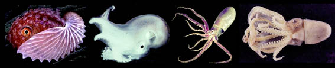
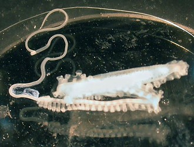

## Phylogeny 

-   « Ancestral Groups  
    -   [Incirrata](../Incirrata.md)
    -   [Octopod](../../Octopod.md)
    -   [Octopodiformes](Octopodiformes)
    -   [Coleoidea](Coleoidea)
    -   [Cephalopoda](Cephalopoda)
    -   [Mollusca](Mollusca)
    -   [Bilateria](Bilateria)
    -   [Animals](Animals)
    -   [Eukaryotes](Eukaryotes)
    -   [Tree of Life](../../../../../../../../../Tree_of_Life.md)

-   ◊ Sibling Groups of  Incirrata
    -   [Amphitretidae](Amphitretidae.md)
    -   [Octopodidae](Octopodidae.md)
    -   Argonautoida
    -   [Bolitaenidae](Bolitaenidae.md)
    -   [Vitreledonella richardi](Vitreledonella_richardi)

-   » Sub-Groups
    -   [Haliphron atlanticus](Haliphron_atlanticus)
    -   [Tremoctopus](Tremoctopus)
    -   [Argonauta](Argonauta)
    -   [Ocythoe tuberculata](Ocythoe_tuberculata)

# Argonautoida [Naef, 1912] 

[Richard E. Young and Michael Vecchione](http://www.tolweb.org/)

Four families comprise a well-defined monophyletic clade.

Containing group: [Incirrata](../Incirrata.md)

## Introduction

All four families of the Argonautoida are pelagic although one
(Alloposidae) is \"associated\" with the ocean floor. The families are
primarily distinguished by an unusual means of copulation which involves
transferring a detached hectocotylus from the male to the female. The
clade includes gelatinous species as well as very muscular species.

#### Diagnosis

An incirrate octopod \...

-   with detachable hectocotylus.

### Characteristics

1.  Arms
    1.  Arm suckers in two series (grade to single series near mouth in
        **Haliphron**).
    2.  One of third arm pair entirely hectocotylized and enrolled in a
        sac or pouch prior to use.
    3.  Hectocotylized arm autotomizes (i. e., detaches) during
        copulation.

        
        **Figure**. Detached hectocotylus of ***Argonauta argo*** found
        wiggling among contents of a midwater trawl. Photograph
        (overexposed) by M. Vecchione.

2.  Funnel
    1.  Funnel-locking apparatus well developed but structure differs
        among families.
3.  Mantle
    1.  Males much smaller than females; males dwarfs in three families.
4.  Shell
    1.  Internal shell present only in Alloposidae; shell lost in other
        families.
5.  Radula
    1.  Radula heteroglossan.

### Discussion of Phylogenetic Relationships

Naef (1923) suggested that the argonautoid families were derived from
the Octopodidae and presented a phylogeny, shown above in the title
frame, based on the characteristics of the hectocotylus.

Voight (1997), in a cladistic study using mostly different characters,
presented a less resolved phylogeny:

        \    --- Alloposidae
         \  / --- Argonautidae
          \/ /
           \/--- Ocythoidae
            \
             \--- Tremoctopodidae

### References

Naef, A. 1921/23. Cephalopoda. Fauna und Flora des Golfes von Neapel.
Monograph, no. 35.

Nesis, K. N. 1982. Abridged key to the cephalopod mollusks of the
world\'s ocean. 385+ii pp. Light and Food Industry Publishing House,
Moscow. (In Russian.). Translated into English by B. S. Levitov, ed. by
L. A. Burgess (1987), Cephalopods of the world. T. F. H. Publications,
Neptune City, NJ, 351pp.

Voight, J. R. 1997. Cladistic analysis of the octopods based on
anatomical characters. J. Moll. Stud. 63: 311-325.

## Title Illustrations



  ---------------------------------------
  Scientific Name ::   Argonauta nodosa, Haliphron atlanticus, Ocythoe tuberculata, Tremoctopus violaceus
  Acknowledgements   courtesy of Mark Norman
  Copyright ::          © 1996 David Paul (Argonauta), Ron Gilmer (Haliphron), Dorothy Petersen (Ocythoe), M. Vecchione (Tremoctopus)
  ---------------------------------------
