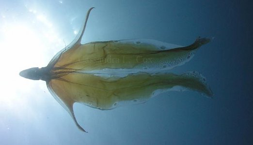
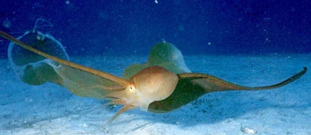
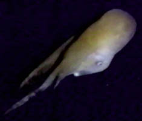
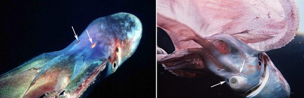
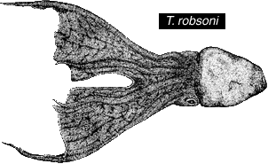
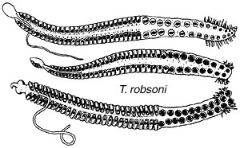
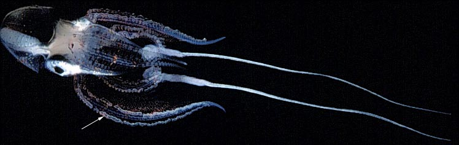

## Phylogeny 

-   « Ancestral Groups  
    -   [Argonautoida](../Argonautoida.md)
    -   [Incirrata](../../Incirrata.md)
    -   [Octopod](../../../Octopod.md)
    -   [Octopodiformes](Octopodiformes)
    -   [Coleoidea](Coleoidea)
    -   [Cephalopoda](Cephalopoda)
    -   [Mollusca](Mollusca)
    -   [Bilateria](Bilateria)
    -   [Animals](Animals)
    -   [Eukaryotes](Eukaryotes)
    -   [Tree of Life](../../../../../../../../../../Tree_of_Life.md)

-   ◊ Sibling Groups of  Argonautoida
    -   [Haliphron atlanticus](Haliphron_atlanticus)
    -   Tremoctopus
    -   [Argonauta](Argonauta)
    -   [Ocythoe tuberculata](Ocythoe_tuberculata)

-   » Sub-Groups 

## Tremoctopodidae [Tryon, 1879] 

# *Tremoctopus* [Chiaie 1830]

## Blanket octopus 

[Katharina M. Mangold (1922-2003), Michael Vecchione, and Richard E. Young](http://www.tolweb.org/)

The Tremoctopodidae contains a single genus with the following four
species:

-   *Tremoctopus violaceus*
-   *Tremoctopus gelatus*
-   *Tremoctopus gracilis*
-   *Tremoctopus robsoni*

Containing group: [Argonautoida](../Argonautoida.md)

## Introduction

Most species have large, muscular females, ca. 1 m or more in total
length, that occupy surface waters of tropical and subtropical oceans.
In females the dorsal and dorsolateral arms are distinctly longer than
arms III and IV and are connected by an extensive web which is absent
from the other arms.

**Figure**. ***T. violaceus*** swimming just above the shallow ocean
floor. Note the string-like structure trailing from the broad web of arm
I. This \"string\" is actually the slender arm I extending beyond the
web. Posterolateral view of ***T. violaceus*** swimming just above the
shallow ocean floor. Photographed by Rob Rush at 68 feet deep off Delray
Beach Ledge, Florida, USA (near 26°N 80°W), May 12, 2001, 9:06 AM local
time.

Large ocelli can be displayed on the dorsal web. This web and the
slender tip of the arms can, apparently, be autotomized along visible
\"fracture\" lines. The autotomized arms and membranes presumably wiggle
to distract or cling to a predator while the octopod swims away.
[Evidence for this and additional photographs of free-swimming ***T. violaceus*** can be seen here.](http://www.tolweb.org/notes/?note_id=3124) Apparently the web is
only extended when the octopod is threatened. [A video on YouTube shows the large web rolled up and held close to the mouth.](http://www.youtube.com/watch?v=Zy-ZlzAM6f8 "Tremoctopus"){target="_blank"}
The blanket octopod seen in this video was filmed in the Sea of Japan
(T. Kubodera, pers. comm.)

**Figure**. The picture of ***T. violaceus*** on the left, taken in an
aquarium, shows the typical color pattern. Photograph taken by Vicente
Hernandez. The photograph on the right of ***Tremoctopus*** sp. taken
from a submersible shows the octopod swimming at a depth of 340 m and
about 5 m above the bottom in Hawaiian waters. [An AVI format video clip of this individual is available at Cephalopods in Action](http://www.mnh.si.edu/cephs/young92/cephs6.html#trem1).
Submersible photograph courtesy of the Hawaii Undersea Research
Laboratory.

#### Diagnosis

An argonautoid \...

-   with extensive web between dorsal four arms; web virtually absent
    between other arms.

### Characteristics

1.  Arms
    1.  Dorsal four arms much longer than ventral four arms.
    2.  Deep web present between dorsal four arms (see title
        photograph).
    3.  Hectocotylus develops in sac burried beneath right eye.
    4.  Proximal half of hectocotylus with papillate lateral fringes.
2.  Swim bladder
    1.  Hydrostatic organ (swim bladder) present dorsal to digestive
        system.
3.  Water pores
    1.  Present at base of dorsal and ventral arms.\

        \
        **Figure**. Two views of a swimming ***T. violaceus*** showing
        water pores (arrows). **Left** - View of the dorsal water pores.
        **Right** - View of the ventral water pores. Photographs by
        [Peter         Wirtz.](http://www.medslugs.de/E/Photographers/Peter_Wirtz.htm#photos)

#### Comments

The presence of a hydrostatic organ was recently reported by Bizikov
(2004).

### Nomenclature

[A list of all nominal genera and species in the Tremoctopodidae can be found here.](http://www.tolweb.org/notes/?note_id=2465) The list
includes the current status and type species of all genera, and the
current status, type repository and type locality of all species and all
pertinent references.

The systematics of the Tremoctopodidae was review by Thomas (1977). He
concluded that two species existed, ***T. violaceus*** and his new
species ***T. gelatus*** Thomas, 1977. The former species he divided
into two subspecies, ***T. v. violaceus***, from the Atlantic Ocean and
***T. v. gracilis***, from the Pacific and Indian Oceans. O\'Shea (1999)
has resurrected a New Zealand species, ***T. robsoni***. Since the
degree of difference between the latter and ***T. violaceus*** is of the
same order as that between the two subspecies of ***T. violaceu*****s**
we here elevate the two subspecies to specific level:

-   ***Tremoctopus violaceus violaceus*** Chiaie, 1830 becomes
    ***Tremoctopus violaceus*** Chiaie, 1830\
-   ***Tremoctopus violaceus gracilis*** (Eydoux and Souleyet, 1852).
    becomes ***Tremoctopus gracilis*** (Eydoux and Souleyet, 1852).

There is some confusion on the proper name of ***T. robsoni***. Mike
Sweeney (USNMNH) explains: \"The name ***Tremoctopus robsonianus*** is
in the title of the paper (an abstract from a meeting of the Wellington
Philosophical Society). However the taxon is introduced in the text with
the name ***Tremoctopus robsoni*** n.sp. The taxon was published in the
1883 volume (#16) of the Transactions of the New Zealand Institute, but
had a publication date of May 1884.\" The correct name is ***Tremoctopus
robsoni*** Kirk, 1884.

### Species

Of the four recognized species, ***T. gelatus*** is easily recognized by
its gelatinous consistency and generally pale pigmentation, the other
three species are very similar. The most useful character is the number
of sucker pairs on the distal half of the hectocotylus of the male.
Another character is the number of gill filaments on the outer
demibranch of the gill not including the terminal filament.

  -------- -----------------
  Species              Consistency   Distal hecto. suckers   Gill filaments males   Gill filaments females
  ***T. violaceus***   Muscular      15-19 pairs             9-11                   13-16
  ***T. gracilis***    Muscular      19-22 pairs             9-11                   13-16
  ***T. robsoni***     Muscular      27-28 pairs             10-13                  15
  ***T. gelatus***     Gelatinous    \- ? -                  7-8                    8-11
  -------- -----------------

  : **Species differences**

{height="185" width="302"}

**Figure**. **Left** - ventral and dorsal views of ***T. gelatus***, 328
mm ML, from Thomas, 1977. Drawing printed with the Permission of the
Bulletin of Marine Science. Right - Dorsal view of ***T. robsoni***, 61
mm ML. Drawing from O\'Shea, 1999.

A few additional features on the hectocotylus seem to have specific
value. The proximal suckers number 22-23 pairs in ***T. violaceus***,
27-29 pairs in ***T. gracilis*** (Thomas, 1977) and 9-15 in ***T.
robsoni*** according to the figures shown here from O\'Shea, 1999. Also
the hectocotylus of the first two species has a fringe of fleshy
papillae that extend the full length of the proximal section, while the
third species, according to the illustration, has the fringe restricted
to the base of the proximal section.

{height="186" width="300"}

**Figure**. Oral views of three hectocotyli of ***T. robsoni***.
Drawings from O\'Shea, 1999.

### Behavior

Young individuals carry broken tentacles of the Portuguese man-of-war
(jellyfish) on the suckers of the dorsal four arms. The borrowed
tentacles, which have stinging cells, presumably have a defensive and/or
offensive function.

{width="748"}

**Figure**. Ventral view of a young female ***T. gracilis***, Hawaiian
waters. The white arrow points to the man-of-war tentacles held by the
left arm II. Similar worm-like tentacles can be seen attached to suckers
of arms I and the other arm II. Note the large white balls with long
streaming white tentacles. The identity of these is unknown but
presumably they are larger pieces of the man-of-war or some other
jellyfish.
### Life History

Males are dwarfs (15 mm ML), often reaching only 5-10% of the female
size. The females carry numerous (100,000 to 150,000) small eggs (0.9 X
1.5 mm in size). The eggs are attached to a sausage-shaped calcareous
secretion held at the base of the dorsal arms and carried by the female
until hatching. The hatchling has the arm bases in a cuff as in
***Argonauta***. Data are from Thomas (1977) and Naef (1921/23). [More information of the egg mass, embryos and hatchlings can be found here](http://www.tolweb.org/accessory/Tremoctopus_Eggs,_etc.?acc_id=2416).\

### Distribution

***T. violaceus*** lives in the Atlantic and ***T. gracilis*** in the
Indo-Pacific; ***T. gelatus*** is a deep-living, gelatinous, presumably
mesopelagic, species that is cosmopolitan in tropical and temperate seas
(Thomas, 1977). ***T. robsoni*** is known from waters off New Zealand
(O\'Shea, 1999).

### References

Bizikov, V. A. 2004. The shell in Vampyropoda (Cephalopoda): Morphology,
functional role and evolution. Ruthenica. Supplement 3: 1-88.

Naef, A. 1921-23. Cephalopoda. Fauna und Flora des Golfes von Neapel.
Monograph, no. 35. English translation: A. Mercado (1972). Israel
Program for Scientific Translations Ltd., Jerusalem, Israel. 863pp.,
IPST Cat. No. 5110/1,2.

O\'Shea, Steve. 1999. The Marine Fauna of New Zealand: Octopoda
(Mollusca: Cephalopoda). NIWA Biodiversity Memoir 112:280pp.

Thomas, R. F. 1977. Systematics, distribution, and biology of
cephalopods of the genus *Tremoctopus* (Octopoda:Tremoctopodidae). Bull.
Mar. Sci. 27: 353-392.

## Title Illustrations



  ------------------------
  Scientific Name ::     Tremoctopus violaceus
  Location ::           1 mile east of Pompano Beach, Florida.
  Comments             Water depth 11 m.
  Specimen Condition   Live Specimen
  Identified By        M. Vecchione
  Sex ::                Female
  View                 Ventral
  Copyright ::            © 2005 [Cassandra L. Cox](mailto:craftycassandra@hotmail.com)
  ------------------------

## Confidential Links & Embeds: 

### #is_/same_as :: [Tremoctopodidae](/_Standards/bio/bio~Domain/Eukaryotes/Animals/Bilateria/Mollusca/Cephalopoda/Coleoidea/Octopodiformes/Octopod/Incirrata/Argonautoida/Tremoctopodidae.md) 

### #is_/same_as :: [Tremoctopodidae.public](/_public/bio/bio~Domain/Eukaryotes/Animals/Bilateria/Mollusca/Cephalopoda/Coleoidea/Octopodiformes/Octopod/Incirrata/Argonautoida/Tremoctopodidae.public.md) 

### #is_/same_as :: [Tremoctopodidae.internal](/_internal/bio/bio~Domain/Eukaryotes/Animals/Bilateria/Mollusca/Cephalopoda/Coleoidea/Octopodiformes/Octopod/Incirrata/Argonautoida/Tremoctopodidae.internal.md) 

### #is_/same_as :: [Tremoctopodidae.protect](/_protect/bio/bio~Domain/Eukaryotes/Animals/Bilateria/Mollusca/Cephalopoda/Coleoidea/Octopodiformes/Octopod/Incirrata/Argonautoida/Tremoctopodidae.protect.md) 

### #is_/same_as :: [Tremoctopodidae.private](/_private/bio/bio~Domain/Eukaryotes/Animals/Bilateria/Mollusca/Cephalopoda/Coleoidea/Octopodiformes/Octopod/Incirrata/Argonautoida/Tremoctopodidae.private.md) 

### #is_/same_as :: [Tremoctopodidae.personal](/_personal/bio/bio~Domain/Eukaryotes/Animals/Bilateria/Mollusca/Cephalopoda/Coleoidea/Octopodiformes/Octopod/Incirrata/Argonautoida/Tremoctopodidae.personal.md) 

### #is_/same_as :: [Tremoctopodidae.secret](/_secret/bio/bio~Domain/Eukaryotes/Animals/Bilateria/Mollusca/Cephalopoda/Coleoidea/Octopodiformes/Octopod/Incirrata/Argonautoida/Tremoctopodidae.secret.md)

