---
title: Octopodidae
---

# [[Octopodidae]] 

Octopods, octopuses, devilfishes 

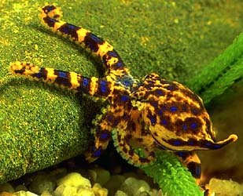  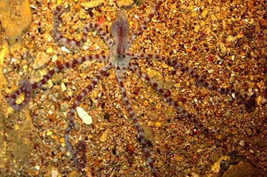 

This family is made up of the familiar bottom-living octopuses and
contains the majority of the genera and species which make up the Order
Incirrata. The taxonomy of the family is poor with more than 30 genera
coined, of which the following 24 are generally accepted as valid. There
are over 200 species worldwide with the majority lacking detailed
descriptions.

## #has_/text_of_/abstract 

> The **Octopodidae** comprise the family containing the majority of known octopus species 
> (about 175 species).
>
> [Wikipedia](https://en.wikipedia.org/wiki/Octopodidae) 
## Introduction

[Mark D. Norman, F. G. Hochberg, Christine Huffard, and Katharina M. Mangold (1922-2003)]() 

Members of this family are the best known of the octopods. There is
considerable diversity within this family. They range in size from pygmy
species mature at under one gram (e.g., ***Octopus wolfi***) to the
Giant Pacific Octopus (***Octopus dofleini***) of the North Pacific
reaching weights in excess of 150 kilograms with an arm span of over 5
m. All are muscular with one or two rows of suckers. Body proportions
vary between species, from animals with arms approximately twice the
mantle length (as in the blue-ringed octopuses, genus
***Hapalochlaena**)* to those with arms up to 10 times the mantle length
(as in ***Ameloctopus***) (see title photos above). The skin also varies
between species from smooth (as in ***Benthoctopus*** - left photograph
below) to highly sculptured (as in ***Octopus cyanea*** - right
photograph) below.

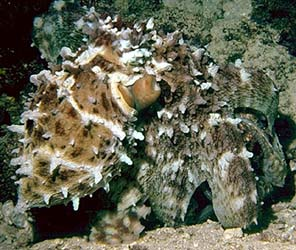

***Benthoctopus levis*** (left) from Heard Island, Indian Ocean
(photograph copyright © 1996, T. Stranks); ***Octopus cyanea*** (right)
from the Great Barrier Reef (photograph copyright © 1996, Mark Norman).
### Characteristics

1.  Suckers in one or two series.
2.  One of the third arms modified in males (= hectocotylus), as an open
    sperm groove (running along ventral edge of the arm) and a modified
    terminal tip (ligula), typically spoon-like.
3.  Hectocotylus not detachable.
4.  Internal shell reduced to a pair of stylets or lost.
5.  Stomach and caecum posterior to digestive gland.
6.  Lateral radula teeth (if present) simple, with single cusp.

### Discussion of Phylogenetic Relationships

There has been little research into the phylogeny of this family as the
morphology of the majority of genera and species are yet to be described
in detail. Molecular analyses presently are rudimentary. Earlier works
have recognised up to four subfamilies on the basis of relatively few
characters, particularly the number of sucker rows and the presence or
absence of an ink sac and a diverticulum branch off the crop (see Voss,
1988). These subfamilies are Octopodinae (double sucker row, ink sac and
crop diverticulum present), Eledoninae (single sucker row, ink sac and
crop diverticulum present), Bathypolypodinae (double sucker row, ink sac
absent), Graneledoninae (single sucker row, ink sac and crop
diverticulum absent). The latter two subfamilies are restricted to
deeper waters and Voss (1988) discusses possible adaptations of these
groups to lightless depths. The validity of these groupings have not
been firmly established and there is a high likelihood of convergence in
these few characters. The most detailed treatments of this family are
provided in Naef (1923), Sasaki (1929), Robson (1929) and Nesis (1982).

### Life history

Members of this family mate by the male transferring sperm packages
(spermatophores) to the female using the modified third arm
(hectocotylus). Spermatophores are shunted along an open groove on the
hectocotylised arm to a spoon-shaped tip (ligula). The male places the
spermatophores within the oviducts of the female. Females can store
sperm for up to 10 months (Mangold, in Boyle, 1983), and in many species
immature females can mate and store viable sperm until mature. The
elongate spermatophores evert within the oviduct to form a sperm bulb
(spermatangia). In certain species, the everting spermatophore is
covered in sharp teeth which aid the penetration of the sperm bulb along
the oviduct through the oviducal glands and into the body of the ovary.
In most species, sperm is stored within or adjacent to the oviducal
glands. Fertilization typically occurs as the eggs pass through the
oviducal glands.

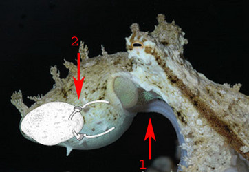{height="250" width="361"}

Spermatophore groove of ***Abdopus aculeatus***, arrow points to
spermatophore guide that may direct the spermatophores as they are
expelled from the funnel. Note coiled tip of this mating arm, perhaps to
protect the ligula.  © 2005 [Christine Huffard](mailto:chuffard@berkeley.edu) .  Ligula of an undescribed pygmy
octopus from Tonga. © 1997 [Christine Huffard](mailto:chuffard@berkeley.edu) . Diagram of the female
reproductive tract (***Abdopus aculeatus***) during copulation.  Arrow 1
points to the spermatophore groove of the inserted hectocotylus.  Arrow
2 points an oviducal gland, photo © 2005 [Roy L Caldwell](mailto:rlcaldwell@berkeley.edu)

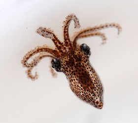{width="212"}

Crawl-away hatchling of the large-egged ***Octopus cf. mercatoris*.** ©
2006 [Roy L Caldwell](mailto:rlcaldwell@berkeley.edu)

Egg size varies between different species and falls into two broad
categories, according to Boletzky (1977): \"Large-egg\" species produce
eggs greater than 10% of the mantle length (as few as 50, up to 30 mm
long), and \"small-egg\" species produce many small eggs less than 10%
of mantle length (up to 600,000, as small as 1.5 mm each). Hatchlings of
most large-egg species are well-developed and adopt a benthic habit on
hatching, although this generalization does not hold for some pygmy
species such as ***O. bocki***. These young typically possess arms with
many suckers and adult-like skin sculpture and colour patterns.

The hatchlings of the \"small-egg\" species live in the plankton in
their early stages and are characterized by short arms with few suckers
and simple colour patterns consisting of a few large \"founder\"
chromatophores (Packard, 1985). The morphology of these planktonic
stages changes rapidly on settlement, quickly transforming to resemble
the adult.

The females of all species within this family brood, remaining with the
eggs until hatching, cleaning the eggs by jetting water through them as
they develop. Females typically cease feeding prior to spawning and
establish themselves within the safety of a lair. Eggs are typically
laid in strings or festoons, where the egg stalks are interwoven or
glued together. Most species attach the eggs to the substrate, shells or
man-made objects. Females of several species in the genera
***Hapalochlaena*** and ***Amphioctopus*** carry the egg strings on
their arms, enveloping them within the webs. The duration of development
of the embryos is longer at low temperatures than at high ones, and is
longer in large eggs than in small ones. **Octopus vulgaris** eggs (2.0
mm) develop in 30 days at 20 C and in 65 days at 15 C. The large eggs of
**Bathypolypus arcticus** (i.e., 15 mm) need one year to develop (O\'Dor
and Macalaster, in Boyle, 1983).

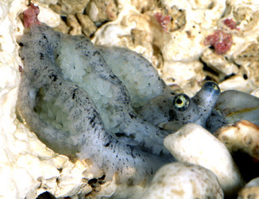\

Female ***Abdopus abaculus*** brooding eggs.\
© 2000 [Roy L Caldwell](mailto:rlcaldwell@berkeley.edu)

Spawning is terminal in the majority of octopodid species, i.e., females
die shortly after the last embryos have hatched. In other species, e.g.,
***Octopus chierchiae***, spawning is intermittent, where females resume
feeding after the embryos hatch, and grow until the next spawning takes
place (Rodaniche, 1984) although the ovaries do not regress and regrow
between spawning episodes.  At the end of their life span, octopuses
tend to lose mass, coordination, and the ability to express complex body
patterns (see brooding female ***Abdopus abaculus*** below).

Members of this family prey on a wide range of animals, although
primarily crustaceans (View
Foraging_video). Certain species appear to be generalists (one
individual of ***Octopus dierythraeus*** was caught carrying crabs, a
bivalve shell, a fish, a polychaete worm and a freshly decapitated
octopus; Norman, 1993a), while others concentrate on a single group.
***Octopus alpheus*** has a diet apparently restricted to crabs (Norman,
1993). Certain species use the radula to drill bivalve or gastropod
shells (e.g., Nixon and Maconnachie, 1988). ***Octopus ornatus*** preys
heavily on octopuses of other species (Norman, 1993b). Cannibalism has
also been reported for many species.

As in all cephalopods, octopuses are fast growing. At hatching,
***Octopus vulgaris*** juveniles weigh 2 mg, growing to weights of 2 to
3 kg in 12 to 18 months (Mangold, in Boyle, 1983). Paralarvae of this
species feed on planktonic crustaceans, whereas the newly settled young
feed mostly on benthic prey. The conversion rate of young ***Octopus
vulgaris*** is 50% when fed crustaceans. The life-span of members of the
Octopodidae varies between about 6 months in small tropical species to
four years in cold water species such as ***Bathypolypus arcticus***
(O\'Dor and Macalaster, in Boyle, 1983).

### Behaviour

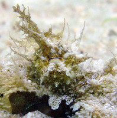

***Abdopus aculeatus*** close up showing chromatophores and skin
papillae. © 2005 [Christine Huffard](mailto:chuffard@berkeley.edu)

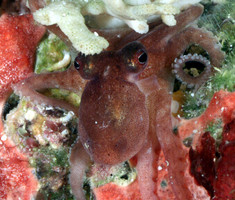

***Octopus bocki*** © 1996 [Roy L Caldwell](mailto:rlcaldwell@berkeley.edu)

Many shallow-water species exhibit a remarkable match to the color and
texture of the background (in spite of the fact that they are color
blind!). This camouflage is produced by chromatophore combinations,
passive reflection from specialized cells (iridophores, leucophores) and
sculpture formed by raised (even branched) muscular patches and papillae
(see image below).  Variation in skin anatomies leads to a wide range of
species-specific body patterns and skin textures.  For example, body
patterns in ***Octopus bocki*** appear limited to fairly uniform purple
with iridescent patches on the mantle and around the eyes, while
***Octopus cyanea*** can display numerous patterns using differently
colored chromatophores.

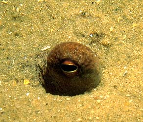

Camouflaged undescribed member of ***Octopus horridus*** group, Great
Barrier Reef, © 1996 M. Norman

For many species, activity is restricted to specific periods. Many
species are only active at night (e.g., ***Octopus ornatus***), while
others are predominantly day active (e.g., ***Octopus cyanea***), see
Houck (1982). Certain species are further restricted in their activity
periods to the duration of low tides, only emerging to forage in rock
pools on exposed intertidal reefs.

Octopuses of this family seek shelter in a number of ways. Many species
utilize or construct holes as temporary or semi-permanent lairs, often
recognised by prey remains or small piles of pebbles surrounding the
entrance. These lairs may occur in corals, rock and rubble or can be
excavated in sand or mud sediments.  Many night-active species such as
***O. ornatus*** simply excavate a hole anywhere amongst rubble in the
substrate at the end of a night\'s foraging, covering themselves with
rubble or sand during the day. Other species which occur on open sand
substrates (such as ***O. kaurna***) simply bury in open sand. Certain
species such as ***O. berrima*** (photograph below) possess a ridge-like
keel around the lateral mantle which may aid in guiding the animal below
the sand. This species frequently buries below the sand, occasionally
raising a single eye like a periscope to scan. In some species (such as
***O. bimaculoides***) larger individuals outcompete smaller individuals
for preferred shelters.  True territoriality however has not been shown
in octopuses.  

Defenses in this group range from camouflage (as seen in the photograph
below), to ink dummy decoys, to ink smoke screens (see image below of
ink from ***O. cyanea***), to arm-dropping (as in ***Ameloctopus***) and
production of strong toxins advertised by distinctive colour patterns
(as in ***Hapalochlaena***). Alarm displays in certain species have been
supplemented by a pair of false-eye spots, one on the lateral arm crown
below each eye. These ocellate octopuses flare the webs and display
these spots to produce the appearance of the head of a large predator
(e.g., photograph below of ***Octopus mototi***, Norman, 1993b).  Some
sand-dwelling octopuses (such as ***Thaumoctopus mimicus***) can escape
threatening sitations by burying into the sand and emerging more than
one meter away.

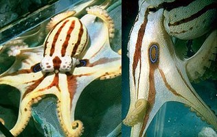

***Octopus berrima***, from Victoria, southern Australia , © 1996 S.
Foale. Ink smokescreen of ***Octopus cyanea**,* from Palmyra Atoll. ©
2006 [Christine Huffard](mailto:chuffard@berkeley.edu) .  Ocellated
octopus ***Octopus mototi***, from the Great Barrier Reef © 1996 M.
Norman. 
### Distribution

Members of this family are found in marine habitats ranging from
intertidal reefs to the deep sea (to at least 5000 m). They live in all
oceans of the world from the equator to polar latitudes, and occupy a
wide range of habitats from coral and rocky reefs, seagrass and algal
beds, to sand and mud soft substrates. The group is represented by
possible habitat generalists (such as the large ***Enteroctopus
dofleini*** which ranges from the intertidal to depths in excess of 450
m) and specialists (such as ***Vulcanoctopus hydrothermalis*** which is
found only in hydrothermal vents). Some octopodids appear to space
themselves far apart from each other, while others clump in available
habitat.  We do not currently know if these distributions reflect
ecological preferences or the outcomes of inter/intra-specific
competition.  Although some species occupy a den and forage in the
vicinity for weeks or longer, species studied thus far do not appear to
be territorial and defend their home range from conspecifics.

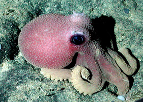

***Callistoctopus ornatus*** foraging in less than 10 cm of water, less
than one meter from the beach. Rurutu, Austral Islands © 2006 Christine
Huffard; ***Octopus cyanea*** on an intertidal reef, Rurutu, Austral
Islands. © 2006 Christine Huffard; Undescribed octopus foraging on sand
plains in North Sulawesi, Indonesia; 15 m deep © 2006 Christine Huffard;
***Graneledone boreopacifica*** Davidson Seamount; 1973 m deep. © 2002
NOAA/MBARI.
### Key to Genera of the Family Octopodidae

The following key treats clearly defined or named genera within the
family Octopodidae. The generic placement of many taxa within this
family remain unresolved and are thus not covered by this key. These
taxa are treated below under the general category "unplaced *Octopus*".
Genera designated with an asterisk (\*) are in urgent need of revision.

**Notes for key:**

**Male diagnostic characters:** As for many other cephalopod groups,
octopus taxonomy relies heavily on the reproductive charactersof mature
males, particularly structures of the modified reproductive arm
(hectocotylised arm). Female material is harder to identify.

**Arm lengths:** Use of relative arm lengths requires intact arms. A
sudden change in sucker diameter at any point along an arm is an
indicator of partial arm regeneration. Such arms should not be
considered in assessing relative arm lengths.

1a         Suckers in single row or as slight zigzag in live animals or
contracted specimens.....................2

1b.        Suckers clearly in two rows on all arms
.............................................................. 13

2a.        Ink sac
present.............................................................................................
3

2b.        Ink sac
absent.............................................................................................
10

3a.        Webs greatly enlarged at distal ends to forms wing-like vanes
(single species restricted to western Indian
Ocean)...\.........................................................***Velodona***
**Chun, 1915**

3b.        Web margins absent or as narrow bands to arms tips, not
expanded in distal portion......\...... 4

4a.        Mature males with suckers highly modified on tips of normal
arms, as ridges, stellate suckers, frills of papillae or spongiform
tissue; some member taxa with hectocotylised arm tip that lacks a
distinct ligula and/or
calamus................................................................\....
5

4b.        Mature males with distinct ligula and calamus; normal arm
tips of mature males without obvious sucker modifications
.....................................................................\.......
6

5a.            Hectocotylised arm tip of mature male fleshy and
convoluted in the form of a walnut, no obvious calamus; distal suckers
of normal arms of mature males modified into a fringe of long thin
papillae (single species restricted to southern
Africa).............................................
................................................\...***Aphrodoctopus***
**Roper and Mangold, 1992**

5b.            Hectocotylised arm tip as normal ligula and calamus or
may lack calamus; distal suckers of normal arms of mature males modified
as regular ridges or as spongiform tissue... ........
......................................................................................***Eledone***
**Leach, 1817*\****

6a.        Radula normal with seven rows of teeth plus marginal
plates.................................... 7

6b.        Radula reduced to a single row of highly modified teeth with
vane-like lateral wings (single species restricted to west and
south-west Atlantic Ocean).........***Vosseledone*** **Palacio, 1978**

7a.        Funnel organ as W, UU or VV-shaped pads; skin smooth or
sculptured ....................... 8

7b.        Funnel organ as four distinct short longitudinal pads (IIII);
all dorsal and lateral surfaces covered in large branched papillae
(single species restricted to central western Atlantic
Ocean)....................................................................***Tetracheledone***
**Voss, 1955**

8a.        Small to moderate species, never attaining large sizes; head
width close to or greater than mantle width; gills with 6-11 lamellae
per demibranch........................................... 9

8b.        Large (up to 14kg) species with loose soft gelatinous skin;
head distinctly narrower than mantle; gills with 10-11 lamellae per
demibranch (single species restricted to Antarctic waters)
....................................................................
***Megaleledone*** **Taki, 1961**

9a.        Ligula grove without transverse ridges; lower beak without
sharp modified tip, rostrum curved downwards in lateral profile;
posterior salivary glands approximately equal in length with buccal
mass; stylets present .............................................
***Pareledone*** **Robson, 1932**

9b.        Ligula grove with distinct transverse ridges; lower beak with
sharp modified tip, rostrum straight or slightly upturned in lateral
profile; posterior salivary glands approximately twice length of buccal
mass; stylets absent
.....................\...\...\...\...\...\...\...\...\...\...\...\...\...\...\...\...\...\.....
..................................***Adelieledone*** **Allcock,
Hochberg, Rodhouse and Thorpe, 2003**

10a.      Skin beset with raised conical or composite papillae hardened
with cartilaginous inclusions (less obvious in frozen
material)....................................... ***Graneledone***
**Joubin, 1918**

10b.      Skin lacks hardened papillae, sculpture soft or skin
completely smooth...................... 11

11a.      Arms short, less than 2 times mantle length; posterior
salivary glands large, more than half buccal mass
length....................................................................................
12

11b.      Arms of moderate length, approximately 2-3 times mantle
length; posterior salivary glands small, significantly less than half
buccal mass length ............***Bentheledone*** **Robson, 1932*\****

12a.      Radula reduced to three to five rows of teeth; skin covered in
low regular rounded papillae
..........................................................................***Thaumeledone***
**Robson, 1930*\****

12b.      Radula complete with 7 rows of teeth, lateral teeth flattened
into broad plates; skin smooth (single species known only from Tasman
Sea)........................................................
...................................***Microeledone*** **Norman, Hochberg
and Boucher-Rodoni, 2004**

13a.      Small octopuses with repeated colour pattern of iridescent
blue lines or rings over body, arms and webs (markings fade to white in
preserved material)...... ***Hapalochlaena*** **Robson, 1929**

13b.      Small to large octopuses without repeated iridescent markings
over body, arms and webs (some species possess a pair of iridescent
rings, one on each side of the web between the bases of arms 2 and
3)..........................................................................................
14

14a.      Ink sac
present............................................................................................
15

14b.      Ink sac
absent..........................................................................................\....
22

15a.      Arm autotomy present, evident as multiple arms severed or
regenerating from set level near to arm base (restricted to long-armed
species, arms typically \>4 times mantle length)........... 16

15b.      Arm damage and regeneration not at set plane on arm (long and
short-armed species)....... 17

16a. ***    *** Third or fourth arm pair longest; large crescent-shaped
markings on mantle absent; fields of enlarged suckers present on arms 2
and 3 of mature males (Indo West Pacific only)
...\......\..........................\......\...\...\...\...\...\...\...\...\...\...\...\...\...\.....***Abdopus***
**Norman and Finn, 2001**

16b.      Second arm pair longest; large crescent markings present on
dorso-lateral posterior mantle; enlarged suckers absent (restricted to
Central Americas only).........***Euaxoctopus*** **Voss, 1971**

17a.      Dorsal arms distinctly longer than remaining arms, arm formula
1\>2\>3\>4 ..................\... 16

17b.      Arms approximately equal in length or lateral arms longest
....................................\... 17

16a       Series of water pores on oral web in ring around mouth, small
muscular pore of each pouch opening to exterior around level of 3rd-6th
proximal suckers; ligula tiny in mature males, calamus barely
visible............................................................***Cistopus***
**Gray, 1849**

16b.      Water pouches and pores absent; ligula well-developed in
mature males..........................
..................................................................................***Callistoctopus***
**Taki, 1964**

17a.      Ligula with transverse ligula groove containing small
teeth-like lugs; raised skin ridge present on lateral mantle \[single
deepwater species (200-400 m) in western Pacific\]......................
................................................***Galeoctopus***
**Norman, Boucher and Hochberg, 2004**

17b.      Ligula groove longitudinal, without teeth-like lugs; lateral
mantle ridge present or absent \... 18

18a.      Left third arm of males
hectocotylised.................................................................19

18b.      Right third arm of males hectocotylised
.............................................................. 20

19a.      Mantle opening narrow, one third or less of body
circumference, fitting close to funnel; paired narrow papillae over each
eye; skin ridge absent from lateral mantle; body markings absent
...............................................................................***Pteroctopus***
**Fischer, 1882*\****

19b.      Mantle opening moderate to wide, approximately one half of
body circumference; single large papilla over each eye; lateral mantle
skin ridge present; two pairs of dark spots visible on mantle of live
and well-preserved material............................ ***Scaeurgus***
**Troschel, 1857**

20a.      Giant species (to \>4m total length); skin on mantle in loose
longitudinal folds; ligula very long to accommodate giant spermatophores
(up to 1 m long)...............................................
.....................................................\....***Enteroctopus***
**Rochebrune and Mabille, 1889**

20b.      Small to large species; skin typically with regular or
irregular patch and groove sculpture of raised patches or papillae (not
in loose longitudinal folds); spermatophores small to moderate, never
giant................................................................................................
21

21a.      Arms typically 2-3 times mantle length; skin sculpture of
dorsal mantle head and webs continues on to oral surface of shallow
dorsal web; colour patterns often incorporate dark leading edges along
dorso-lateral face of arms 1-3; four short longitudinal ridges of skin
in diamond arrangement on dorsal mantle; stylets absent .........\...
***Amphioctopus*** **Fisher, 1882* ***

21b.      Arms typically 3-5 times mantle length; sculpture on oral
surface of dorsal web not a continuation of mantle and aboral web
sculpture; colour patterns of dark leading arm edges absent; four large
primary papillae in diamond arrangement on dorsal mantle, stylets
present...........................................................
***Octopus sensu strictu*** **Cuvier, 1797\***

22a.      Arms extremely long, more than 6 times mantle length; arms
with banded brown and white colour pattern
.............................................................***Ameloctopus***
**Norman, 1992**

22b.      Arms short to moderate in length, less than 6 times mantle
length; arms not banded ......\... 23

23a.      Skin white, lacking any pigmentation; iris of eye absent; eyes
small (single species from hydrothermal
vents).................................. ***Vulcanoctopus*** **Gonzalez
and Guerra, 1998**

23b.      Skin with at least some pigmentation (ie oral webs, ventral
and/or dorsal surfaces); iris present; eyes moderate to large
.......................................................................
24

24a.      Calamus of mature males very large, over half ligula length
(single species, southern Australia)
\...\...\...\...\...\...\...\...\...\...\...\...\...\...\...\...\...\...\...\...\...\...\...\...\...\...\..........
***Grimpella*** **Robson, 1928*\****

24b.      Calamus small to moderate, much less than half ligula
length.................................... 25

25a.      Ligula of mature males large and spoon-shaped, deeply
excavated with a number of well-defined transverse ridges
(laminae).................................  ***Bathypolypus*** **Grimpe,
1921**

25b.      Ligula moderate to large, elongate, typically with closed
ligula groove; raised laminae absent
............................................................................***Benthoctopus***
**Grimpe, 1921*\****

## Phylogeny 

-   « Ancestral Groups  
    -   [Incirrata](../Incirrata.md)
    -   [Octopod](../../Octopod.md)
    -   [Octopodiformes](Octopodiformes)
    -   [Coleoidea](Coleoidea)
    -   [Cephalopoda](Cephalopoda)
    -   [Mollusca](Mollusca)
    -   [Bilateria](Bilateria)
    -   [Animals](Animals)
    -   [Eukaryotes](Eukaryotes)
    -   [Tree of Life](../../../../../../../../../Tree_of_Life.md)

-   ◊ Sibling Groups of  Incirrata
    -   [Amphitretidae](Amphitretidae.md)
    -   Octopodidae
    -   [Argonautoida](Argonautoida.md)
    -   [Bolitaenidae](Bolitaenidae.md)
    -   [Vitreledonella richardi](Vitreledonella_richardi)

-   » Sub-Groups
    -   [Ameloctopus litoralis](Ameloctopus_litoralis)
    -   [Pareledone](Octopodidae/Pareledone.md)
	-   *Abdopus* [Norman and Finn, 2001]
	-   *Adelieledone* [Allcock, Hochberg, Rodhouse and Thorpe,
	    2003]
	-   *[Ameloctopus](Ameloctopus_litoralis)*  [Norman, 1992]
	-   *Amphioctopus* [Fisher, 1882]
	-   *Aphrodoctopus* [Roper and Mangold, 1992]
	-   *Bathypolypus* [Grimpe, 1921]
	-   *Benthoctopus* [Grimpe, 1921\*]
	-   *Callistoctopus* [Taki, 1964]
	-   *Cistopus* [Gray, 1849]
	-   *Eledone* [Leach, 1817]
	-   *Enteroctopus* [Rochebrune and Mabille, 1889]
	-   *Euaxoctopus* [Voss, 1971]
	-   *Galeoctopus* [Norman, Boucher and Hochberg, 2004]
	-   *Graneledone* [Joubin, 1918]
	-   *Grimpella* [Robson, 1928\*]
	-   *Hapalochlaena* [Robson, 1929]
	-   *Megaleledone* [Taki, 1961]
	-   *Microeledone* [Norman, Hochberg and Boucher-Rodoni,
	    2004]
	-   *Octopus (sensu strictu)* [Cuvier, 1797\*]
	-   *[Pareledone](Octopodidae/Pareledone.md "go to ToL page")* [Robson,
	    1932]
	-   *Praealtus* [Allcock, Collins, Piatkowski, and Vecchione,
	    2004]
	-   *Pteroctopus* [Fischer, 1882\*]
	-   *Scaeurgus* [Troschel, 1857]
	-   *Tetracheledone* [Voss, 1955]
	-   *Thaumeledone* [Robson, 1930\*]
	-   *Velodona* [Chun, 1915]
	-   *Vosseledone* [Palacio, 1978]
	-   *Vulcanoctopus* [Gonzalez and Guerra, 1998] 

## Title Illustrations

-------------

Scientific Name ::  Hapalochlaena maculosa
Location ::        Victoria, southern Australia
Copyright ::         © 1996 D. Paul

---------------------------------------------------------------------------

Scientific Name ::     Ameloctopus litoralis
Location ::           Darwin, northern Australia
Specimen Condition   Live Specimen
Copyright ::            © 1996 [Mark D. Norman](mailto:mnorman@unimelb.edu.au) 

## Confidential Links & Embeds: 

### #is_/same_as :: [Octopodidae](/_Standards/bio/bio~Domain/Eukaryotes/Animals/Bilateria/Mollusca/Cephalopoda/Coleoidea/Octopodiformes/Octopod/Incirrata/Octopodidae.md) 

### #is_/same_as :: [Octopodidae.public](/_public/bio/bio~Domain/Eukaryotes/Animals/Bilateria/Mollusca/Cephalopoda/Coleoidea/Octopodiformes/Octopod/Incirrata/Octopodidae.public.md) 

### #is_/same_as :: [Octopodidae.internal](/_internal/bio/bio~Domain/Eukaryotes/Animals/Bilateria/Mollusca/Cephalopoda/Coleoidea/Octopodiformes/Octopod/Incirrata/Octopodidae.internal.md) 

### #is_/same_as :: [Octopodidae.protect](/_protect/bio/bio~Domain/Eukaryotes/Animals/Bilateria/Mollusca/Cephalopoda/Coleoidea/Octopodiformes/Octopod/Incirrata/Octopodidae.protect.md) 

### #is_/same_as :: [Octopodidae.private](/_private/bio/bio~Domain/Eukaryotes/Animals/Bilateria/Mollusca/Cephalopoda/Coleoidea/Octopodiformes/Octopod/Incirrata/Octopodidae.private.md) 

### #is_/same_as :: [Octopodidae.personal](/_personal/bio/bio~Domain/Eukaryotes/Animals/Bilateria/Mollusca/Cephalopoda/Coleoidea/Octopodiformes/Octopod/Incirrata/Octopodidae.personal.md) 

### #is_/same_as :: [Octopodidae.secret](/_secret/bio/bio~Domain/Eukaryotes/Animals/Bilateria/Mollusca/Cephalopoda/Coleoidea/Octopodiformes/Octopod/Incirrata/Octopodidae.secret.md)

