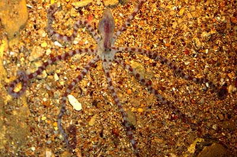
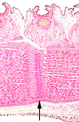

## Phylogeny 

-   « Ancestral Groups  
    -   [Octopodidae](../Octopodidae.md)
    -   [Incirrata](../../Incirrata.md)
    -   [Octopod](../../../Octopod.md)
    -   [Octopodiformes](Octopodiformes)
    -   [Coleoidea](Coleoidea)
    -   [Cephalopoda](Cephalopoda)
    -   [Mollusca](Mollusca)
    -   [Bilateria](Bilateria)
    -   [Animals](Animals)
    -   [Eukaryotes](Eukaryotes)
    -   [Tree of Life](../../../../../../../../../../Tree_of_Life.md)

-   ◊ Sibling Groups of  Octopodidae
    -   Ameloctopus litoralis
    -   [Pareledone](Pareledone.md)

-   » Sub-Groups 

## [[Ameloctopus]]

# *Ameloctopus litoralis* [Norman 1992]

Banded Drop-arm Octopus 

## #has_/text_of_/abstract 

> **Ameloctopus** litoralis is the only species of octopus in monotypic genus Ameloctopus. 
> It is found in shallow waters in tropical Australia and lacks an ink sack.  
> Ameloctopus litoralis lays large eggs compared to other octopuses.
>
> [Wikipedia](https://en.wikipedia.org/wiki/Ameloctopus) 

## Introduction

[Mark D. Norman]()

This distinctive long-armed species is restricted to intertidal coastal
waters of northern Australia. Sexes are approximately equal in size
(mantle length to around 30 mm, total length to 300 mm, weight to 20 g).
This octopus was described in 1992, and there is limited information
available on its behaviour and life history. It has no commercial value.

### Characteristics

1.  Greatly elongated arms, up to 10 times mantle length, equal in
    length when intact.
2.  Arms capable of autotomy at set plane in arm base at level of 4th or
    5th sucker pair.
3.  Small head with tiny eyes.
4.  Mantle thin-walled; dark branchial hearts visible through mantle.
5.  Ink sac absent.
6.  Funnel organ greatly reduced to two to four small oval pads.
7.  Anal flaps absent.
8.  Gills with 5-6 lamellae per demibranch.
9.  Terminal organ of male reproductive tract lacks diverticulum.
10. Spermatophores with bulbous inflated sperm reservoir.
11. Low skin sculpture without papillae.

### Behaviour

***Ameloctopus*** forages over intertidal sand and rubble flats at
night, using the long arms to probe down crevices for small crustaceans.
Captive animals typically remain within shelter and shoot out the long
arms to grab passing prey. This octopus discards arms as a decoy to
predators, in the same manner as drop-tail lizards. The wriggling
severed arm distracts (and feeds!) the predator while the octopus flees.
One arm was observed to writhe for over 4 hours, continuing to crawl and
adhere with suckers. In other arm-dropping octopuses, the arm
regenerates over 6 to 8 weeks. There is a set level in the arm at which
the break occurs. The exact mechanism by which the arm separates is
unknown.

Left: ***Ameloctopus litoralis*** with left arm III autotomized.
Photograph copyright © 1996, Mark D. Norman. Right: Histological section
(longitudinal) of an arm showing the plane where autotomy occurs
(arrow).  Histology, B. Abaloz, photograph copyright © 1996, David Paul.
### Life history

The males of this octopus have a unique system of reproduction. In other
bottom-living octopuses, the male develops a modified third arm from
birth, known as the hectocotylus. This arm has a spoon-like tip used to
pass spermatophores into the oviducts of the female. ***Ameloctopus***
is unique in that it does not develop these modifications until fully
mature (i.e., its reproductive tract is full of spermatophores). Instead
it has a full-length normal arm while the animal is immature, which can
be used for feeding and/or discarding at predators. On maturity, the
male drops this arm near the base and develops the spoon-like tip
directly out of the stump. He is then able to mate using this special
short arm to transfer sperm to the female. Mature females of this
species produce around 80 eggs, each 10 mm long. These relatively large
eggs would result in benthic hatchlings, young that immediately adopt
the bottom-living habits of the adults.

### Habitat

This octopus appears restricted to intertidal reefs and flats of mud,
sand, coral and/or rubble. It emerges to forage over these reefs during
night low tides, typically in depths of 10 cm or less. Presumed benthic
hatchlings appear to restrict this species to continuous coastal habitat
across northern Australia.

### Distribution

***Ameloctopus litoralis*** is known only from the coastal waters of
tropical Australia from the southern Great Barrier Reef (23 deg. 30
min.S , 152 deg. 00 min. E), west to the Dampier Archipelago, Western
Australia (20 deg. 30 min. S, 116 deg. 30 min E).

### References

Norman, M.D. 1992. Ameloctopus litoralis, gen. et sp. nov. (Cephalopoda:
Octopodidae), a new shallow-water octopus from tropical Australian
waters. Invertebrate Taxonomy 6: 567-82

## Title Illustrations 

---------------------------------------------------------------------------

Scientific Name ::     Ameloctopus litoralis
Specimen Condition   Live Specimen
Copyright ::            © 1996 [Mark D. Norman](mailto:mnorman@unimelb.edu.au) 

## Confidential Links & Embeds: 

### #is_/same_as :: [Ameloctopus](/_Standards/bio/bio~Domain/Eukaryotes/Animals/Bilateria/Mollusca/Cephalopoda/Coleoidea/Octopodiformes/Octopod/Incirrata/Octopodidae/Ameloctopus.md) 

### #is_/same_as :: [Ameloctopus.public](/_public/bio/bio~Domain/Eukaryotes/Animals/Bilateria/Mollusca/Cephalopoda/Coleoidea/Octopodiformes/Octopod/Incirrata/Octopodidae/Ameloctopus.public.md) 

### #is_/same_as :: [Ameloctopus.internal](/_internal/bio/bio~Domain/Eukaryotes/Animals/Bilateria/Mollusca/Cephalopoda/Coleoidea/Octopodiformes/Octopod/Incirrata/Octopodidae/Ameloctopus.internal.md) 

### #is_/same_as :: [Ameloctopus.protect](/_protect/bio/bio~Domain/Eukaryotes/Animals/Bilateria/Mollusca/Cephalopoda/Coleoidea/Octopodiformes/Octopod/Incirrata/Octopodidae/Ameloctopus.protect.md) 

### #is_/same_as :: [Ameloctopus.private](/_private/bio/bio~Domain/Eukaryotes/Animals/Bilateria/Mollusca/Cephalopoda/Coleoidea/Octopodiformes/Octopod/Incirrata/Octopodidae/Ameloctopus.private.md) 

### #is_/same_as :: [Ameloctopus.personal](/_personal/bio/bio~Domain/Eukaryotes/Animals/Bilateria/Mollusca/Cephalopoda/Coleoidea/Octopodiformes/Octopod/Incirrata/Octopodidae/Ameloctopus.personal.md) 

### #is_/same_as :: [Ameloctopus.secret](/_secret/bio/bio~Domain/Eukaryotes/Animals/Bilateria/Mollusca/Cephalopoda/Coleoidea/Octopodiformes/Octopod/Incirrata/Octopodidae/Ameloctopus.secret.md)

