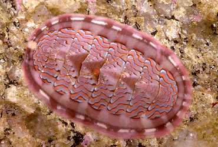

## Phylogeny 
-   « Ancestral Groups  
    -   [Mollusca](Mollusca)
    -   [Bilateria](Bilateria)
    -   [Animals](Animals)
    -   [Eukaryotes](Eukaryotes)
    -   [Tree of Life](../../../../Tree_of_Life.md)

-   ◊ Sibling Groups of  Mollusca
    -   Polyplacophora
    -   [Bivalvia](Bivalvia)
    -   [Gastropoda](Gastropoda)
    -   [Cephalopoda](Cephalopoda)

-   » Sub-Groups 
	-   *Lepidopleurina*
	-   *Ischnochitonina*
	-   *Acanthochitonina*
	-   *Choriplacina*

# [[Chitons]] 

Chitons 

 

## #has_/text_of_/abstract 

> Chitons are marine molluscs of varying size in the class **Polyplacophora** ( POL-ee-plə-KOF-ər-ə), formerly known as Amphineura. About 940 extant and 430 fossil species are recognized.
>
> They are also sometimes known as sea cradles or coat-of-mail shells or suck-rocks, or more formally as loricates, polyplacophorans, and occasionally as polyplacophores.
>
> Chitons have a shell composed of eight separate shell plates or valves. These plates overlap slightly at the front and back edges, and yet articulate well with one another. Because of this, the shell provides protection at the same time as permitting the chiton to flex upward when needed for locomotion over uneven surfaces, and even allows the animal to curl up into a ball when dislodged from rocks. The shell plates are encircled by a skirt known as a girdle.
>
> [Wikipedia](https://en.wikipedia.org/wiki/Chiton) 

## Title Illustrations

------------------------------------------------------------------------------

Scientific Name ::     Tonicella lokii
Location ::           North America
Creator              Photograph by E. Eugenia Patten
Specimen Condition   Live Specimen
Source Collection    [CalPhotos](http://calphotos.berkeley.edu/)
Copyright ::            © 1999 [California Academy of Sciences](http://www.calacademy.org/) 

## Confidential Links & Embeds: 

### #is_/same_as :: [Chitons](/_Standards/bio/bio~Domain/Eukaryotes/Animals/Bilateria/Mollusca/Chitons.md) 

### #is_/same_as :: [Chitons.public](/_public/bio/bio~Domain/Eukaryotes/Animals/Bilateria/Mollusca/Chitons.public.md) 

### #is_/same_as :: [Chitons.internal](/_internal/bio/bio~Domain/Eukaryotes/Animals/Bilateria/Mollusca/Chitons.internal.md) 

### #is_/same_as :: [Chitons.protect](/_protect/bio/bio~Domain/Eukaryotes/Animals/Bilateria/Mollusca/Chitons.protect.md) 

### #is_/same_as :: [Chitons.private](/_private/bio/bio~Domain/Eukaryotes/Animals/Bilateria/Mollusca/Chitons.private.md) 

### #is_/same_as :: [Chitons.personal](/_personal/bio/bio~Domain/Eukaryotes/Animals/Bilateria/Mollusca/Chitons.personal.md) 

### #is_/same_as :: [Chitons.secret](/_secret/bio/bio~Domain/Eukaryotes/Animals/Bilateria/Mollusca/Chitons.secret.md)

