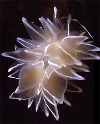
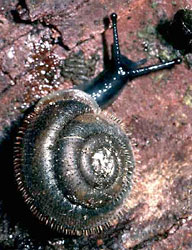
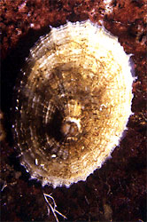

## Phylogeny 

-   « Ancestral Groups  
    -   [Mollusca](Mollusca)
    -   [Bilateria](Bilateria)
    -   [Animals](Animals)
    -   [Eukaryotes](Eukaryotes)
    -   [Tree of Life](../../../../Tree_of_Life.md)

-   ◊ Sibling Groups of  Mollusca
    -   [Chitons](Chitons.md)
    -   [Bivalvia](Bivalvia)
    -   Gastropoda
    -   [Cephalopoda](Cephalopoda)

-   » Sub-Groups
    -   [Caenogastropoda](Caenogastropoda.md)

# [[Gastropoda]] 

 
 
 

## #has_/text_of_/abstract 

> Gastropods (), commonly known as slugs and snails, belong to a large taxonomic class of invertebrates within the phylum Mollusca called **Gastropoda** ().
>
> This class comprises snails and slugs from saltwater, freshwater, and from the land. There are many thousands of species of sea snails and slugs, as well as freshwater snails, freshwater limpets, land snails and slugs.
>
> The class Gastropoda is a diverse and highly successful class of mollusks within the phylum Mollusca. It contains a vast total of named species, second only to the insects in overall number. The fossil history of this class goes back to the Late Cambrian. As of 2017, 721 families of gastropods are known, of which 245 are extinct and appear only in the fossil record, while 476 are currently extant with or without a fossil record.
>
> Gastropoda (previously known as univalves and sometimes spelled "Gasteropoda") are a major part of the phylum Mollusca, and are the most highly diversified class in the phylum, with 65,000 to 80,000 living snail and slug species. The anatomy, behavior, feeding, and reproductive adaptations of gastropods vary significantly from one clade or group to another, so stating many generalities for all gastropods is difficult.
>
> The class Gastropoda has an extraordinary diversification of habitats. Representatives live in gardens, woodland, deserts, and on mountains; in small ditches, great rivers, and lakes; in estuaries, mudflats, the rocky intertidal, the sandy subtidal, the abyssal depths of the oceans, including the hydrothermal vents, and numerous other ecological niches, including parasitic ones.
>
> Although the name "snail" can be, and often is, applied to all the members of this class, commonly this word means only those species with an external shell big enough that the soft parts can withdraw completely into it. Slugs are gastropods that have no shell or a very small, internal shell; semislugs are gastropods that have a shell that they can partially retreat into but not entirely.
>
> The marine shelled species of gastropods include species such as abalone, conches, periwinkles, whelks, and numerous other sea snails that produce seashells that are coiled in the adult stage—though in some, the coiling may not be very visible, for example in cowries. In a number of families of species, such as all the various limpets, the shell is coiled only in the larval stage, and is a simple conical structure after that.
>
> [Wikipedia](https://en.wikipedia.org/wiki/Gastropoda) 

## Title Illustrations

--------------------------------------------------------------------------

Scientific Name ::  Nudibranchia
Comments          Silver cloud nudibranch
Creator           P. Crawford & D. Giberson, UPEI
Copyright ::         © [BIODIDAC](http://biodidac.bio.uottawa.ca/index.htm) 

---------------------------------------------------------------------------
 
Scientific Name ::     Pulmonata
Comments             A pulmonate snail
Creator              Cornuet
Specimen Condition   Live Specimen
Copyright ::            © [BIODIDAC](http://biodidac.bio.uottawa.ca/index.htm) 

--------------------------------------------------------------------------

Scientific Name ::  Gastropoda
Comments          a limpet
Creator           P. Crawford, UPEI
Copyright ::         © [BIODIDAC](http://biodidac.bio.uottawa.ca/index.htm) 

