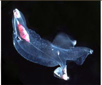
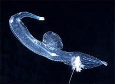

## [[Pterotracheoidea]] 

Heteropoda [Lamarck, 1812], heteropods, sea elephants 

     

## #has_/text_of_/abstract 

> The **Pterotracheoidea** is, according to the Taxonomy of the Gastropoda (Bouchet & Rocroi, 2005), 
> a taxonomic  superfamily of sea snails or sea slugs, marine gastropod molluscs 
> in the clade Littorinimorpha. They are commonly called heteropods or sea elephants.
>
> [Wikipedia](https://en.wikipedia.org/wiki/Pterotracheoidea)  

## Introduction

[Roger R. Seapy]() 

The heteropods are a group of pelagic snails (Class Gastropoda) that are
found in moderate to low abundances, primarily in tropical to
subtropical latitudes. Among the gastropods, they have three striking
adaptations to the open ocean environment. The bodies and shells are
largely transparent; only the buccal mass, eyes and viscera are opaque.
The foot, which in bottom-dwelling snails is the sole-like structure
used for crawling along the bottom, primarily forms a
laterally-compressed swimming fin. The animal swims \"upside-down\" with
the fin directed upward. The eyes are large and image-forming. They are
active predators that visually locate their prey and capture them by
protruding their radula (having elongate, sickle-shaped teeth) from the
mouth at the tip of the proboscis. The presence øf a mobile, trunk-like
proboscis is responsible for their common name, \"sea elephants.\"

#### Diagnosis

Gastropod molluscs with:

-   Paired image-forming eyes with large, spherical lenses.
-   Laterally-flattened ventral swimming fin.

### Characteristics

Eyes

Eye forward-looking, with large, spherical lens.

Eye with basal, ribbon-like retina.

Eye shape, viewed from dorsal aspect, generally tubular to triangular.

Wall of eye partially (unpigmented region forms a \"window\") to
completely pigmented.

Eye enclosed in gelatinous capsule.

**Figure**. **Left** - Side view of ***Atlanta peroni*** with
transparent shell, Hawaiian waters. Keel surrounds the outermost shell
whorl. **Right** - Side view of transparent shell of ***Carinaria
galea***, Hawaiian waters. Large, flaring keel extends to the right in
the photograph. Shell surrounds visceral mass and gills, all of which is
attached to the body by a thick stalk. Photographs copyright © 2005 R.
Seapy.

Comments

The three families can be distinguished by the following characters:

  ------- ----------------------
  Family            Adult shell   Body can retract into shell   Adult body size             Location of swimming fin
  Atlantidae        present       yes                           microscopic (\< ca. 1 cm)   opposite visceral mass
  Carinariidae      present       no                            macroscopic (\> ca. 2 cm)   opposite visceral mass
  Pterotracheidae   absent        n/a                           macroscopic (\> ca. 2 cm)   between visceral mass and head
  ------- ----------------------

### Life History

Heteropods are dioecious (separate sexes) and exhibit sexual dimorphism.
Males have a prominent penis and penial appendage (function unknown) and
the fin sucker in pterotracheids is present only in males. Also, there
are sexual differences in radular morphology in some atlantids.

Male heteropods package sperm into spermatophores. Sperm are transferred
to the penis by an external ciliated groove where they are packed into
spermatophores. Spermatophores are transferred to females during
copulation (mating behavior has only been observed in ***Pterotrachea
hippocampus***; Harbison in Lalli and Gilmer, 1989). Fertilized eggs are
usually layed in mucoid egg strings which eventually break free from the
female, except in ***Firoloida desmaresti*** which has a permanently
attached tubular filament which holds the developing embryos (Owre,
1964).

**Figure**. **Left** - Side view of posterior region of trunk of
***Carinaria japonica***, male, Hawaiian waters. Penis and penial
appendage lie parallel to each other; penis contains brown
spermatophore. **Right** - Side view of visceral nucleus in
***Pterotrachea coronata***, female, Hawaiian waters. The egg string is
released from the oviduct opening, which is surrounded by transparent
\"lips\". Photographs copyright © 2005 R. Seapy.

All heteropods have a free-swimming, planktotrophic veliger larva.
Larvae hatch from the egg within a few days of fertilization. The
veliger possesses a dextrally (right-hand) coiled, calcareous shell and
a flexible, chitinous operculum. The larval velum (ciliated swimming and
feeding organ) is initially small and bilobed. With growth each lobe
forms into two (pterotracheids) or three (atlantids and carinariids)
long and slender lobes. Following metamorphosis the larval shell is
retained as the protoconch of the adult shell (in atlantids and
carinariids) or is cast off (in pterotracheids, which lack an adult
shell). The larval operculum is either retained (atlantids) or cast off
(carinariids and pterotracheids). The duration of the larval stage is
not known, nor is age or life span of the adults. The largest heteropods
are the carinariids (to 500 mm in ***Carinaria cristata***) followed by
the pterotracheids (to 330 mm in ***Pterotrachea coronata***) (Lalli and
Gilmer, 1989).

**Figure**. **Left** - Oral view of veliger larva of ***Carinaria
lamarcki*** with six slender, ciliated velar lobes. Drawing from
Thiriot-Quievrèux (1973). **Right** - Late veliger larva of ***Oxygyrus
keraudreni***, shell diameter about 1.0 mm, from Hawaiian waters. Velar
lobes (light violet color) retracted into shell; head, proboscis and
opercular lobe extend from shell. Photograph copyright © 2005 R. Seapy.

### Natural History

 

All heteropods swim with their ventral side directed upward and the
dorsal side, with the shell (when present) and visceral mass downward.
Steady swimming is by undulations of the fin. In atlantids, a
considerable side-to-side body motion is induced by the large fin,
although the shell and keel act to partially offset the fin\'s
movements. The large, elongate bodies of the carinariids and
pterotracheids greatly dampen the side-to-side body motion. In the
latter two groups, and especially in the pterotracheids, flexion of the
trunk and tail are used in accelerated swimming during pursuit of prey
or evasion of predators. The bodies of pterotracheids are the most
elongate and streamlined of the three families, and they are the fastest
swimmers.

The atlantids are negatively buoyant. During the day they must swim to
maintain position. At night, however, they secrete strands of buoyant
mucus, up to 0.5 m long, from which they are suspended (Lalli and
Gilmer, 1989; Newman, 1990). Carinariids and pterotracheids have been
observed to float motionless without sinking (Lalli and Gilmer, 1989).
Their neutral buoyancy results from the large amounts of gelatinous
tissue, mostly in the trunk and tail, that is made positively-buoyant by
ion regulation; i.e., by replacing heavier sulfate ions by lighter
chloride ions (up to 75% in ***Pterotrachea coronata***) (Denton and
Shaw, 1961).

Heteropods are carnivores that feed during the day, locating their prey
visually. The eyes are unusual because they have a narrow, strip-like
retina. Image formation is accomplished by scanning-eye movements. In
atlantids, the only family studied to date, the retina is rotated
through a 90° arc, from downward vertical to horizontal (Land, 1982).
Presumably, prey are located beneath the animal by light reflected off
the prey\'s body. In all heteropods, prey are captured by elongate,
hooked radular teeth (described above). In the atlantids, the fin sucker
is large and is used to hold the prey while pieces of tissue are torn
off and ingested. In the carinariids and pterotracheids prey are
ingested whole. The fin sucker is much smaller in these two groups and
does not appear to be used in feeding. It is directed ventrally to
posteroventrally and is spatially separated from the mouth; its primary
or sole function is presumably to hold males and females together during
mating.

Heteropods feed on a variety of zooplanktonic prey. Atlantids feed
preferentially on other gastropods, especially shelled pteropods
(Richter, 1968; Newman, 1990), and carinariids feed selectively on soft
bodied prey (e.g., salps, doliolids and chaetognaths in ***Carinaria
japonica***; Seapy, 1980). Little is known of feeding in pterotracheids.

Defense against predators is based largely on transparency, although the
buccal mass, pigmented region of the eyes, and the visceral mass (or
visceral nucleus) are opaque. ***Pterotrachea*** uses reflectivity and
behavioral orientation to reduce the visibility of these structures to
upward-searching predators (Seapy and Young, 1986).

## Phylogeny 

-   « Ancestral Groups  
    -   [Caenogastropoda](Caenogastropoda)
    -   [Gastropoda](Gastropoda)
    -   [Mollusca](Mollusca)
    -   [Bilateria](Bilateria)
    -   [Animals](Animals)
    -   [Eukaryotes](Eukaryotes)
    -   [Tree of Life](../../../../../../Tree_of_Life.md)

-   ◊ Sibling Groups of  Caenogastropoda
    -   Carinarioidea

-   » Sub-Groups
	-  Carinarioidea [Blainville, 1818]
    -   [Atlantidae](Atlantidae.md)
    -   [Pterotracheidae](Pterotracheidae.md)
	-   *[Atlantidae](Atlantidae.md "go to ToL page")*[ Rang,
	    1829]
	-   *[Pterotracheidae](Pterotracheidae.md "go to ToL page")*[
	    Rafinesque, 1814]
	-   *Carinariidae*
	    -   *Carinaria*
	        -   *Carinaria challengeri*
	        -   *Carinaria cithara*
	        -   *Carinaria cristata*
	        -   *Carinaria galea*
	        -   *Carinaria japonica*
	        -   *Carinaria lamarcki*
	    -   *Cardiapoda*
	        -   *Cardiapoda placenta*
	        -   *Cardiapoda richardi*
	    -   *Pterosoma planum*

## Title Illustrations

-------------------------------------------------------------------------

Scientific Name ::     Oxygyrus keraudreni
Specimen Condition   Live Specimen
Copyright ::            © 2005 [Roger R. Seapy](mailto:rseapy@fullerton.edu) 

-------------------------------------------------------------------------

Scientific Name ::     Carinaria japonica
Specimen Condition   Live Specimen
Copyright ::            © 2005 [Roger R. Seapy](mailto:rseapy@fullerton.edu) 

-------------------------------------------------------------------------

Scientific Name ::     Pterotrachea coronata
Specimen Condition   Live Specimen
Copyright ::            © 2005 [Roger R. Seapy](mailto:rseapy@fullerton.edu) 

## Confidential Links & Embeds: 

### #is_/same_as :: [Pterotracheoidea](/_Standards/bio/bio~Domain/Eukaryotes/Animals/Bilateria/Mollusca/Gastropoda/Caenogastropoda/Pterotracheoidea.md) 

### #is_/same_as :: [Pterotracheoidea.public](/_public/bio/bio~Domain/Eukaryotes/Animals/Bilateria/Mollusca/Gastropoda/Caenogastropoda/Pterotracheoidea.public.md) 

### #is_/same_as :: [Pterotracheoidea.internal](/_internal/bio/bio~Domain/Eukaryotes/Animals/Bilateria/Mollusca/Gastropoda/Caenogastropoda/Pterotracheoidea.internal.md) 

### #is_/same_as :: [Pterotracheoidea.protect](/_protect/bio/bio~Domain/Eukaryotes/Animals/Bilateria/Mollusca/Gastropoda/Caenogastropoda/Pterotracheoidea.protect.md) 

### #is_/same_as :: [Pterotracheoidea.private](/_private/bio/bio~Domain/Eukaryotes/Animals/Bilateria/Mollusca/Gastropoda/Caenogastropoda/Pterotracheoidea.private.md) 

### #is_/same_as :: [Pterotracheoidea.personal](/_personal/bio/bio~Domain/Eukaryotes/Animals/Bilateria/Mollusca/Gastropoda/Caenogastropoda/Pterotracheoidea.personal.md) 

### #is_/same_as :: [Pterotracheoidea.secret](/_secret/bio/bio~Domain/Eukaryotes/Animals/Bilateria/Mollusca/Gastropoda/Caenogastropoda/Pterotracheoidea.secret.md)

