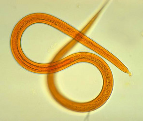

# [[Nematoda]]

Roundworms 

 

## #has_/text_of_/abstract 

> The nematodes ( NEM-ə-tohdz or NEEM-; Ancient Greek: Νηματώδη; Latin: **Nematoda**), roundworms or eelworms constitute the phylum Nematoda. Species in the phylum inhabit a broad range of environments. Most species are free-living, feeding on microorganisms, but many are parasitic. Parasitic worms (helminths) are the cause of soil-transmitted helminthiases.
>
> They are classified along with arthropods, tardigrades and other moulting animals in the clade Ecdysozoa. Unlike the flatworms, nematodes have a tubular digestive system, with openings at both ends. Like tardigrades, they have a reduced number of Hox genes, but their sister phylum Nematomorpha has kept the ancestral protostome Hox genotype, which shows that the reduction has occurred within the nematode phylum.
>
> Nematode species can be difficult to distinguish from one another. Consequently, estimates of the number of nematode species are uncertain. A 2013 survey of animal biodiversity suggested there are over 25,000. Estimates of the total number of extant species are subject to even greater variation. A widely referenced 1993 article  estimated there might be over a million species of nematode. A subsequent publication challenged this claim, estimating the figure to be at least 40,000 species. Although the highest estimates (up to 100 million species) have since been deprecated, estimates supported by rarefaction curves, together with the use of DNA barcoding and the increasing acknowledgment of widespread cryptic species among nematodes, have placed the figure closer to one million species.
>
> Nematodes have successfully adapted to nearly every ecosystem: from marine (salt) to fresh water, soils, from the polar regions to the tropics, as well as the highest to the lowest of elevations. They are ubiquitous in freshwater, marine, and terrestrial environments, where they often outnumber other animals in both individual and species counts, and are found in locations as diverse as mountains, deserts, and oceanic trenches. They are found in every part of the Earth's lithosphere, even at great depths, 0.9–3.6 km (3,000–12,000 ft) below the surface of the Earth in gold mines in South Africa. They represent 90% of all animals on the ocean floor. In total, 4.4 × 1020 nematodes inhabit the Earth's topsoil, or approximately 60 billion for each human, with the highest densities observed in tundra and boreal forests. Their numerical dominance, often exceeding a million individuals per square meter and accounting for about 80% of all individual animals on Earth, their diversity of lifecycles, and their presence at various trophic levels point to an important role in many ecosystems. They play crucial roles in polar ecosystems. The roughly 2,271 genera are placed in 256 families. The many parasitic forms include pathogens in most plants and animals. A third of the genera occur as parasites of vertebrates; about 35 nematode species are human parasites.
>
> [Wikipedia](https://en.wikipedia.org/wiki/Nematode) 

## Phylogeny 

-   « Ancestral Groups  
    -   [Bilateria](Bilateria)
    -   [Animals](Animals)
    -   [Eukaryotes](Eukaryotes)
    -   [Tree of Life](../../../Tree_of_Life.md)

-   ◊ Sibling Groups of  Bilateria
    -   [Deuterostomia](Deutero.md)
    -   [Arthropoda](Arthropoda)
    -   [Onychophora](Onychophora)
    -   [Tardigrade](Tardigrade.md)
    -   Nematoda
    -   [Nematomorpha](Nematomorpha)
    -   [Kinorhyncha](Kinorhyncha)
    -   [Loricifera](Loricifera)
    -   [Priapulida](Priapulida)
    -   [Arrow_Worm](Arrow_Worm.md)
    -   [Gastrotricha](Gastrotricha)
    -   [Rotifera](Rotifera)
    -   [Gnathostomulida](Gnathostomulida)
    -   [Limnognathia maerski](Limnognathia_maerski)
    -   [Cycliophora](Cycliophora)
    -   [Mesozoa](Mesozoa)
    -   [Platyhelminthes](Platyhelminthes)
    -   [Annelida](Annelida)
    -   [Bryozoa](Bryozoa)
    -   [Sipuncula](Sipuncula)
    -   [Mollusca](Mollusca)
    -   [Nemertea](Nemertea)
    -   [Entoprocta](Entoprocta)
    -   [Phoronida](Phoronida)
    -   [Brachiopoda](Brachiopoda)

-   » Sub-Groups 

## Title Illustrations

--------------------------

Scientific Name ::    Strongyloides
Creator             CDC/Dr. Mae Melvin
Life Cycle Stage ::    filariform larva
Source Collection   [Public Health Image Library](http://phil.cdc.gov/Phil/default.asp)

