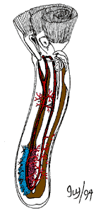

# [[Phoronida]]

## Horseshoe worms 

 

## #has_/text_of_/abstract 

> Phoronids (taxonomic name **Phoronida**, sometimes called horseshoe worms) 
> are a small phylum of marine animals that filter-feed with a lophophore (a "crown" of tentacles), 
> and build upright tubes of chitin to support and protect their soft bodies. 
> 
> They live in most of the oceans and seas, including the Arctic Ocean 
> but excluding the Antarctic Ocean, and between the intertidal zone and about 400 meters down. 
> 
> Most adult phoronids are 2 cm long and about 1.5 mm wide, although the largest are 50 cm long.
>
> The name of the group comes from its type genus: Phoronis.
>
> [Wikipedia](https://en.wikipedia.org/wiki/Phoronid) 

## Title Illustrations

Diagram showing the internal anatomy of a phoronid.\
Drawing by Ivy Livingstone. Copyright © 1994
[BIODIDAC](http://biodidac.bio.uottawa.ca/index.htm).

--------------------------------------------------------------------------

Copyright ::   © 1994 [BIODIDAC](http://biodidac.bio.uottawa.ca/index.htm) 

## Phylogeny 

-   « Ancestral Groups  
    -   [Bilateria](Bilateria)
    -   [Animals](Animals)
    -   [Eukaryotes](Eukaryotes)
    -   [Tree of Life](../../../Tree_of_Life.md)

-   ◊ Sibling Groups of  Bilateria
    -   [Deuterostomia](Deutero.md)
    -   [Arthropoda](Arthropoda)
    -   [Onychophora](Onychophora)
    -   [Tardigrade](Tardigrade.md)
    -   [Nematoda](Nematoda)
    -   [Nematomorpha](Nematomorpha)
    -   [Kinorhyncha](Kinorhyncha)
    -   [Loricifera](Loricifera)
    -   [Priapulida](Priapulida)
    -   [Arrow_Worm](Arrow_Worm.md)
    -   [Gastrotricha](Gastrotricha)
    -   [Rotifera](Rotifera)
    -   [Gnathostomulida](Gnathostomulida)
    -   [Limnognathia maerski](Limnognathia_maerski)
    -   [Cycliophora](Cycliophora)
    -   [Mesozoa](Mesozoa)
    -   [Platyhelminthes](Platyhelminthes)
    -   [Annelida](Annelida)
    -   [Bryozoa](Bryozoa)
    -   [Sipuncula](Sipuncula)
    -   [Mollusca](Mollusca)
    -   [Nemertea](Nemertea)
    -   [Entoprocta](Entoprocta)
    -   Phoronida
    -   [Brachiopoda](Brachiopoda)

-   » Sub-Groups 
	-   *Phoronis ovalis*
	-   *Phoronis hippocrepia*
	-   *Phoronis ijimai*
	-   *Phoronis australis*
	-   *Phoronis muelleri*
	-   *Phoronis psammophila*
	-   *Phoronis pallida*
	-   *Phoronis svetlanae*
	-   *Phoronis vancouverensis*
	-   *Phoronis architecta*
	-   *Phoronopsis albomaculata*
	-   *Phoronopsis harmeri*
	-   *Phoronopsis californica*
	-   *Phoronopsis viridis*
	-   *Phoronopsis malakhovi*

## Confidential Links & Embeds: 

### [Phoronida](/_Standards/bio/bio~Domain/Eukaryotes/Animals/Bilateria/Phoronida.md) 

### [Phoronida.public](/_public/bio/bio~Domain/Eukaryotes/Animals/Bilateria/Phoronida.public.md) 

### [Phoronida.internal](/_internal/bio/bio~Domain/Eukaryotes/Animals/Bilateria/Phoronida.internal.md) 

### [Phoronida.protect](/_protect/bio/bio~Domain/Eukaryotes/Animals/Bilateria/Phoronida.protect.md) 

### [Phoronida.private](/_private/bio/bio~Domain/Eukaryotes/Animals/Bilateria/Phoronida.private.md) 

### [Phoronida.personal](/_personal/bio/bio~Domain/Eukaryotes/Animals/Bilateria/Phoronida.personal.md) 

### [Phoronida.secret](/_secret/bio/bio~Domain/Eukaryotes/Animals/Bilateria/Phoronida.secret.md)

