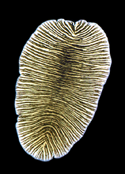

# [[Platyhelminthes]] 

Flatworms, tapeworms, flukes 

 

## #has_/text_of_/abstract 

> **Platyhelminthes** (from the Greek πλατύ, platy, meaning "flat" and ἕλμινς (root: ἑλμινθ-), helminth-, meaning "worm") is a phylum of relatively simple bilaterian, unsegmented, soft-bodied invertebrates commonly called flatworms or flat worms. Being acoelomates (having no body cavity), and having no specialised circulatory and respiratory organs, they are restricted to having flattened shapes that allow oxygen and nutrients to pass through their bodies by diffusion. The digestive cavity has only one opening for both ingestion (intake of nutrients) and egestion (removal of undigested wastes); as a result, the food can not be processed continuously.
>
> In traditional medicinal texts, Platyhelminthes are divided into Turbellaria, which are mostly non-parasitic animals such as planarians, and three entirely parasitic groups: Cestoda, Trematoda and Monogenea; however, since the turbellarians have since been proven not to be monophyletic, this classification is now deprecated. Free-living flatworms are mostly predators, and live in water or in shaded, humid terrestrial environments, such as leaf litter. Cestodes (tapeworms) and trematodes (flukes) have complex life-cycles, with mature stages that live as parasites in the digestive systems of fish or land vertebrates, and intermediate stages that infest secondary hosts. The eggs of trematodes are excreted from their main hosts, whereas adult cestodes generate vast numbers of hermaphroditic, segment-like proglottids that detach when mature, are excreted, and then release eggs. Unlike the other parasitic groups, the monogeneans are external parasites infesting aquatic animals, and their larvae metamorphose into the adult form after attaching to a suitable host.
>
> Because they do not have internal body cavities, Platyhelminthes were regarded as a primitive stage in the evolution of bilaterians (animals with bilateral symmetry and hence with distinct front and rear ends). However, analyses since the mid-1980s have separated out one subgroup, the Acoelomorpha, as basal bilaterians – closer to the original bilaterians than to any other modern groups. The remaining Platyhelminthes form a monophyletic group, one that contains all and only descendants of a common ancestor that is itself a member of the group. The redefined Platyhelminthes is part of the Spiralia, one of the two main groups of Protostomia. These analyses had concluded the redefined Platyhelminthes, excluding Acoelomorpha, consists of two monophyletic subgroups, Catenulida and Rhabditophora, with Cestoda, Trematoda and Monogenea forming a monophyletic subgroup within one branch of the Rhabditophora. Hence, the traditional platyhelminth subgroup "Turbellaria" is now regarded as paraphyletic, since it excludes the wholly parasitic groups, although these are descended from one group of "turbellarians".
>
> A planarian species has been used in the Philippines and Maldives in an attempt to control populations of the imported giant African snail (Achatina fulica), which was eating agricultural crops. Success was initially reported for the Maldives but this was only temporary and the role of flatworms has been questioned. These planarians have now spread very widely throughout the tropics and are themselves a serious threat to native snails, and should not be used for biological control. In northwest Europe, there are concerns about the spread of the New Zealand planarian Arthurdendyus triangulatus, which preys on earthworms.
>
> [Wikipedia](https://en.wikipedia.org/wiki/Flatworm) 

## Phylogeny 

-   « Ancestral Groups  
    -   [Bilateria](Bilateria)
    -   [Animals](Animals)
    -   [Eukaryotes](Eukaryotes)
    -   [Tree of Life](../../../Tree_of_Life.md)

-   ◊ Sibling Groups of  Bilateria
    -   [Deuterostomia](Deutero.md)
    -   [Arthropoda](Arthropoda)
    -   [Onychophora](Onychophora)
    -   [Tardigrade](Tardigrade.md)
    -   [Nematoda](Nematoda)
    -   [Nematomorpha](Nematomorpha)
    -   [Kinorhyncha](Kinorhyncha)
    -   [Loricifera](Loricifera)
    -   [Priapulida](Priapulida)
    -   [Arrow_Worm](Arrow_Worm.md)
    -   [Gastrotricha](Gastrotricha)
    -   [Rotifera](Rotifera)
    -   [Gnathostomulida](Gnathostomulida)
    -   [Limnognathia maerski](Limnognathia_maerski)
    -   [Cycliophora](Cycliophora)
    -   [Mesozoa](Mesozoa)
    -   Platyhelminthes
    -   [Annelida](Annelida)
    -   [Bryozoa](Bryozoa)
    -   [Sipuncula](Sipuncula)
    -   [Mollusca](Mollusca)
    -   [Nemertea](Nemertea)
    -   [Entoprocta](Entoprocta)
    -   [Phoronida](Phoronida)
    -   [Brachiopoda](Brachiopoda)

-   » Sub-Groups
    -   [Aspidogastrea](Aspidogastrea.md)
    -   [Cestodaria](Cestodaria.md)

-   *Turbellaria*
    -   *Nemertodermatida*
    -   *Acoela*
    -   *Catenulida*
    -   *Macrostomida*
    -   *Lecithoepitheliata*
    -   *Rhabdocoela*
    -   *Prolecithophora*
    -   *Proseriata*
    -   *Tricladida*
    -   *Polycladida*
-   *Monogenea*
    -   *Monopisthocotylea*
    -   *Polyopishtocotylea*
-   *Trematoda*
    -   *Digenea*
    -   *[Aspidogastrea](Aspidogastrea.md "go to ToL page")*
-   *Cestoda*
    -   *[Cestodaria](Cestodaria.md "go to ToL page")*
    -   *Eucestoda*

## Title Illustrations

Stylochus. Photograph from Gray Museum Slide Collection, copyright ©
1995, [Marine Biological Laboratory](http://www.mbl.edu/), Woods Hole.

Copyright ::   © 1995 [Marine Biological Laboratory, Woods Hole](http://www.mbl.edu/) 

## Confidential Links & Embeds: 

### #is_/same_as :: [Platyhelminthes](/_Standards/bio/bio~Domain/Eukaryotes/Animals/Bilateria/Platyhelminthes.md) 

### #is_/same_as :: [Platyhelminthes.public](/_public/bio/bio~Domain/Eukaryotes/Animals/Bilateria/Platyhelminthes.public.md) 

### #is_/same_as :: [Platyhelminthes.internal](/_internal/bio/bio~Domain/Eukaryotes/Animals/Bilateria/Platyhelminthes.internal.md) 

### #is_/same_as :: [Platyhelminthes.protect](/_protect/bio/bio~Domain/Eukaryotes/Animals/Bilateria/Platyhelminthes.protect.md) 

### #is_/same_as :: [Platyhelminthes.private](/_private/bio/bio~Domain/Eukaryotes/Animals/Bilateria/Platyhelminthes.private.md) 

### #is_/same_as :: [Platyhelminthes.personal](/_personal/bio/bio~Domain/Eukaryotes/Animals/Bilateria/Platyhelminthes.personal.md) 

### #is_/same_as :: [Platyhelminthes.secret](/_secret/bio/bio~Domain/Eukaryotes/Animals/Bilateria/Platyhelminthes.secret.md)

